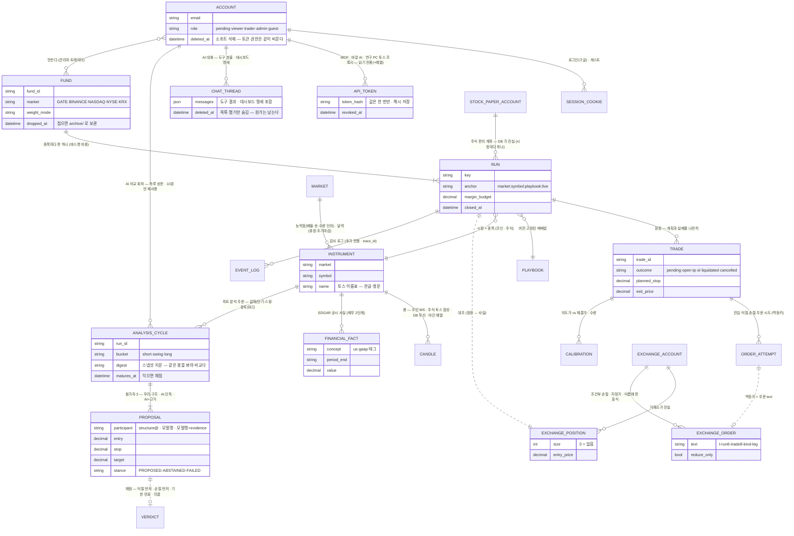

# 업 앤 다운 (Up & Down) — 코인 선물 · 주식 자동투자 플랫폼

매매법을 **백테스트 → 모의 라이브(테스트넷) → 실계좌**로 **같은 코드 한 벌**로 굴리는 플랫폼입니다.
백테스트가 돈 세션과 실계좌가 도는 세션이 같은 `Session.step()` 이고, 원장·손절·대조·리포트가 전부 그 위에서 돕니다.
코인 선물(Gate · Binance)과 주식(KRX · NASDAQ · NYSE — 토스 시세 · 페이퍼 계좌)이 **같은 세션 엔진**을 돌고, 그 위에
재무제표(SEC EDGAR) 저평가 후보 · 거시 지표 · **AI 차트 분석 주문**(규칙 엔진의 계획과 AI 참가자를 같은 봉에서 채점) ·
**AI 투자 어시스턴트**(도구 15개 · MCP 로 바깥 AI 에도 개방)가 얹혀 있습니다.

매매법(진입·청산 규칙)은 **플러그인**으로 붙습니다. 이 저장소에는 견본 매매법 하나(이동평균 교차)만 들어 있고,
실제로 돈을 굴리는 매매법·측정 결과·연구 스크립트는 들어 있지 않습니다. 플랫폼은 매매법의 이름을 모릅니다.

> ⚠️ 이 소프트웨어를 이용한 투자 결과에 대해 작성자는 어떤 책임도 지지 않습니다. 견본 매매법은 성과가 측정된 것이 아닙니다.
> AI 는 **제안·표시·채점까지만** 합니다 — 주문이 되는 경로는 사람의 확인뿐입니다.

---

## 목차

1. [화면](#1-화면)
2. [한 장 그림 — 무엇이 어떻게 도나](#2-한-장-그림--무엇이-어떻게-도나)
3. [기능](#3-기능)
4. [주식 · 재무 · 거시 · AI 차트 분석 주문](#4-주식--재무--거시--ai-차트-분석-주문)
5. [AI 어시스턴트 · MCP](#5-ai-어시스턴트--mcp)
6. [백테스트는 어떻게 쓰나](#6-백테스트는-어떻게-쓰나)
7. [매매법 붙이기](#7-매매법-붙이기)
8. [로그인 · 권한 · 데모/실계좌](#8-로그인--권한--데모실계좌)
9. [안전장치](#9-안전장치)
10. [아키텍처 — 계층과 문](#10-아키텍처--계층과-문)
11. [시작하기](#11-시작하기)
12. [배포 · 운영](#12-배포--운영)
13. [설정 파일](#13-설정-파일)
14. [문서 색인](#14-문서-색인)
15. [개발 규약 · 품질 게이트](#15-개발-규약--품질-게이트)
16. [라이선스](#16-라이선스)

---

## 1. 화면

차트는 전부 **TradingView Lightweight Charts**(오픈소스 `lightweight-charts` 5)로 그립니다 — 콘솔 · 판 상세 · 차트 분석 주문 · 백테스트 리포트 · 펀드 상세가 같은 부품을 씁니다.
지표 · 구조물 · 진입/손절/익절 선은 서버가 계산한 값을 **그대로 옮겨 그리고** 화면은 새 계산을 하지 않습니다. 화면 왼쪽의 **코인 / 주식** 스위치가 묶음을 가르고, 같은 화면이 묶음에 따라 거래소·시장·종목을 바꿉니다.

| | |
|---|---|
|  | **거래 콘솔 (코인)** — 거래소가 말하는 사실이 첫 화면이다. 계좌 총액·가용 잔액·오늘 손익·포지션·잡힌 증거금·미실현을 카드로 보이고, 120초마다 원장과 거래소를 대조해 어긋나면 배지가 말한다. 아래는 리밸런싱 펀드 — 종목·비중·몫(예산+손익)·포지션 증거금·미실현·실현손익·포지션 표와 입금·출금·구성 편집·지금 리밸런싱, 그리고 펀드 만들기. |
|  | **거래 콘솔 (주식)** — 같은 화면이 주식 묶음으로 바뀐다. 시장 칩(KRX · NASDAQ · NYSE · 토스 마크 · "연결 필요")과 장 상태(장 마감 · 다음 개장), **시장 분위기·거시 지표** 카드(VIX 를 20/30 구간 색과 설명으로 · 나스닥100 선물 · S&P 500 · 미국 10년물 · 달러 · 금 · WTI · 기준금리 · CPI · 못 받은 지표는 이유와 함께), 페이퍼 계좌 카드(잔액 · 오늘 손익 · 대기 증거금 · 포지션 · 미실현). 아래로 저평가 후보가 이어진다. |
|  | **저평가 후보** — SEC EDGAR 재무제표로 종목을 **자기 5년 백분위 대비** 싼 순으로. 범위 칩(전체 · SP 500 · NASDAQ · NYSE) · 서버 정렬·필터·쪽 · 행마다 토스 마크·한글 이름·가격·점수·PER·PBR·FCF 수익률·부채비율·60일 등락·부채 깃발·최근 공시·"왜 이 자리". 점수는 정렬 기준이지 추천이 아니다. 1단계(지금 값)는 백그라운드로 준비하고 Redis 사본이 배포를 넘긴다. |
|  | **AI 차트 분석 주문** — 시장·종목·갈래(단기 15m · 스윙 1h · 장투 1d)를 고르면 **차트 보기**(봉·이평·ADX · DB 먼저라 1초)가 바로 뜨고, **분석**을 누르면 규칙 엔진이 구조(지지/저항 · 전고/전저 선 · 52주 · ATR) · 재무 · VIX 를 읽어 RiskManager 가 확정한 롱/숏 계획(진입 · 손절 · 1차 · 목표 · %·손익비 라벨)을 그 위에 얹는다. 저평가 후보 칩을 누르면 그 종목으로. "사용한 근거" 카드가 레벨이 어디서 떨어졌는지(잊힘 · 관통 · 접점 부족 · 비용 안)까지 적어 **후보 없음이 오류인지 원래 없는 자리인지** 가른다. **AI 비교**는 같은 스냅샷을 AI 단독 · AI+근거에 동시에 던져 실험 원장에 기록하고, 이력 · 성적표(참가자 × 갈래 × 시장 · 표본 30 미만 회색)로 채점한다. 주문은 사람이 주식 주문 창에서 보고 보낸다. |
|  | **AI 투자 어시스턴트** — 질문 카드(테슬라 종목 코드 · 애플 저렴해? · 엔비디아 고점 근처야? · 200만원으로 뭐가 좋아? · 저평가 상위 10 · VIX …)와 모델 선택. 오른쪽 **펀드 설정** 마법사(동의 · 자본 · 성향 · 매매 설정 · 검토)는 AI 가 아니라 사전 세팅이고 숫자는 전부 과거 창 실측(손익 · MDD · 매매 · 청산 표)이다. |
|  | **도킹 채팅** — 어시스턴트는 어느 화면에서든 가장자리에 붙는다. "200만원으로 미국주식 시작하려는데" 에 `recommend_by_budget` · `symbol_resolve` · `market_view` 도구로 답하고, 매매법의 과거 실측(기간 · 손익 · MDD · 추천 여부)을 숨기지 않는다. 뒤는 리밸런싱 펀드(AAPL · NVDA · MSFT · 입금 · 지금 리밸런싱 · 구성 편집)와 펀드 만들기. |
|  | **AI 리포트** — 토너먼트(모델 × 프롬프트 버전 · N/30 · 적중률 · 평균 R · 손익 · MDD · 토큰 입/출 · 환각 · 표본 30 미만은 회색)와 **도구 시험**(도구마다 실제 질문 하나를 실제 모델에 넣어 기대한 도구가 불렸나 · 성공했나 · 답이 있나만 잰다 — 답의 질은 사람 눈으로 채점하지 않는다). |
|  | **MCP 토큰** — Claude Desktop · Cursor · ChatGPT 가 이 앱의 도구를 쓰게 하는 개인 API 토큰. 값은 만든 직후 한 번만 보이고 해시로 저장, 되돌리기. 토큰은 **읽기와 MCP 만** — 주문·설정은 화면에서. 같은 토큰으로 연구 PC 가 서버의 토스 프록시를 쓴다. |
|  | **RUN 상세** — 판 하나의 계좌·로직·점검 카드(매매 로직이 도는가 · 판정 횟수 · 스트림 · 증거금 · 낙폭 · 봉 흐름 · 이어받은 RUN · 첫 판정 시각)와 차트. 진입·청산(트레일)·손절 선과 지표 오버레이가 원장 값과 같은 식으로 그려지고, 축별 신선도와 국면·매매법 상태가 배지로 붙는다. |
|  | **리포트** — 원장의 누적 손익률, 청산 결과 분포(손절·목표 익절·전환 익절·반익반본·강제청산), 판별 손익률, 구간에 활동한 라이브 판 표(플레이북 · 펀드 · 익절/손절 · 매매 수 · 차트 열기). 계좌 → 펀드 종합 → RUN 세부 순서. |
|  | **백테스트 리포트 — 어떤 데이터에서** — 실측 봉(BINANCE·GATE·UPBIT)과 그 끝에서 이어지는 합성 미래를 한 시간선에 그린다. 화면은 새 계산을 하지 않고 문서·결과 파일의 숫자를 옮겨 오며, 옮긴 값은 빌드마다 원문과 대조된다. |
|  | **백테스트 리포트 — 합성 45미래** — 시나리오(블랙스완 ~ AI 폭등)별 자본 배수 × MDD 산점도, 중앙·최악·CVaR·5~95% 구간, 청산 난 미래 수. 아래 펀드 구성 매트릭스는 실측 4.5년 × 보정 45미래를 나란히 둔다. |
|  | **관리 — 계정·권한 묶음** — 계정마다 권한 묶음 하나 + 개별 기능 칩. 승인 없이 N시간이 지나면 임시 보류되고, 기준은 관리자가 정한다. 기능 열 개를 묶음(게스트 · 실거래 조회 게스트 · 열람자 · 거래자 · 관리자 · 슈퍼 관리자)으로 관리하고 관리자 권한은 슈퍼 관리자만 준다. |
|  | **관리 — 문의·자원·로그** — 보류된 사람이 남긴 문의, 호스트 CPU·RAM·디스크와 프로세스별 RSS·FD·가동 시간, DB·Redis 크기, 로그 내려받기. |

화면 구성은 [3. 기능](#3-기능)에 글로도 적었다.

## 2. 한 장 그림 — 무엇이 어떻게 도나


- **판(RUN)** = 종목 하나에 매매법 하나를 붙여 도는 세션. 백테스트 판은 봉인 구간을 걸어가고, 라이브 판은 거래소 봉이 마감될 때 걷습니다. 주식 판은 배율 1 · 롱 온리 · 정수 주 · 장중만 — 차이는 코드 분기가 아니라 능력표(`config/markets.yml`)와 달력(`config/market_sessions.yml`)이 말합니다.
- **펀드** = 판 여러 개를 하나로 묶어 예산을 다시 나누는 리밸런싱 바구니. 입금·출금은 원장 잔고에만 반영되고 주문은 나가지 않습니다.
- **원장** = 진입·청산·손절·수수료·펀딩이 적힌 단일 출처. 거래소가 말하는 것과 두 리듬(30초·120초)으로 맞춥니다.
  자세한 길은 [runtime_architecture.md](docs/platform/runtime_architecture.md) 와 [ledger_reconciliation.md](docs/architecture/ledger_reconciliation.md).
- **AI** 는 사실을 읽고 제안까지만 합니다. 차트 분석 주문의 AI 참가자는 `LlmProposal` — 표시·기록·채점 전용이고 주문 경로가 없습니다 → [ai_agents_and_mcp.md](docs/architecture/ai_agents_and_mcp.md).

### 다이어그램 (Mermaid)

전부 Mermaid 라 GitHub 에서 바로 그려진다. 기술 ERD(실제 테이블) · 시퀀스(한 걸음 · 재기동 · 대조 · 라우팅 · AI 채팅 한 턴 · 바깥 호출 한 층 · 차트 분석 주문 한 번 · 토스 프록시와 예열) ·
블루그린 스윔레인 · 대조 판정 트리는 [docs/architecture/diagrams.md](docs/architecture/diagrams.md) 에 있다.

#### 플로우차트 — 캔들 하나가 리포트 한 줄이 되기까지


#### 개념 ERD — 사람이 말하는 단어로



원장(RUN · TRADE)은 앱의 **의도**, 거래소(POSITION · ORDER)는 **사실**이다. 둘을 잇는 유일한 끈은 주문 이름(멱등키)이고, 점선이 대조다.
주식 판은 거래소 대신 DB 의 페이퍼 계좌가 사실이고, 계정·대화·토큰·펀드는 소프트 삭제(`*_at`)다. 차트 분석 주문의 회차(ANALYSIS_CYCLE · PROPOSAL)는
**실험 원장**이라 주문과 이어지지 않는다 — 채점만 한다.

#### 스윔레인 — 판(RUN)의 생명주기 · 누가 무엇을 하나

```mermaid
flowchart LR
    subgraph H[사람 · 화면]
        h1[펀드/판 만들기<br/>코인: 거래소 · 배율 / 주식: 시장 · 정수 주 · 장중만] --> h2["콘솔에서 본다<br/>포지션 · 손절 · 대조 배너 · 걸음 눈금"]
        h2 --> h3{"대조 경보?"}
        h3 -->|잔재| h4[거두기]
        h3 -->|무주공산| h5[이어받기 / 닫기]
        h6[판 종료 · 펀드 접기 → archive/]
        h7[AI 채팅 · MCP<br/>positions · propose_order 제안까지]
        h8["차트 분석 주문<br/>차트 보기 → 분석 → AI 비교<br/>'이 계획으로 주문' 은 주문 창 초안"]
    end
    subgraph A[api 리더]
        a1["_live_start<br/>연결 거래소 · 달력(휴장·조기마감) · 유동성 · 1계약/1주 예산 · 중복 판 · 잔재 회수 · 요청 예산 300"] --> a2[RunStore.open<br/>닻으로 열린 판 있으면 이어받기]
        a2 --> a3[LiveRunner 시작]
        a7[watchdog 60s<br/>DB 의 열린 판 vs 러너] --> a8[revive · 실패 시 경보]
        a9[reconcile_loop 120s<br/>4축 대조 · 진입 차단]
        a10[_close_live_position<br/>포지션 청산 → 원장 마감 → 잔재 회수]
        a11[자원 비트 30s<br/>loop_lag_ms · caches · 요율 눈금]
        a12["작업 레지스트리 + SSE<br/>분석 · AI 비교 · 예열 — 진행 줄 · 같은 일은 하나만"]
        a13["채점 루프 1h<br/>익은 회차 판정"]
        a14["야간 예열 21:00Z<br/>유니버스 15m·1h·4h"]
    end
    subgraph P[연구 PC · 로컬 데모]
        p1["TossProxyAdapter<br/>봉은 /admin/toss/candles 한 번 · 나머지는 /admin/toss/result"]
    end
    subgraph R[LiveRunner]
        r1[봉 마감 → Session.step<br/>step_ms 로 잰다] --> r2[진입 지정가<br/>멱등키·판 표식]
        r2 --> r3[체결 → 우편함 → 원장]
        r3 --> r4[조건부 손절 + 익절 reduce-only<br/>주식 페이퍼는 갭 손절 규칙]
        r4 --> r5[30초 점검<br/>손절 재장착 · 선청산 대조 · 펀딩 · 휴장 중 frame_frozen 오탐 없음]
        r5 --> r6[걸음마다 원장·대기 계획 저장]
    end
    subgraph O[common/http 한 층]
        o1[재시도 · Retry-After · 예산 · 스로틀(TOSS_RATE_PER_SECOND) · 로그<br/>주문은 NO_RETRY]
    end
    subgraph X[거래소 · 브로커]
        x1[(Gate · Binance<br/>포지션 · 조건부 · 체결 이력)] ~~~ x2[(토스<br/>1분·일봉 원봉 · 시세 · 달력 · VI<br/>토큰은 client 당 하나)] ~~~ x3[(주식 페이퍼 계좌<br/>DB stock_paper_accounts)] ~~~ x4[(NVIDIA NIM<br/>AI 참가자)]
    end
    subgraph DB[PostgreSQL · Redis]
        d1[(wf_runs<br/>meta_json.pending_entry)] ~~~ d2[(wf_trades · wf_orders<br/>wf_calibration)] ~~~ d3[(event_logs<br/>추가 전용)] ~~~ d4[(candles · financial_facts<br/>봉 · 재무 사실)] ~~~ d5[(Redis<br/>리더 락 · 비트 · 저평가 사본)]
    end

    h1 --> a1
    a3 --> r1
    r2 --> o1
    r4 --> o1
    r5 --> o1
    o1 --> x1
    o1 --> x2
    r2 --> x3
    x1 --> r3
    x3 --> r3
    d4 --> r1
    r6 --> d1
    r6 --> d2
    a9 --> o1
    a9 --> h2
    a7 --> d1
    a11 --> h2
    h4 --> o1
    h5 --> a3
    h6 --> a10 --> o1
    a10 --> d1
    h7 --> a1
    h8 --> a12
    a12 --> o1
    a12 --> x4
    a12 --> d4
    a13 --> d4
    a14 --> o1
    a14 --> d4
    p1 -->|개인 토큰| a12
    d5 --> h2
```

## 3. 기능

### 거래 콘솔 (`/console`)

- **코인 / 주식 스위치** — 같은 화면이 묶음에 따라 거래소·시장·종목을 바꿉니다. 주식 묶음은 시장 칩(KRX · NASDAQ · NYSE · 토스 연결 여부)과 장 상태(장 마감 · 다음 개장), 거시 지표 카드, 페이퍼 계좌 카드, 저평가 후보로 이어집니다.
- **계좌 카드** — 계정, 오늘 손익(실현 · KST 00시 기준), 가용 잔액, 계좌 총액, 주문 대기 증거금, 포지션(종목·계약·평단·배율·청산가), 잡힌 증거금 합, 미실현 손익. 거래소가 준 값을 그대로 보이고, 원장과 어긋나면 **거래소 대조** 배지가 말합니다.
- **연결된 거래소** — 키로 어댑터를 얻을 수 있는 거래소만 켜집니다(설정 이름이 아니라 실제 자격증명 기준).
- **포지션 전량 청산** — 확인 패널을 거쳐 거래소의 모든 포지션을 닫습니다. 재인증(구글) 기한 안에서만 됩니다.
- **종목 순위** — 24시간 거래대금 순.
- **리밸런싱 펀드** — 종목·비중·몫(예산+손익)·포지션 증거금·미실현·실현손익·포지션 표. 입금·출금(인라인 · 거래소 계좌 남은 자리를 넘으면 "잔고가 X 부족" 으로 거절), 구성 편집(종목·비중·전략), 지금 리밸런싱, 재정렬, 삭제. 비중 방식은 고정(`static`) 또는 일봉 수익 랭크(`rank60` · 매일 00 UTC 갱신). 성과는 TWR. **펀드 상세**는 종목마다 일봉 차트 + 몫·포지션·1일/5일 등락.
- **펀드 만들기** — 이름 · 시작 자본 · 거래소/시장 · 전략을 골라 종목마다 판을 띄웁니다. 기본 종목·비중은 [config/baskets.yml](config/baskets.yml).

### RUN 상세 (`/paper/<run>`)

- **계좌 · 로직 카드** — 지갑 잔액, 굴리는 예산(증거금), 미실현, 포지션 / 매매 로직이 도는가, 판정·주문 횟수, 스트림, 증거금·지갑, 원장 손익, 낙폭, 봉 점검(30초), 이어받은 RUN, 첫 판정 시각. 국면·매매법 상태 배지와 축별 신선도(봉이 닫힌 뒤 몇 분).
- **차트** — 10초~1일 축. 판정 축을 ◆ 로 표시하고, 진입·청산(트레일)·손절 선과 지표 오버레이(이평·ADX 등)를 **원장과 같은 식**으로 그립니다. 매매 표기와 근거 배지가 봉 위에 붙습니다.
- **안전장치 발동** — 브레이커·강제청산·대조 실패 같은 사건을 시간순으로.
- **조작** — 자동 매매 켬/끔, 배율 변경, 프로브(거래소 재조회), 이어받기(재기동 뒤 입양), 수동 매수·매도(차트 주문 판 `custom`).

### AI 차트 분석 주문 (`/ai/chart-order`)

- **차트 보기** — 시장·종목·갈래(단기 15m · 스윙 1h · 장투 1d)를 고르면 봉·이평·ADX 가 바로 뜹니다. 봉은 DB 먼저(예열돼 있으면 1초), 첫 적재만 브로커. 저평가 후보 칩을 누르면 그 종목으로.
- **분석** — 작업으로 띄우고 진행 줄(봉 → 구조 → 전고/전저 · 52주 → 재무 → VIX → 계획)을 SSE 로 흘립니다. 지지/저항은 잊힘·관통·접점 부족·비용 안 기준으로 거르고, RiskManager 가 롱/숏 계획(진입 · 손절 · 1차 · 목표 · 진입 대비 % · 손익비)을 확정합니다. 후보가 없으면 **이유를 적어** 오류인지 원래 없는 자리인지 가릅니다.
- **AI 비교** — 같은 스냅샷을 AI 단독 · AI+우리 근거 에 동시에 던지고, 우리-구조 계획과 셋을 실험 원장 한 회차로 남깁니다. 익으면 채점 루프가 익절 먼저 · 손절 먼저 · 기한 만료로 판정하고, **성적표**(참가자 × 갈래 × 시장 · 표본 30 미만 회색)에 쌓입니다.
- **주문** — "이 계획으로 주문" 은 주식 주문 창의 초안입니다. 사람이 보고 보냅니다(정수 주 · 배율 1 · 장중만 · 페이퍼 계좌).

### AI 투자 어시스턴트 (`/ai/chat` · 어느 화면에서든 도킹)

- 질문 카드와 모델 선택. 모델이 **도구로 사실을 읽어** 근거 줄과 함께 답하고, 숫자가 여럿이면 대시보드 명세를 냅니다(값은 도구 결과 참조만 — 근거 없는 칸은 빈 칸으로 세어 환각 열에 오릅니다).
- 오른쪽 **펀드 설정** 마법사(동의 · 자본 · 성향 · 매매 설정 · 검토)는 AI 가 아니라 사전 세팅이고, 숫자는 전부 과거 창 실측입니다.
- **AI 리포트** — 토너먼트(모델 × 프롬프트 버전 · 적중률 · 평균 R · 손익 · MDD · 토큰 · 환각)와 도구 시험(도구마다 실제 질문 하나 · 실제 모델).
- **MCP 토큰** (`/tokens`) — Claude Desktop · Cursor · ChatGPT 가 같은 도구를 쓰게 하는 개인 API 토큰. 값은 한 번만 보이고 해시로 저장, 되돌리기. 읽기와 MCP 만.

### 리포트 (`/report`)

- **계좌 → 펀드 종합 → RUN 세부** 순서. 누적 손익률(원장 · 청산 순서 합), 결과 분포(손절 · 목표 익절 · 전환 익절 · 반익반본 · 강제청산), 판별 손익률(금액 + %), 구간에 활동한 판 표(플레이북 · 펀드 · 익절/손절 · 매매 수 · 차트 열기).
- **자산 일일 스냅샷** — 매일 00:05 KST 계좌 총액을 적어 월별 꺾은선을 그립니다. 손익은 늘 금액과 % 를 같이, 수익률에는 MDD 를 함께 적습니다.
- **메일 리포트** — SMTP 가 설정돼 있으면 같은 내용을 HTML 메일로 매일 보냅니다. `POST /report/send` 로 즉시 발송.

### 백테스트 리포트 (`/evidence`)

매매법이 **무엇으로 검증됐는지**를 보이는 화면입니다. 어떤 데이터(실측 봉 · 합성 미래)에서, 합성 45미래의 자본 배수 × MDD 산점도, 중앙·최악·CVaR·5~95% 구간, 청산 난 미래 수, 펀드 구성 매트릭스. 화면은 새 계산을 하지 않고 `config/evidence/` 의 결과 묶음을 옮겨 옵니다.
공개본에는 근거 묶음이 없어 이 화면은 비어 있습니다 — 자기 매매법을 측정해 묶음을 만들면 채워집니다.

### 관리 (`/accounts` · 관리자)

- **계정** — 처지(정상 · 대기 · 임시 보류 · 차단), 권한 묶음 선택 + 기능 칩(묶음 밖 개별 기능은 점선 · `+`/`×`), 가입·마지막 로그인·승인자, 메모, 조치(승인 · 보류 해제/유예 연장 · 차단/해제 · 삭제). 되돌리기 어려운 조치는 행 안 확인 패널로, 팝업은 없습니다.
- **보류 기준** — 승인 없이 N시간이 지나면 임시 보류. 관리자가 시간을 정합니다.
- **권한 묶음** — 기능 열 개를 묶음으로. 내장 여섯(게스트 · 실거래 조회 게스트 · 열람자 · 거래자 · 관리자 · 슈퍼 관리자)은 안의 기능만 고치고, 새 묶음은 만들고 지울 수 있습니다. 고치면 그 묶음을 가진 모두에게 1분 안에 반영.
- **문의** — 보류된 사람이 카드에서 보낸 문의. SMTP 가 있으면 관리자 메일로도 갑니다.
- **자원** — 호스트 CPU·RAM·디스크, 프로세스별 RSS·FD·가동 시간(30초 갱신), DB·Redis 크기. **로그 내려받기** — 날짜 범위와 종류를 골라 zip.

## 4. 주식 · 재무 · 거시 · AI 차트 분석 주문

코인에서 증명한 세션 엔진을 주식으로 넓힌 층입니다. **시장 이름으로 분기하지 않습니다** — 능력표와 달력이 차이를 말합니다.

| 조각 | 무엇 | 어디 |
|---|---|---|
| 시세 · 봉 | 토스 REST 폴링 스트림(정규장만 · 1m/1d 원봉) → `StoredCandles`(DB 우선 · 브로커는 꼬리만 · 빈 구간은 7일 덩어리 4개 동시). 정규장 기준 창(`lookback_span`)이라 주식 분봉도 400봉이 다 옵니다 | `marketdata/toss` · `orchestration/walkforward/stored_candles.py` |
| **토스 프록시** | 토스 조회 토큰은 client 당 하나 · 추가 발급 불가 → 발급 주체를 실계좌 서버 하나로. 서버 `GET /admin/toss/result`(원시 경로 허용 목록)와 `GET /admin/toss/candles`(서버가 DB 먼저 합성한 봉을 요청 한 번에) · 연구 PC 는 `TossProxyAdapter`. 요율은 `TOSS_RATE_PER_SECOND`(기본 5 · 429 를 보고 올린다) | `apps/api/toss_proxy.py` · `marketdata/toss/proxy_client.py` · `proxy_adapter.py` |
| **야간 예열** | 매일 21:00Z 서버가 유니버스의 15m·1h·4h 를 미리 합성해 DB 에 둡니다(`POST /admin/toss/warm` 으로 지금 띄우기도) — 낮의 첫 클릭이 수십 초에서 1~2초로 | `apps/api/warm_candles.py` |
| 휴장 · 조기마감 · 서머타임 | `MarketCalendar`(뉴욕 현지시각 · tz DB · 휴장·조기마감 · 모르면 `UNKNOWN`) + 토스 달력 대조 + 장중 VI·거래정지는 토스 유의사항으로 | `common/domain/session.py` · `marketdata/calendar_check.py` |
| 판 시작 예산 | 브로커 요청을 세고 상한(`RUN_START_REQUEST_CAP`)을 넘으면 503 — 워밍업이 요율을 태우지 않게 | `common/http.Outbound.budget` |
| 페이퍼 계좌 | `StockPaperAdapter` — DB `stock_paper_accounts` · 갭 손절 · 거절 5종 · 정수 주 · 배율 1 · 롱 온리 · 장중만 · 주문 창. **토스 실주문 어댑터는 없습니다** — `STOCK_LIVE_ORDERS=1` 은 예외로 멈춥니다 | `execution/stock_paper.py` |
| 유니버스 | S&P 500 후보 → 토스 시총 상위 자동 적재 · 한글·영문 이름표 | `config/fundamentals/` |
| 재무 1단계 | EDGAR `frames`(개념 하나 · 기간 하나 · 전 회사 한 파일) 로 "지금 값" — 현재가는 시장별 묶음 한 번 · **백그라운드 준비 · Redis 6시간 사본**(배포·재시작 뒤에도 "준비 중" 이 안 뜹니다) | `analysis/fundamentals/quick.py` · `apps/api/fundamentals.py` |
| 재무 2단계 | `companyfacts` 이력 → PER · PBR · PSR · EV/EBITDA · FCF 수익률의 **자기 5년 백분위** 평균 − 부채 깃발 감점 = 저평가 점수(정렬 기준이지 추천이 아닙니다). 순위표도 백그라운드 · 낡은 표 먼저 · Redis 24시간 사본 | `analysis/fundamentals/` · `apps/api/fundamentals_rank.py` |
| 저평가 후보 화면 | 범위 칩 `전체` · `SP 500` · `NASDAQ` · `NYSE` · 서버 정렬·필터·쪽 · 행마다 시장·한글 이름 · "이력 받기" 로 2단계 승격 | `web/src/ValueRanking.tsx` |
| **AI 차트 분석 주문** | 갈래([config/analysis_buckets.yml](config/analysis_buckets.yml): 단기 15m · 스윙 1h · 장투 1d · 맥락 축 · 유효 봉 · RR) → 차트 보기 → 분석 작업(진행 줄) → RiskManager `confirm` → AI 비교(스냅샷 한 번 고정 · 두 참가자 동시에) → 실험 원장 → 채점 루프 → 이력 · 성적표 | `apps/api/chart_order.py` · `orchestration/chart_order/` · `orchestration/ai_experiment/` · `web/src/AiChartOrder.tsx` |
| 거시 카드 | VIX(20/30 구간 색 · 설명) · 나스닥100 선물 · S&P500 · 10년물 · 달러 · 금 · WTI · 원달러 · EFFR(1h 기억) · CPI(12h 기억) · 코스피 · 코스닥 · 한국 10년물 — 실패한 지표는 이유와 함께 | `marketdata/macro` · `web/src/MacroPanel.tsx` |

왜 재무가 두 단계인가: `frames` 는 한 개념·한 기간을 **전 회사**로 주고, `companyfacts` 는 한 회사의 **전 이력**을 줍니다. 백분위(5년)는 이력이 있어야
나오고 그것은 회사마다 수 MB 라, 상위 종목만 미리 적재하고 나머지는 지금 값만 보이다가 사람이 "이력 받기" 를 누르면 올라갑니다.

왜 첫 적재가 느린가: 토스는 1분 원봉만 주므로 1h 400봉(정규장 기준)은 1분봉 약 4만 개 = 200페이지입니다. 그래서 (1) 서버가 밤에 미리 채우고 (2) 로컬은 서버 합성본을 한 번에 받고 (3) 요율은 429 를 보며 올립니다.
토스 API 실측은 [toss_api_notes.md](docs/platform/toss_api_notes.md).

## 5. AI 어시스턴트 · MCP

사용자가 말로 묻고, 모델이 **도구로 사실을 읽어** 근거와 함께 답하고, 주문은 **제안까지만**. 자세한 설계는 [ai_agents_and_mcp.md](docs/architecture/ai_agents_and_mcp.md),
시험한 대화는 [ai_chat_scenarios.md](docs/architecture/ai_chat_scenarios.md).

```
질문 ─▶ 계획(모델) ─▶ 도구(코드 · 사실) ─▶ 종합(모델 · 근거 줄) ─▶ [숫자가 여럿이면] 대시보드 명세(값은 도구 결과 참조만)
         ▲ 최대 6왕복 · 규칙 8개 · 자체 루프 · 어느 화면에서든 가장자리에 도킹
```

| 조각 | 무엇 |
|---|---|
| 도구 15 | `symbol_resolve` · `market_view` · `valuation` · `positions` · `extremes` · `base_rate` · `playbook_expectation` · `propose_order` · `recommend_by_budget` · `portfolio_exposure` · `trade_journal` · `screen` · `macro_view` · `render_dashboard` · `profile_wizard` — 영어 이름 + **한국어 설명 + 유사어**, 의도 분류는 모델이 |
| 규칙 | `propose_order` 는 RiskManager 값으로 **제안**만. 주문이 되는 경로는 화면의 사람 확인. `screen` 은 서버가 정렬(모델이 순위를 매기지 않습니다) |
| 환각 측정 | 대시보드 숫자는 `{"from": "도구.키"}` 참조만 — 근거 없는 칸은 비우고 `missing` 으로 셉니다(AI 리포트 환각 열) |
| 모델 풀 | NVIDIA NIM 후보를 설정([config/llm_pool.yml](config/llm_pool.yml))으로 · 폴백 사슬 · 폐기(410)는 "모델 없음" 으로 따로 · 모델별 원가·정확도 리포트 |
| 시험 | 도구마다 사례 하나 + 합성 = 16사례가 **실제 모델·실제 도구**로 돕니다(`POST /ai/report/eval`) · 답의 질은 사람 눈으로 채점하지 않습니다 |
| 차트 분석 주문의 AI | 같은 스냅샷(5m·15m·1h·4h·1d + 주·월봉)을 AI 단독 · AI+우리 근거에 **동시에** 던집니다. 우리-구조 제안과 함께 실험 원장 한 회차 · 하루 상한 · 10분 안 같은 종목이면 재사용 · 익으면 채점 루프가 판정 · 성적표 |
| **MCP** | 같은 도구 13개를 `POST /mcp`(Streamable HTTP · 무상태 · 기존 FastAPI 한 경로)로 Claude Desktop · Cursor · ChatGPT 에 개방. **개인 토큰**(`/tokens` · 해시 저장 · 되돌리기) · 토큰 호출자는 **읽기와 MCP 만**(주문 403 · 예열 작업 하나만 예외) |

## 6. 백테스트는 어떻게 쓰나

백테스트 엔진은 라이브와 같은 `Session` 입니다. 구간을 **봉인**하고(미래를 못 보게) 그 안을 걸어갑니다.

**① 봉인 세션 — API**

```bash
# 세션 열기 — start 를 안 주면 시작점이 랜덤이다 (시드로만 재현). "잘 나올 구간" 을 사람이 고르지 못하게.
curl -X POST localhost:8000/walkforward/start -H 'content-type: application/json' \
  -d '{"playbook":"sample_ma_cross","symbol":"BTC_USDT","market":"GATE","cash":"10000","days":30,"seed":7}'
# 걸어가기 · 상태 · 스냅샷(차트용)
curl -X POST localhost:8000/walkforward/step/<session_id>
curl localhost:8000/walkforward/state/<session_id>
curl localhost:8000/walkforward/snapshot/<session_id>
```

응답에는 원장(매매 · 손익 · 손절 · 수수료 · 펀딩), 깔때기(판정 → 진입 → 청산 수), 국면이 들어 있습니다. 봉인 규칙은 `RANDOM_RANGE` 와 `_check_seal` 이 지키고, 데이터가 모자라면 열리지 않습니다.

**② 스모크 스크립트 — 한 판 끝까지**

```bash
uv run python scripts/dev/smoke_walkforward.py 2024-03-02 7     # 그 날부터 7일, recommended 플레이북으로
```

**③ 시험으로** — 견본 매매법이 D1 250봉 + 4h + 5m 피드에서 진입·청산까지 도는지 [tests/test_sample_end_to_end.py](tests/test_sample_end_to_end.py) 가 확인합니다. 자기 매매법도 같은 모양의 시험을 두는 것을 권합니다.

**④ 모의 라이브(테스트넷)** — 콘솔을 Demo Trading 으로 두고 판을 시작하면 테스트넷 계좌로 실제 주문을 내며 걷습니다. 백테스트와 라이브 사이의 마지막 검증 단계입니다. 주식은 페이퍼 계좌(DB)가 그 자리입니다.

백테스트 결과를 읽을 때의 규칙: 수익률은 반드시 MDD 와 함께, 일·월·연·전체로 분해해서, 같은 봉 안 진입·익절은 낙관으로 봅니다. 표본이 30건 아래면 판정하지 않습니다.
대량 매트릭스·합성 미래 같은 연구 도구는 매매법과 함께 비공개에 있습니다 — 플랫폼은 그 결과를 [백테스트 리포트](#백테스트-리포트-evidence)로 보여 주는 역할만 합니다.

## 7. 매매법 붙이기

파일 셋 + 등록 한 줄입니다. 자세한 절차와 점검표는 [docs/platform/strategy_authoring.md](docs/platform/strategy_authoring.md).

| 무엇 | 어디 | 견본 |
|---|---|---|
| 탐지기 — 봉을 받아 `TradeSetup`(방향 · 진입 · 손절 · 목표)을 제안 | `src/updown/analysis/detectors/<rule_id>.py` · `register()` | [sample_ma_cross.py](src/updown/analysis/detectors/sample_ma_cross.py) |
| 룰 설정 — 문턱값·배수 (코드에 박지 않는다) | `config/rules/<rule_id>.yml` | [sample_ma_cross.yml](config/rules/sample_ma_cross.yml) |
| 플레이북 선언 — 시간축 · 국면 · 셋업 · 배율 · 리스크 | `config/playbooks.yml` | [playbooks.yml](config/playbooks.yml) |
| 등록 | `pyproject.toml` `[project.entry-points."updown.detectors"]` | 한 줄 |

플랫폼은 entry point 로 탐지기를 **발견**만 하고 import 하지 않습니다. 매매법을 별도 패키지로 두면 `pyproject.toml` 한 줄로 붙습니다. 지표는 자체 구현(`analysis/indicators`)만 씁니다 — 라이브러리 위임 금지는 재현성 때문입니다.

## 8. 로그인 · 권한 · 데모/실계좌

- **구글 로그인**만 있습니다. 비밀번호를 저장하지 않습니다. 세션은 서명된 쿠키이고 등급은 쿠키가 아니라 **매 요청 DB** 에서 읽어 권한 회수가 즉시 듣습니다.
- **처음 온 사람은 승인 대기** — 데모를 둘러보고 리포트를 볼 수 있습니다. 승인 없이 N시간(기본 24)이 지나면 **임시 보류**로 모든 창구가 닫히고 "관리자에게 문의" 카드만 보입니다.
- **권한은 기능 단위** — 데모 거래 · 실거래 · 감사 · 리포트 · 데모/실거래 계좌 조회 · 데모/실거래 RUN 조회 · 권한 관리 · 권한 묶음 편집. 창구마다 요구하는 기능이 코드에 정해져 있고(`common/security/caps.py`), 같은 경로가 **데모 서버에서는 데모 기능, 실계좌 서버에서는 실거래 기능**을 요구합니다. 모르는 POST 는 거래 기능을 요구합니다(새 창구를 만들면 자동으로 잠깁니다).
- **관리자 권한은 슈퍼 관리자만** 줍니다. 자기 권한은 못 내리고 마지막 슈퍼 관리자도 못 내립니다.
- **개인 토큰** — `/tokens` 에서 만들고 해시로 저장 · 되돌리기 · **읽기와 MCP 만**(주문·설정 403) · 관리자 토큰만 `/admin/toss/*` 프록시를 통과합니다.
- **데모와 실계좌는 다른 프로세스**입니다. 데모 API 는 테스트넷 키와 자기 DB 로 돌고 실계좌 키를 읽을 수도 없습니다. 계정·권한 표만 함께 씁니다. 행선지는 `updown_mode` 쿠키가 정하고 **기본은 데모**입니다.
- **게스트** — 구글 없이 단추 하나로 데모 읽기 전용 세션(4시간).

## 9. 안전장치

| 무엇 | 어떻게 |
|---|---|
| 어댑터 획득 독점 | 브로커 어댑터는 `execution/gateway.OrderGateway` 만 만든다. 조회 어댑터(토스 직접/프록시 포함)는 `marketdata/provider.py` 하나. 다른 곳의 import 는 정적 검사(AST)가 막는다 |
| 바깥 호출 한 층 | 모든 HTTP 는 `common/http.Outbound` 를 지난다(재시도 · `Retry-After` · 예산 · 스로틀 · 로그). 주문 클라이언트는 `NO_RETRY`. 층 밖의 원시 클라이언트는 래칫 시험이 잡는다 |
| 손절선은 올리기만 | 하향 조정 경로가 없다. RiskManager 가 손절·익절·수량의 단일 출처 — 차트 분석 주문의 계획도 같은 `confirm` 을 지난다 |
| AI 는 주문 경로가 없다 | `llm/` 은 `decision/`·`execution/` 을 import 할 수 없다(import-linter). `propose_order` 는 제안, `LlmProposal` 은 표시·기록·채점 전용. MCP 토큰은 읽기 전용 |
| 멱등키 | 모든 주문에 멱등키. 재시도 전 체결 여부를 먼저 조회 |
| 봉 사이 체결 흡수 | 30초 점검이 판정 봉 중간에 채워진 지정가를 원장에 옮기고 즉시 손절을 건다 |
| 거래소 대조 | 120초마다 원장 ↔ 거래소 포지션·주문을 맞추고 어긋남을 분류(고아 · 대기 · 드리프트) |
| 거래 리더 락 | Redis 락으로 API 인스턴스 하나만 거래한다. 블루그린 배포 중 팔로워는 거래 POST 를 503 으로 거절 |
| 달력 · 장중 상태 | 휴장 · 조기마감 · VI · 거래정지면 걸음이 없다. 모르는 날은 `UNKNOWN` 이라 열렸다고 말하지 않는다 |
| 재인증 | 돈이 움직이는 클릭은 최근 구글 인증(기한 안)을 요구. 읽기 폴링에는 걸지 않는다 |
| 요청 상한 | 사람당 분당 거래 요청 30건 · 같은 종류 작업은 동시에 2개 · 같은 종목·갈래 분석은 도는 것을 준다 |
| 브레이커 | 연속 손절 · 낙폭 · 대조 실패에 따라 진입을 멈추거나 판을 닫는다 |
| 설정 누락 = 기동 거부 | 필수 키가 없으면 뜨지 않는다. 비-실계좌 프로세스에 실계좌 키가 보이면 기동 거부. 토스 프록시 두 값이 반쪽이면 기동 거부, 실계좌 서버는 프록시 client 가 될 수 없다 |
| 로그 실패가 리스크 감소를 막지 않는다 | 손절·청산·주문 취소는 로그가 실패해도 집행하고 폴백 파일에 남긴다 |

## 10. 아키텍처 — 계층과 문

```
common → marketdata → llm → portfolio → analysis → decision → execution → orchestration → apps
```

| 계층 | 책임 | 하지 않는 것 |
|---|---|---|
| `common` | 도메인 모델 · 설정 · 로깅 · 비용표 · 락 · 보안 판정(순수 함수) · **배관**(아웃바운드 HTTP `http/` · TTL 캐시 · 자원 눈금) · 능력표 · 달력 | 도메인 I/O 를 모른다 |
| `marketdata` | 거래소·출처 I/O — `BrokerAdapter` 뒤로 Gate · Binance · Upbit · 토스(직접 · 프록시) 의 차이를 숨긴다 · 재무(EDGAR) · 거시 · 봉 저장소 | 판단 · 주문 값 결정 |
| `llm` | 모델 풀 · NVIDIA NIM 포트 · `LlmProposal` | `decision` · `execution` import (계약으로 차단) |
| `portfolio` | 사실 집계 (TWR · 현금흐름) — 읽기 전용 | 목표 비중 |
| `analysis` | 지표 · 구조물 · 셋업 탐지(플러그인) · 플레이북 · 레벨 거르기 · 재무 지표·백분위 — **제안만** | 손절·수량 확정 · 집행 import |
| `decision` | RiskManager · 사이징 · 바스켓 배분 — 손절·익절·수량을 **확정** · 손절폭 하한 | 거래소 호출 |
| `execution` | `OrderGateway` — 어댑터 획득의 **유일한 문** · 주식 페이퍼 어댑터 | 값을 바꾸는 것 |
| `orchestration` | 백테스트 · 모의 라이브(walkforward · `StoredCandles`) · 대조 · 펀드 · 리포트 · AI 채팅 루프·도구 · 차트 분석 주문 계획·참가자·성적표 · 실험 원장 — **조립만** | 자체 판단 로직 |
| `apps` | FastAPI(`/mcp` · 작업 레지스트리+SSE · 토스 프록시 · 야간 예열) · 스케줄러 · 화면 API | 도메인 로직 |

의존 방향은 `import-linter` 계약 네 개가 CI 에서 강제합니다(계층 순서 · 분석→집행 금지 · 탐지기→이행률 금지 · LLM→결정/집행 금지). 경계표는 [architecture_boundaries.md](docs/platform/architecture_boundaries.md), 인터페이스 계약은 [interfaces_v1.md](docs/platform/interfaces_v1.md),
바깥 호출 · 캐시 · 작업 · 소프트 삭제 · 눈금 같은 횡단 관심사는 [cross_cutting_design.md](docs/architecture/cross_cutting_design.md).

## 11. 시작하기

```bash
cp .env.example .env.dev          # DB · Redis · 테스트넷 키 · 구글 로그인 · SESSION_SECRET · ADMIN_EMAILS
make up                           # postgres · redis · api(실계좌 모드) · api_demo(테스트넷) · engine · web  (healthy 까지 대기)
make ci                           # ruff → pyright → import-linter → pytest → web 시험 — CI 와 같은 순서
```

| | |
|---|---|
| 화면 | `http://localhost:5175` — 처음 들어오면 데모(테스트넷) 모드 |
| API | `http://localhost:5175/api/` (nginx 가 쿠키로 데모/실계좌 API 를 가른다) · 직접은 8000(실계좌 모드) · 8002(데모) |
| 첫 관리자 | `ADMIN_EMAILS` 에 적힌 구글 계정이 처음 로그인할 때 슈퍼 관리자가 된다 |
| 캔들 적재 | `uv run python scripts/runtime/backfill_cli.py` — 앵커·구간은 [config/backfill.yml](config/backfill.yml) |
| 주식 (로컬) | `.env.dev` 에 `DEMO_MARKETS=BINANCE,NASDAQ` 과 서버 프록시 두 줄(`TOSS_PROXY_URL` · `TOSS_PROXY_TOKEN` — 사이트 `/tokens` 의 관리자 토큰). 토스를 두 프로세스가 직접 부르면 토큰이 서로 무효화된다 |
| AI | `NVIDIA_API_KEY` + [config/llm_pool.yml](config/llm_pool.yml). 없으면 채팅·AI 비교만 꺼지고 나머지는 돈다 |
| 개발 화면 | `make dev` (vite 5173 · 즉시 반영) |

`make help` 가 모든 목표를 보여 줍니다(`up` `rebuild` `down` `logs` `psql` `migrate` `test` `lint` `secrets` `boundaries` …).
호스트 준비(WSL2 · Docker · 포트 예약 · 시계)는 [host_setup.md](docs/platform/host_setup.md).

## 12. 배포 · 운영

- **한 줄 배포** — `main` 에서 `bash scripts/deploy/ship.sh`: 로컬 빌드 → 이미지 전송 → 라이브 DB 마이그레이션 → **블루그린** 교체(새 슬롯이 팔로워로 뜨고, 옛 슬롯이 락을 놓으면 승격 · 열린 판을 이어받는다) → 태그 `v<버전>`. 서버 주소는 `scripts/ops/host.env`(비추적)에만 둡니다. 교체 창의 502 는 클라이언트(프록시 · 백필)가 백오프로 넘깁니다.
- **운영 스크립트** — `scripts/ops/remote.sh <스크립트>` 로 서버에서 파일 하나를 돌립니다(인라인 명령은 따옴표가 깨진다는 것을 수십 번 겪었습니다). `status.sh`(컨테이너 · 리더 · 오류 · nginx 트래픽 · 열린 판 · 디스크), `probe_post_deploy.sh`(5xx · 업스트림 · 토스 토큰 · 열린 주문), `probe_gate.py`(계좌 · 포지션 · 대기 주문 · 손절), `probe_toss_proxy.sh` · `probe_value_screen.sh` · `probe_warm.sh`, `trace_*`(주문·판 추적), `env_set.sh`(값 안 찍고 바꾸기 · 실계좌 스위치·키는 거절). 전부 **이름·유무만** 출력하고 시크릿은 찍지 않습니다.
- **리버스 프록시** — Caddy 가 TLS, nginx 가 정적 파일과 API 분기. **백업** — `docker/backup.sh` · `restore.sh`.
- **예열 · 요율** — 배포로 리더 슬롯이 바뀌면 야간 예열 작업은 죽으므로 `POST /admin/toss/warm` 으로 다시 띄웁니다. `TOSS_RATE_PER_SECOND` 같은 env 값은 사람이 서버에서 바꿉니다(스크립트는 이미지 태그 한 줄만).
- 런북은 [ops_runbook.md](docs/platform/ops_runbook.md), 절차는 [deploy.md](docs/platform/deploy.md), 환경변수 목록은 [env_live.md](docs/platform/env_live.md) 와 [env_and_secrets.md](docs/platform/env_and_secrets.md).

## 13. 설정 파일

| 파일 | 무엇 |
|---|---|
| [config/playbooks.yml](config/playbooks.yml) | 플레이북 선언 — 매매법의 단일 출처. 공개본은 견본 하나 + 차트 주문(`custom`) |
| [config/rules/](config/rules/README.md) | 탐지기별 문턱값·배수. 룰 id 마다 파일 하나 |
| [config/markets.yml](config/markets.yml) | **시장 능력표** — 배율 · 숏 · 수량 단위 · 결제 · 펀딩 · 24h · 호가 규칙 · 페이퍼 시드. 엔진은 시장 이름 대신 이것을 읽는다 |
| [config/market_sessions.yml](config/market_sessions.yml) | 마켓 캘린더 — 개장 시각 · 휴장 · 조기마감(코인은 상시) |
| [config/costs.yml](config/costs.yml) | 거래소·시장별 수수료 · 슬리피지 · 펀딩 기본값 — 백테스트·모의·RiskManager 가 같은 표를 쓴다. 시장마다 블록이 있어야 하고 없으면 예외 |
| [config/risk.yml](config/risk.yml) | 리스크 정책 — 1회 리스크 상한, ATR 손절 배수 후보, 청산가 대비 손절 상한, 최소 손절 폭, 트레일 허용 버킷 |
| [config/analysis_buckets.yml](config/analysis_buckets.yml) | 차트 분석 주문의 갈래 — 단기 · 스윙 · 장투의 진입축 · 맥락축 · 유효 봉 · RR |
| [config/llm_pool.yml](config/llm_pool.yml) · [config/ai_aliases.yml](config/ai_aliases.yml) | AI 모델 풀(NVIDIA NIM 후보 · 폴백) · 종목 별칭 사전 |
| [config/fundamentals/](config/fundamentals/) | 유니버스 · 한글/영문 이름표 · S&P 500 후보 · us-gaap 개념 표 |
| [config/baskets.yml](config/baskets.yml) | 펀드 기본 종목·비중과 테스트넷에 없는 계약 |
| [config/backfill.yml](config/backfill.yml) | 캔들 적재 앵커·구간 (앵커는 과거로만 내린다 — 앞으로 올리면 백테스트가 재현되지 않는다) |
| [config/candle_integrity.yml](config/candle_integrity.yml) | 캔들 무결성 규칙(빈 봉 · 중복 · 시각 어긋남) |
| [config/structures.yml](config/structures.yml) | 구조물(레벨 · 추세선 · 채널) 탐지 상수 |
| `.env.example` · `.env.demo.example` | 환경변수 본 — 값은 절대 커밋하지 않는다 |

## 14. 문서 색인

### 플랫폼 (`docs/platform/`)

| 문서 | 무엇 |
|---|---|
| [runtime_architecture.md](docs/platform/runtime_architecture.md) | 배포된 서버가 어떻게 도나 — 요청·돈·데이터의 길, 외부 호출 예산, 죽으면 무엇이 살아나나, 1 GB 에서 지키는 다섯 가지 |
| [strategy_authoring.md](docs/platform/strategy_authoring.md) | 매매법 작성 가이드 — 탐지기 · 룰 설정 · 플레이북 · entry point · 시험 · 점검표 |
| [architecture_boundaries.md](docs/platform/architecture_boundaries.md) | 도메인 경계 확정 매트릭스와 강제 방법(import-linter · AST 검사) |
| [interfaces_v1.md](docs/platform/interfaces_v1.md) | 도메인 인터페이스 계약 — `BrokerAdapter` · `SetupDetector` · 원장 |
| [logging_conventions.md](docs/platform/logging_conventions.md) | 로깅 규약 — `trace_id → proposal_id → order_id → position_id` 체인, event_type, 행동 분류 |
| [ops_runbook.md](docs/platform/ops_runbook.md) | 운영 런북 — 접속 · 배포 · 점검 · 함정 · 토스 프록시 |
| [deploy.md](docs/platform/deploy.md) | 외부 공개 배포 절차 — 서버 · TLS · 구글 콘솔 · 블루그린 |
| [host_setup.md](docs/platform/host_setup.md) | 판이 밤새 도는 기계를 만드는 법 — WSL2 · Docker · 포트 · 시계 |
| [env_and_secrets.md](docs/platform/env_and_secrets.md) | 환경 분리(dev · paper · live)와 시크릿 운용 |
| [env_live.md](docs/platform/env_live.md) | 실계좌 서버 환경변수의 단일 목록(이름만 · 값 없음) |
| [upbit_api_notes.md](docs/platform/upbit_api_notes.md) · [toss_api_notes.md](docs/platform/toss_api_notes.md) | 거래소 API 실측 기록 — 토스는 토큰 · 원봉 · 요율 · 프록시 |

### 설계 기록 (`docs/architecture/`)

| 문서 | 무엇 |
|---|---|
| [README.md](docs/architecture/README.md) | 설계 기록 묶음 — 사고 → 결정의 흐름 |
| [diagrams.md](docs/architecture/diagrams.md) | 개념 ERD · 기술 ERD · 시퀀스(차트 분석 주문 · 토스 프록시와 예열 포함) · 스윔레인 · 플로우차트 |
| [ai_agents_and_mcp.md](docs/architecture/ai_agents_and_mcp.md) | AI 는 무엇을 하고 무엇을 못 하나 — 도구 · 루프 · 대시보드 명세 · MCP · 차트 분석 참가자 |
| [ai_chat_scenarios.md](docs/architecture/ai_chat_scenarios.md) | 시험한 대화 — 사례 · 기대한 도구 · 결과 |
| [cross_cutting_design.md](docs/architecture/cross_cutting_design.md) | 바깥 호출 한 층 · TTL 캐시 · 작업+SSE · 소프트 삭제 · 비동기 눈금 |
| [ledger_reconciliation.md](docs/architecture/ledger_reconciliation.md) | 원장과 거래소를 어떻게 맞추나 — 대조 · 장애 · 영속성 |
| [functional_and_load_review.md](docs/architecture/functional_and_load_review.md) | 기능 · 비동기 · 동시성 · 부하 검토 |
| [architecture_security_audit.md](docs/architecture/architecture_security_audit.md) | 추상화 · 하드코딩 · 책임 분리 · 보안 점검 |
| [code_quality_review.md](docs/architecture/code_quality_review.md) | 코드 품질 보고 — 추상화 · 책임 분리 · 주석 · 구조 |

### 그 밖에

| 문서 | 무엇 |
|---|---|
| [CLAUDE.md](CLAUDE.md) | 개발 규약 — 계층 · Google 스타일 docstring · 도구 체인 · 절대 규칙 열두 개 |
| [CHANGELOG.md](CHANGELOG.md) | 변경 이력 (SemVer) |
| [docs/README.md](docs/README.md) | 문서 색인 |
| [scripts/README.md](scripts/README.md) | 스크립트 안내 |

매매법 문서(판단 근거 · 플레이북 · 측정 결과 · 계획 이력)는 매매법과 함께 비공개에 있습니다.

## 15. 개발 규약 · 품질 게이트

- **Python 3.12 · uv · FastAPI · SQLAlchemy 2 (async, psycopg3) · Alembic · redis-py · `mcp` SDK** / **React 18 + TypeScript strict + Vite + TradingView Lightweight Charts 5** / **Docker Compose (base + override)**.
- 모든 공개 함수·클래스·모듈에 **한국어 Google 스타일 docstring** — "무엇" 이 아니라 **왜**(단위 · 단일 출처 · 조용한 실패 금지의 근거)를 적습니다. `ruff D` 와 docstring 감사가 절 누락 0 을 강제합니다.
- **절대 규칙** — 어댑터 직접 생성 금지 · 시크릿 커밋 금지 · AI 가 가격·수량·타이밍을 결정하지 않는다(제안·표시·채점까지만) · 손절 하향 금지 · 손절/익절 단일 출처 · 동일 입력 동일 출력(결정론 코어에 난수·현재시각 금지) · 멱등키 · UTC 저장 · 조용한 실패 금지 · 지표 자체 구현 · 사람 눈으로 정답지를 만들지 않는다 · 권위가 아니라 성과가 판정한다. 전문은 [CLAUDE.md](CLAUDE.md).
- **게이트** — ruff(줄 100자 · 한글 2폭) · pyright strict · tsc strict · import-linter 계약 4 · AST 가드(실주문 우회 · 원시 HTTP 클라이언트 · 게이트웨이) · 주문 서명 가로채기 시험 · 문서 링크 래칫 · 시크릿·매매법 식별자 스캔 · pytest · vitest.
- **CI** — `ruff → pyright → import-linter → pytest → tsc → vitest`. 같은 순서를 로컬에서 `make ci` 가 돕니다.
- **버전** — `pyproject.toml` 이 단일 출처, 태그 `v<버전>` 이 서버에 떠 있는 것입니다.

## 16. 라이선스

[Elastic License 2.0](LICENSE) 을 따릅니다. 읽고, 고치고, 회사 안에서 쓰는 것은 자유이며, **이 소프트웨어를 남에게 관리형·호스팅
서비스로 제공하는 것**과 라이선스 키·기능 제한을 우회하는 것만 금지됩니다. 이 소프트웨어를 이용한 투자 결과에 대해 작성자는
어떤 책임도 지지 않습니다.
