# 업 앤 다운 (Up & Down)

코인 선물과 국내·해외 주식을 한 엔진으로 굴리는 자동투자 플랫폼이다.

매매법은 백테스트로 먼저 검증하고, 같은 코드를 테스트넷과 실계좌에 올린다. 그 위에 재무제표 기반 저평가 후보,
거시 지표, AI 차트 분석 주문, AI 투자 어시스턴트가 붙어 있다. AI 는 제안과 채점까지만 하고, 주문은 사람이 낸다.

매매법(진입과 청산 규칙)은 플러그인으로 붙는다. 이 저장소에는 견본 매매법 하나(이동평균 교차)만 들어 있고,
실제로 돈을 굴리는 매매법과 측정 결과, 연구 스크립트는 들어 있지 않다. 플랫폼은 매매법의 이름을 모른다.

> 이 소프트웨어를 이용한 투자 결과에 대해 작성자는 어떤 책임도 지지 않는다. 견본 매매법은 성과가 측정된 것이 아니다.
> 작성자의 실계좌에서는 2026-09-05 부터 돌고 있다. 주식은 토스 시세로 페이퍼 계좌만 돈다.

| 궁금한 것 | 문서 |
|---|---|
| 지금 서버에서 무엇이 도나 | [runtime_architecture.md](docs/platform/runtime_architecture.md) |
| 왜 이렇게 설계했나 | [architecture/](docs/architecture/README.md) |
| AI 는 무엇을 하고 무엇을 못 하나 | [ai_agents_and_mcp.md](docs/architecture/ai_agents_and_mcp.md) |
| 매매법을 어떻게 붙이나 | [strategy_authoring.md](docs/platform/strategy_authoring.md) |
| 서버를 어떻게 돌리나 | [ops_runbook.md](docs/platform/ops_runbook.md) |

| 규모 (2026-09-11) | |
|---|---|
| 기간 | 2026-08-02 ~ 2026-09-11, 커밋 1,638개 |
| 백엔드 | Python 3.12, 약 123,000줄, API 라우트 161개, DB 테이블 22개 |
| 프론트엔드 | React 18 + TypeScript, 약 30,100줄 |
| 시험 | pytest 3,802개 (298 파일), vitest 28 파일 |
| AI | 채팅 도구 15개, MCP 로 13개 개방, 차트 분석 참가자 3 |

**목차** <br>
[화면](#화면) · <br>
[다이어그램](#다이어그램) · <br>
 <br>
[1 전체 구조](#1-전체-구조) · <br>
[2 개발 방식](#2-개발-방식) · <br>
[3 계층과 책임](#3-계층과-책임) · <br>
[4 매매법 붙이기](#4-매매법-붙이기) · <br>
[5 연결된 거래소와 데이터](#5-연결된-거래소와-데이터) · <br>
[6 주식 · 재무 · 거시](#6-주식--재무--거시) · <br>
[7 AI 차트 분석 주문](#7-ai-차트-분석-주문) · <br>
[8 AI 어시스턴트와 MCP](#8-ai-어시스턴트와-mcp) · <br>
[9 백테스트 검증](#9-백테스트-검증) · <br>
[10 실거래 안전장치](#10-실거래-안전장치) · <br>
[11 운영](#11-운영) · <br>
[12 로그인과 보안](#12-로그인과-보안) · <br>
[13 배포와 CI](#13-배포와-ci) · <br>
[14 저장소 구조](#14-저장소-구조) · <br>
[15 시작하기](#15-시작하기) · <br>
[16 규칙과 도구](#16-규칙과-도구) · <br>
[17 문서 지도](#17-문서-지도) · <br>
[18 라이선스](#18-라이선스)

---

## 화면

차트는 모두 TradingView Lightweight Charts 로 그린다. 지표와 진입·손절·익절 선은 서버가 계산한 값을 그대로 옮겨 그리고,
화면은 따로 계산하지 않는다. 왼쪽의 코인 / 주식 스위치로 묶음을 바꾸면 같은 화면이 거래소, 시장, 종목을 바꿔 보여 준다.

| | |
|---|---|
| 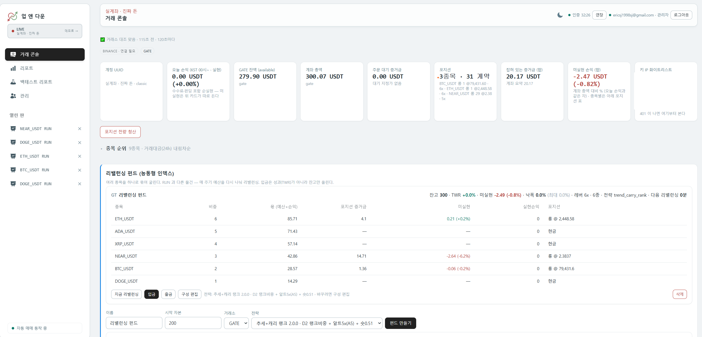 | **거래 콘솔 (코인)**. 계좌 총액, 가용 잔액, 오늘 손익, 포지션, 증거금, 미실현 손익을 카드로 보여 준다. 120초마다 원장과 거래소를 대조하고 어긋나면 배지로 알린다. 아래에는 리밸런싱 펀드가 있다. 종목과 비중, 몫, 손익을 보고 입금, 출금, 구성 편집, 리밸런싱을 할 수 있다. |
| 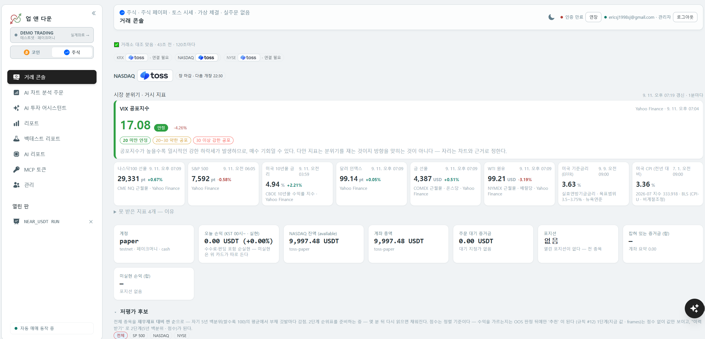 | **거래 콘솔 (주식)**. 같은 화면이 주식 묶음으로 바뀐다. 시장 칩(KRX, NASDAQ, NYSE)과 장 상태, 거시 지표 카드(VIX, 나스닥100 선물, S&P 500, 미국 10년물, 달러, 금, WTI, 기준금리, CPI), 페이퍼 계좌 카드가 보인다. 못 받은 지표는 이유와 함께 표시한다. |
| 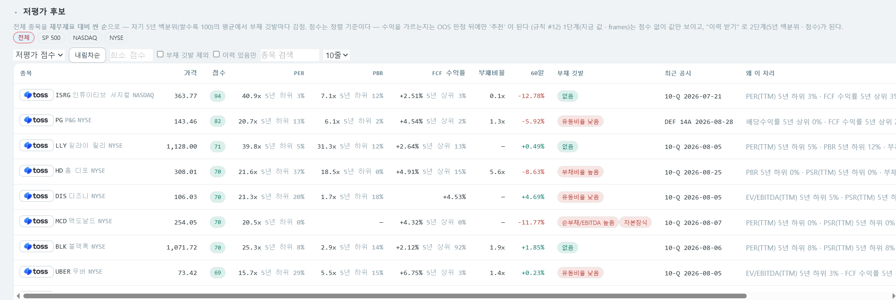 | **저평가 후보**. SEC EDGAR 재무제표로 종목을 자기 5년 백분위 대비 싼 순서로 보여 준다. 범위(전체, SP 500, NASDAQ, NYSE)를 고를 수 있고 서버가 정렬과 필터를 한다. 행마다 가격, 점수, PER, PBR, FCF 수익률, 부채비율, 60일 등락, 최근 공시, "왜 이 자리"가 있다. 점수는 정렬 기준이지 추천이 아니다. |
| 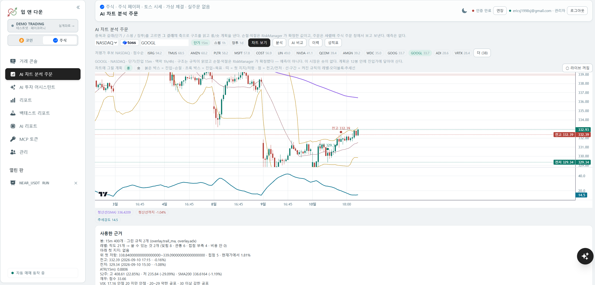 | **AI 차트 분석 주문**. 시장, 종목, 갈래(단기 15m, 스윙 1h, 장투 1d)를 고르면 차트가 바로 뜬다. "분석"을 누르면 규칙 엔진이 지지·저항, 전고·전저, 52주 범위, 재무, VIX 를 읽고 RiskManager 가 롱·숏 계획을 확정해 차트 위에 그린다. 후보가 없으면 그 이유를 적는다. "AI 비교"는 같은 봉을 AI 두 참가자에게 던져 기록하고, 뒤에 성적표로 채점한다. 주문은 사람이 주문 창에서 낸다. |
| 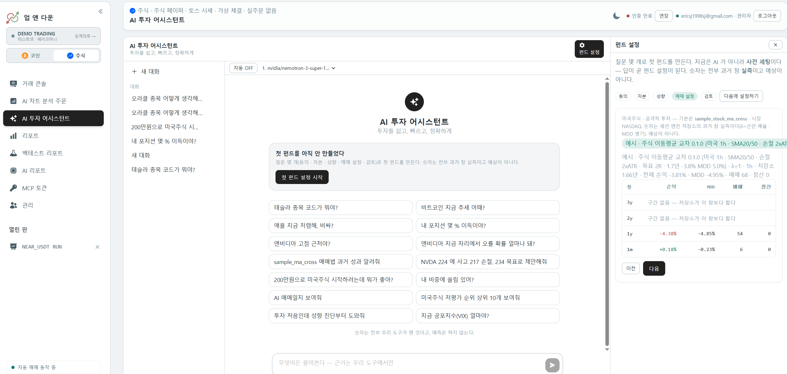 | **AI 투자 어시스턴트**. 채팅으로 종목, 시장, 재무, 내 계좌를 묻고 답을 받는 화면이다. 예시 질문 카드로 바로 시작할 수 있고 모델을 고를 수 있다. 오른쪽 펀드 설정 마법사로 투자 성향(동의, 자본, 성향, 매매 설정, 검토)을 파악하면, 그에 맞는 매매법과 종목, 분석을 추천한다. 추천에 붙는 숫자는 예상이 아니라 과거 실측이다. |
| 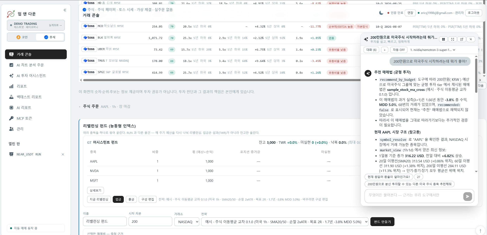 | **AI 투자 어시스턴트 채팅**. 어시스턴트는 어느 화면에서든 가장자리에 붙는다. "200만원으로 미국주식 시작하려는데" 같은 질문에 도구로 사실을 읽어 근거와 함께 답하고, 추천한 매매법의 과거 실측(기간, 손익, MDD, 추천 여부)을 같이 보여 준다. 뒤에 보이는 것은 리밸런싱 펀드 화면이다. |
| 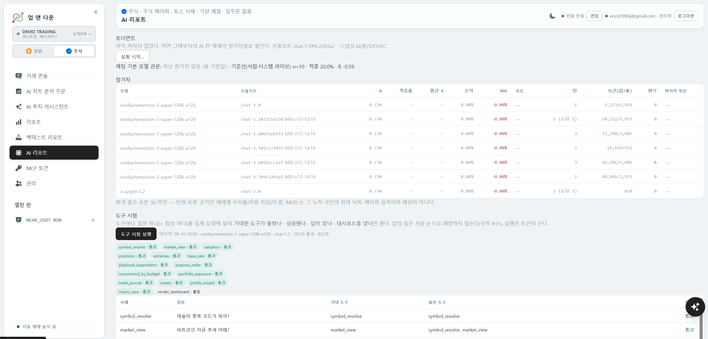 | **AI 리포트**. 모델별 토너먼트(적중률, 평균 R, 손익, MDD, 토큰, 환각)와 도구 시험 결과다. 도구 시험은 도구마다 실제 질문 하나를 실제 모델에 넣어 기대한 도구가 불렸는지만 잰다. 답의 질을 사람 눈으로 채점하지는 않는다. |
| 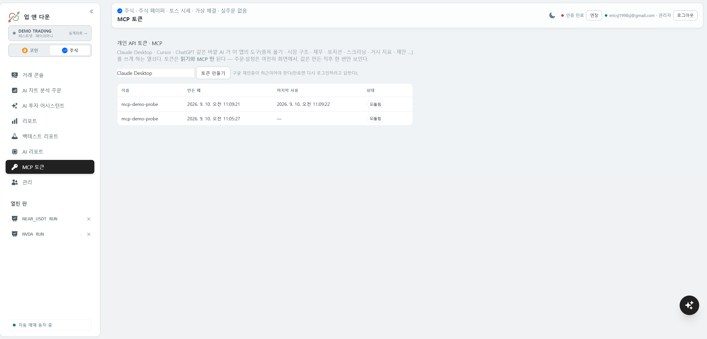 | **MCP 토큰**. Claude Desktop, Cursor, ChatGPT 가 이 앱의 도구를 쓰게 하는 개인 토큰이다. 값은 만든 직후 한 번만 보이고 해시로 저장된다. 토큰으로는 읽기와 MCP 만 되고 주문과 설정은 화면에서만 된다. |
| 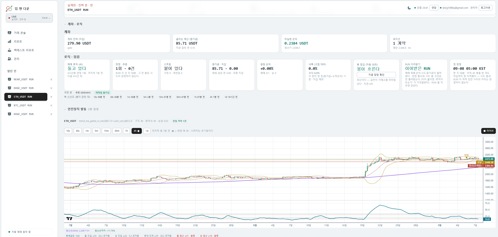 | **RUN 상세**. RUN 하나의 계좌, 로직, 점검 카드와 차트다. 진입·청산·손절 선과 지표를 원장 값 그대로 그리고, 축별 신선도와 매매법 상태를 배지로 붙인다. |
| 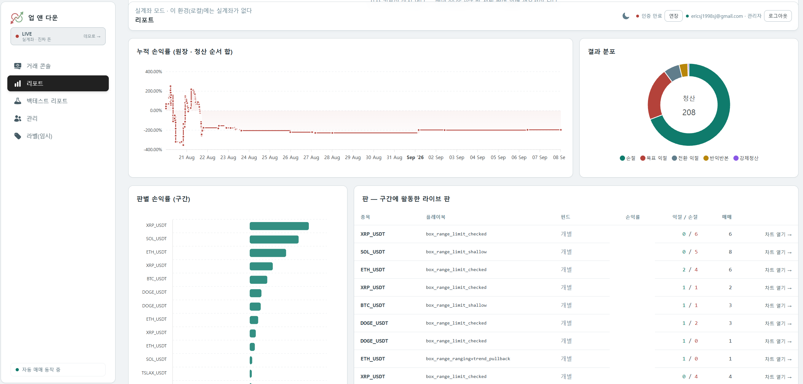 | **리포트**. 누적 손익률, 청산 결과 분포, 판별 손익률, 구간에 활동한 RUN 목록이다. 계좌, 펀드, RUN 순서로 내려간다. |
| 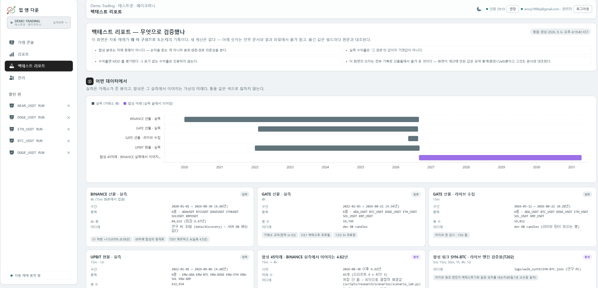 | **백테스트 리포트 (데이터)**. 실측 봉과 그 끝에서 이어지는 합성 미래를 한 시간선에 그린다. 화면은 계산하지 않고 결과 파일의 숫자를 옮기며, 옮긴 값은 빌드마다 원문과 대조된다. |
| 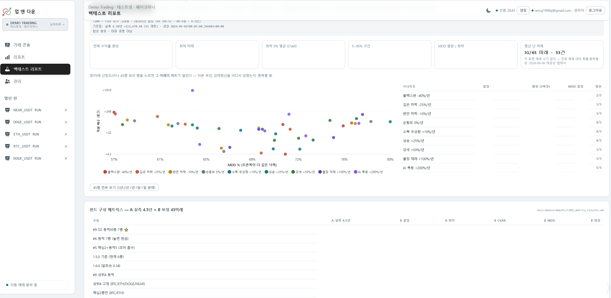 | **백테스트 리포트 (합성 45미래)**. 시나리오별 자본 배수와 MDD 산점도, 중앙값, 최악, CVaR, 청산 난 미래 수. 아래는 펀드 구성 매트릭스다. |
| 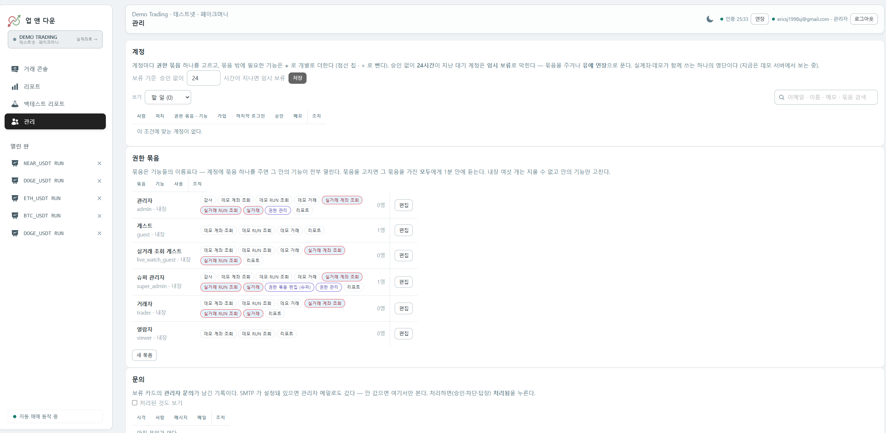 | **관리 (계정과 권한)**. 계정마다 권한 묶음 하나와 개별 기능 칩을 준다. 승인 없이 일정 시간이 지나면 임시 보류된다. |
| 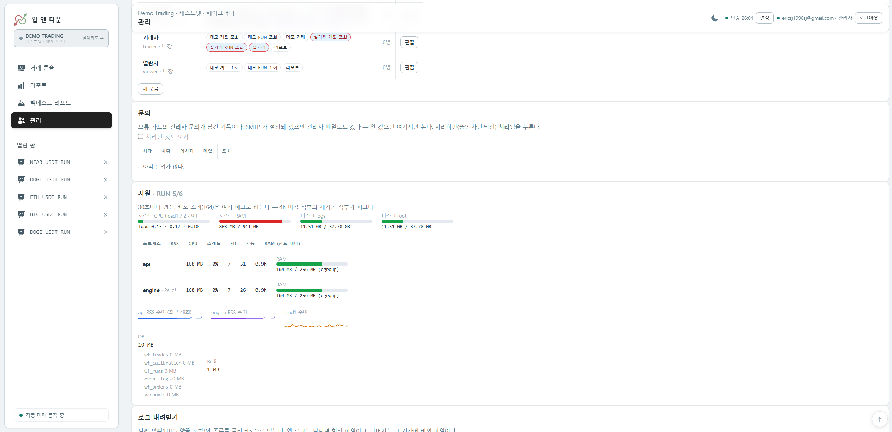 | **관리 (문의, 자원, 로그)**. 보류된 사람의 문의, 호스트 CPU·RAM·디스크, 프로세스별 자원, DB·Redis 크기, 로그 내려받기. |

## 다이어그램

모두 Mermaid 라 GitHub 에서 바로 그려진다. 기술 ERD, 시퀀스(한 걸음, 재기동, 대조, AI 채팅, 차트 분석 주문, 토스 프록시와 예열),
블루그린 배포는 [docs/architecture/diagrams.md](docs/architecture/diagrams.md)에 있다.

### 플로우차트: 봉 하나가 리포트 한 줄이 되기까지

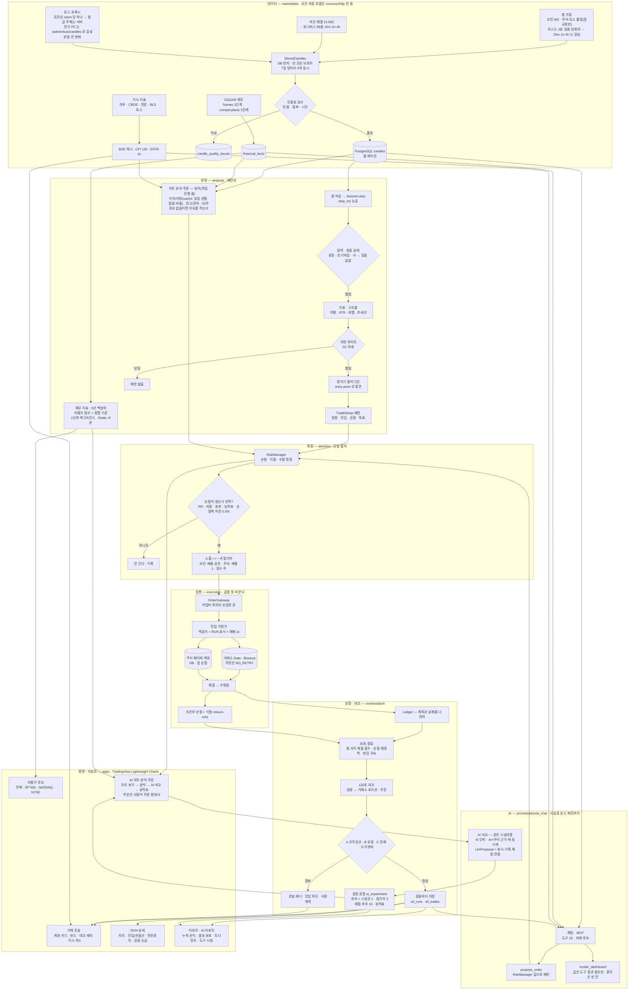

### 개념 ERD


원장(RUN, TRADE)은 앱의 의도이고, 거래소(POSITION, ORDER)는 사실이다. 둘을 잇는 것은 주문 이름에 넣은 멱등키 하나뿐이고, 점선이 대조다.
주식 RUN 은 거래소 대신 DB 의 페이퍼 계좌가 사실이다. 차트 분석 주문의 회차(ANALYSIS_CYCLE, PROPOSAL)는 실험 기록이라 주문과 이어지지 않는다.

### 스윔레인: RUN의 생명주기

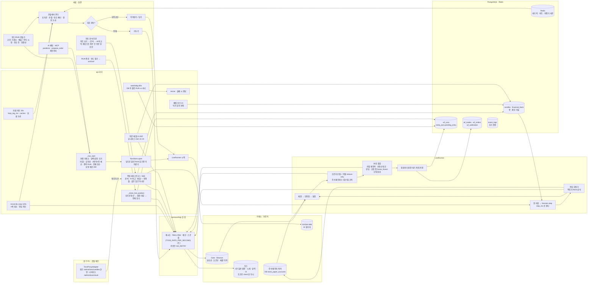

## 1. 전체 구조

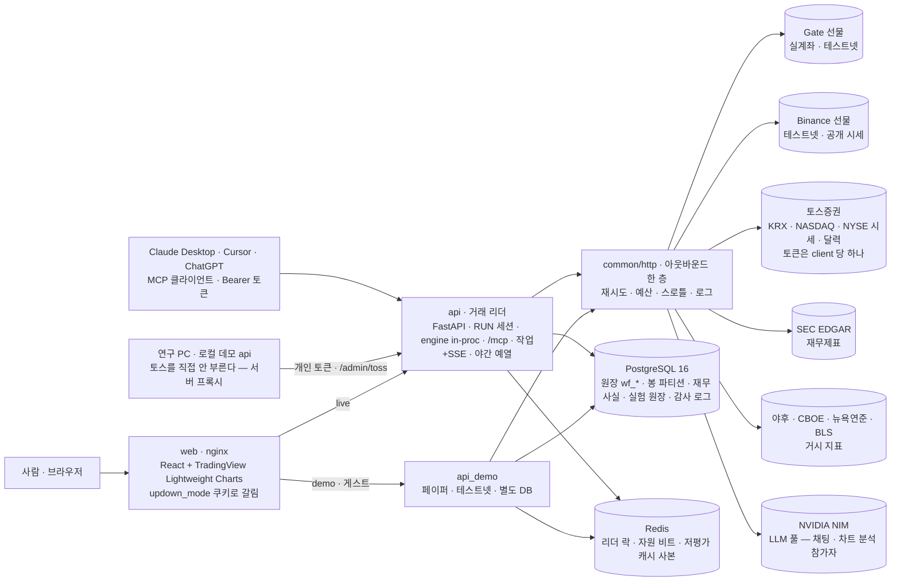

핵심 원칙은 다섯 가지다.

- 분석, 결정, 집행을 코드 계층으로 나눈다. 분석은 제안만 하고, 손절과 수량은 결정 계층이 확정하며, 집행은 값을 바꾸지 못한다. import-linter 가 역방향 의존을 막는다.
- 코인과 주식은 같은 세션 엔진을 돈다. 배율, 숏 가능 여부, 수량 단위, 휴장 같은 차이는 설정 파일(능력표와 달력)에 적고, 엔진은 시장 이름으로 분기하지 않는다.
- 실주문 어댑터는 한 파일(`execution/gateway.py`)에서만 만든다. 바깥 HTTP 호출은 한 층(`common/http/`)만 지난다. 둘 다 AST 시험이 우회를 잡는다.
- 백테스트, 테스트넷, 실계좌가 같은 `Session.step()` 을 돈다. 봉과 체결 같은 비동기 입력은 우편함으로 밖에서 넣어 코어를 결정론으로 유지한다.
- 원장은 의도이고 거래소는 사실이다. 30초와 120초 주기로 둘을 맞추되, 값을 지어내지 않는다.

토스 조회 토큰은 클라이언트당 하나뿐이라 토스를 직접 부르는 프로세스는 실계좌 서버 하나다. 연구 PC 는 개인 토큰으로 서버의 프록시를 쓴다.

### 세션 엔진은 어떻게 도나

이 프로젝트에서 "RUN"은 종목 하나에 매매법 하나를 붙여 돌리는 단위다. RUN 하나는 세션 하나를 가진다.
세션은 봉이 하나 닫힐 때마다 한 걸음을 걷는다. 한 걸음에서 하는 일은 이렇다.

1. 새 봉을 받아 지표(이동평균, ATR, RSI 등)와 구조물(지지·저항, 추세선)을 갱신한다.
2. 상위 시간축(일봉) 추세로 지금이 진입해도 되는 국면인지 본다. 아니면 이번 걸음은 여기서 끝난다.
3. 매매법(탐지기)이 진입 자리를 찾으면 "방향, 진입가, 손절가, 목표가"를 제안한다.
4. RiskManager 가 그 제안을 검사한다. 손익비가 충분한지, 비용을 빼도 남는지, 손절이 청산가 안쪽인지, 표본이 충분한지. 통과하면 수량까지 확정한다.
5. 확정된 계획을 주문으로 바꿔 거래소에 보낸다. 체결되면 손절과 익절 주문을 거래소에 걸어 둔다.
6. 걸음의 결과(계획, 주문, 체결, 손익)를 원장에 적는다.

이 여섯 단계가 백테스트, 테스트넷, 실계좌에서 같은 함수로 돈다. 다른 것은 봉이 어디서 오느냐(파일, 거래소 웹소켓, 토스 폴링)와
주문이 어디로 가느냐(가상 체결, 테스트넷, 실계좌)뿐이다. 그래서 백테스트에서 본 숫자와 실계좌의 숫자를 같은 기준으로 비교할 수 있다.

세션 자체는 시계도 난수도 거래소도 모른다. 같은 봉을 넣으면 항상 같은 결과가 나온다. 봉과 체결 통지는 바깥에서 우편함에 넣어 주고,
세션은 걸음을 시작할 때 우편함을 비우며 읽는다.

## 2. 개발 방식

문서가 코드보다 먼저 나온다. 코드는 문서에 적힌 결정을 구현하고, 측정 결과는 다시 문서로 돌아간다.

```
설계 SSoT (auto_invest_spec)  →  절대 규칙 (CLAUDE.md)  →  태스크 문서 (비공개)
        ↑                                                       ↓
   측정 결과 (비공개)   ←   코드와 시험   ←   구현 (측정 전에 판정 기준을 먼저 정한다)
```

| 원칙 | 방법 |
|---|---|
| 스펙에 없는 결정은 임의로 하지 않는다 | 애매하면 태스크 문서의 "착수 전 확정 필요" 표에 올리고 사람이 정한다. 결정에는 번호를 붙여 기록에 남긴다. |
| 한 태스크는 한 파일 | 목적, 선행 조건, 완료 조건을 적는다. 틀린 판단은 지우지 않고 "대체됨"을 붙인다. |
| 판정 기준을 측정 전에 정한다 | 필요 승률표, 표본 하한 30, 봉인 구간을 결과를 보기 전에 고정한다. 결과가 좋게 나오는 것 자체를 의심한다. |
| 기록은 지우지 않는다 | 계획 이력, 측정 스크립트, 숫자의 원문을 보관한다. 재현이 안 된 것도 적는다. |
| AI 협업 규약 | [CLAUDE.md](CLAUDE.md)가 문서 우선순위, 절대 규칙, 코딩 규약을 정한다. AI 는 가격, 수량, 타이밍을 정하지 않고 실계좌 배포는 사람이 허가한다. |
| docstring | 공개 함수와 클래스에 한국어 Google 스타일 docstring 을 단다. "무엇"이 아니라 "왜"를 적는다. 절 누락은 CI 가 잡는다. |
| 브랜치와 버전 | `main` 은 배포된 것, `dev` 는 개발 중인 것. 배포는 `main` 에서만 하고 태그 `v<버전>` 이 서버에 떠 있는 버전이다. |
| 공개 저장소 | 매매법은 비공개, 플랫폼은 공개다. 커밋마다 훅이 시크릿과 매매법 식별자를 검사하고, 통과하면 공개 저장소에 같은 커밋을 올린다. |

## 3. 계층과 책임

```
common → marketdata → llm → portfolio → analysis → decision → execution → orchestration → apps
(왼쪽이 아래. 위 계층만 아래 계층을 import 할 수 있다)
```

| 계층 | 하는 일 | 하지 않는 일 |
|---|---|---|
| `common` | 도메인 모델, 설정, 로깅, DB, 락, 권한 판정, HTTP 층, 캐시 | 시세나 주문 같은 도메인 I/O |
| `marketdata` | 거래소와 데이터 출처 I/O. Gate, Binance, Upbit, 토스(직접과 프록시), EDGAR, 거시 지표, 봉 저장소 | 판단, 주문 값 결정 |
| `llm` | 모델 풀, NVIDIA NIM 연결, `LlmProposal` | `decision`, `execution` import |
| `portfolio` | 사실 집계(수익률, 현금흐름). 읽기 전용 | 목표 비중 |
| `analysis` | 지표, 구조물, 셋업 탐지, 플레이북, 레벨 거르기, 재무 지표. 제안만 한다 | 손절과 수량 확정 |
| `decision` | RiskManager. 손절, 익절, 수량을 확정한다 | 거래소 호출 |
| `execution` | OrderGateway. 어댑터를 얻는 유일한 문. 주식 페이퍼 어댑터 | 값을 바꾸는 것 |
| `orchestration` | 백테스트, 모의 라이브, 대조, 리포트, AI 채팅 루프, 차트 분석 주문, 실험 기록, 리밸런서. 조립만 한다 | 자체 판단 로직 |
| `apps` | FastAPI(라우트 161개, MCP, 작업과 SSE, 토스 프록시, 야간 예열), 스케줄러 | 도메인 로직 |

우회하면 위험한 것은 문을 하나로 두고 기계로 지킨다.

- 실주문 어댑터는 `execution/gateway.py` 에서만 만든다. 조회 어댑터는 `marketdata/provider.py` 에서만 만든다. 다른 곳에서 만들면 AST 시험이 실패한다.
- 바깥 HTTP 는 `common/http.Outbound` 만 `httpx.AsyncClient` 를 만든다. 예외 파일 목록은 시험이 잠근다.
- 손절, 익절, 수량은 RiskManager 가 정하고 러너는 옮기기만 한다. 손절선은 올리는 것만 허용된다.
- 저장은 `RunStore` 한 곳에서만 한다.
- 임계값은 코드가 아니라 `config/*.yml` 에 둔다.
- 금지 계약 세 개. 분석은 집행을 import 하지 못한다. 탐지기는 이행률을 import 하지 못한다(미래 참조 차단). LLM 은 결정과 집행을 import 하지 못한다.

## 4. 매매법 붙이기

매매법은 파일 셋과 등록 한 줄로 붙는다. 절차와 점검표는 [strategy_authoring.md](docs/platform/strategy_authoring.md)에 있다.

| 무엇 | 어디 | 견본 |
|---|---|---|
| 탐지기. 봉을 받아 방향, 진입, 손절, 목표를 제안한다 | `src/updown/analysis/detectors/<rule_id>.py` 의 `register()` | [sample_ma_cross.py](src/updown/analysis/detectors/sample_ma_cross.py) |
| 룰 설정. 문턱값과 배수 | `config/rules/<rule_id>.yml` | [sample_ma_cross.yml](config/rules/sample_ma_cross.yml) |
| 플레이북 선언. 시간축, 국면, 셋업, 배율, 리스크 | `config/playbooks.yml` | [playbooks.yml](config/playbooks.yml) |
| 등록 | `pyproject.toml` 의 `[project.entry-points."updown.detectors"]` | 한 줄 |

플랫폼은 entry point 로 탐지기를 발견만 하고 이름을 알지 못한다. 매매법을 별도 패키지로 두면 `pyproject.toml` 한 줄로 붙는다.
지표는 직접 구현한 것(`analysis/indicators`)만 쓴다. 라이브러리에 맡기지 않는 이유는 재현성이다.

## 5. 연결된 거래소와 데이터

| 출처 | 무엇 | 주문 | 어디에 쓰나 |
|---|---|---|---|
| Gate.io | USDT 무기한 선물 | 실계좌(`LIVE_ORDERS=1`)와 테스트넷 | 실계좌 운용, 서버 데모 |
| Binance | USDT 무기한 선물 | 테스트넷만 | 로컬 데모, 교차 검증 |
| Upbit | KRW 현물 | 조회만 | 비용 실측, 백테스트 자료, 환율 |
| 토스증권 | KRX, NASDAQ, NYSE 시세(1분봉과 일봉), 종목 정보, 거래 유의사항, 휴장일, 환율 | 없음. 주식은 페이퍼 계좌로만 | 주식 RUN, 저평가 후보, 차트 분석 주문 |
| SEC EDGAR | 재무제표 | 없음 | 저평가 점수, `valuation` 도구 |
| 야후, CBOE, 뉴욕연준, BLS | VIX, 지수 선물, 금리, 달러, 원자재, CPI | 없음 | 거시 카드, `macro_view` 도구 |
| NVIDIA NIM | LLM | 없음 | 채팅 어시스턴트, 차트 분석 AI 참가자 |
| Google | OAuth 로그인 | 없음 | 인증 |

- 시장 이름은 `Market` 열거형 한 곳에 있다. 비용표(`config/costs.yml`)는 시장마다 블록이 있어야 하고 없으면 예외다.
- 어댑터는 능력별 Protocol(`StopAware`, `PositionAware` 등)로 선언하고, 러너는 그 능력이 있는지 물어본 뒤 쓴다.
- 조회는 항상 라이브 시장을 보고, 주문만 환경(실계좌 또는 테스트넷)을 따른다.
- 토스 토큰은 클라이언트당 하나다. 두 프로세스가 각자 발급하면 서로 무효화되므로, 서버만 직접 부르고 연구 PC 는 서버 프록시를 쓴다.
- 모든 바깥 호출은 `common/http` 한 층을 지난다. 재시도, `Retry-After`, 요청 예산, 스로틀, 로그를 한 곳에서 처리한다.

## 6. 주식 · 재무 · 거시

코인에서 검증한 세션 엔진을 주식으로 넓힌 층이다.

| 조각 | 설명 | 위치 |
|---|---|---|
| 봉 | 토스는 1분봉과 일봉만 준다. 15m, 1h, 4h 는 서버가 합성한다. `StoredCandles` 가 DB 를 먼저 보고 빈 구간만 브로커에서 받는다(7일 단위, 4개 동시). | `orchestration/walkforward/stored_candles.py` |
| 토스 프록시 | 토스를 부르는 것은 실계좌 서버 하나다. 서버가 `/admin/toss/result`(원시 조회)와 `/admin/toss/candles`(합성한 봉을 한 번에)를 열어 두고, 연구 PC 는 개인 토큰으로 이것을 쓴다. 요율은 `TOSS_RATE_PER_SECOND` 로 조절한다. | `apps/api/toss_proxy.py`, `marketdata/toss/proxy_*.py` |
| 야간 예열 | 매일 21:00 UTC 에 서버가 유니버스 99종의 15m, 1h, 4h 봉을 미리 만들어 둔다. 낮에 처음 누르는 클릭이 30~40초에서 1~2초로 줄었다. | `apps/api/warm_candles.py` |
| 휴장과 조기마감 | 뉴욕 현지시각 기준 달력을 두고 토스 달력과 대조한다. 모르는 날은 `UNKNOWN` 으로 두고 열렸다고 말하지 않는다. 장중 거래정지와 VI 는 토스 유의사항으로 본다. | `common/domain/session.py` |
| 페이퍼 계좌 | 주식 주문은 DB 페이퍼 계좌로만 나간다. 정수 주, 배율 1, 롱만, 장중만, 갭 손절 규칙. 실주문 스위치를 켜면 예외로 멈춘다. | `execution/stock_paper.py` |
| 재무 1단계 | EDGAR `frames` 로 "지금 값"을 받는다. 백그라운드에서 준비하고 Redis 에 6시간 사본을 둬서 배포 직후에도 비지 않는다. | `apps/api/fundamentals.py` |
| 재무 2단계 | `companyfacts` 이력으로 PER, PBR, PSR, EV/EBITDA, FCF 수익률의 5년 백분위를 구하고, 부채 깃발을 감점해 점수를 만든다. 순위표도 백그라운드로 만들고 24시간 사본을 둔다. | `analysis/fundamentals/` |
| 거시 카드 | VIX, 나스닥100 선물, S&P 500, 10년물, 달러, 금, WTI, 원달러, 기준금리, CPI, 코스피, 코스닥. 실패한 지표는 이유를 같이 보여 준다. | `marketdata/macro` |

재무를 두 단계로 나눈 이유. `frames` 는 한 지표를 전 회사 기준으로 한 번에 주고, `companyfacts` 는 한 회사의 전 이력을 준다. 백분위는 이력이 있어야 나오는데 회사마다 수 MB 라, 100종만 미리 받고 나머지는 사람이 "이력 받기"를 누를 때 받는다.

첫 적재가 느린 이유. 1h 봉 400개를 만들려면 1분봉 약 4만 개, 곧 200페이지를 받아야 한다. 초당 5건이면 40초다. 그래서 서버가 밤에 미리 채우고, 로컬은 서버가 합성한 봉을 한 번에 받는다.

## 7. AI 차트 분석 주문

"이 종목, 지금 어디서 사고 어디서 손절해야 하나"를 묻는 화면이다. 답을 세 명이 낸다.
규칙 엔진(우리가 만든 구조 분석), AI 단독(차트만 보고), AI + 근거(차트와 우리 분석을 같이 보고).
셋의 답을 같은 봉 위에 나란히 두고, 시간이 지난 뒤 누가 맞았는지 같은 기준으로 채점한다.
목적은 "AI 가 우리 규칙보다 나은가"를 감이 아니라 성적표로 확인하는 것이다.

**갈래.** 먼저 어떤 호흡으로 볼지 고른다. 단기는 15분봉, 스윙은 1시간봉, 장투는 일봉이다.
갈래마다 계획이 유효한 봉 수와 요구 손익비가 다르며, 이 값은 [config/analysis_buckets.yml](config/analysis_buckets.yml)에 있다.

**차트 보기.** 종목을 고르면 그 갈래의 봉과 이동평균, ADX 가 바로 뜬다. 봉은 DB 에 있는 것을 먼저 쓰기 때문에
밤에 미리 만들어 둔 종목은 1초 안에 뜬다. 저평가 후보 칩을 누르면 그 종목으로 바로 바뀐다.

**분석.** 버튼을 누르면 서버가 작업을 하나 띄우고, 무엇을 하는 중인지 줄 단위로 보여 준다. 순서는 이렇다.

1. 봉을 읽는다. 갈래의 진입 축과 그 위 맥락 축, 두 축을 본다.
2. 지지·저항 후보를 찾는다. 그리고 걸러 낸다. 너무 오래돼 잊힌 것, 종가가 이미 뚫고 지나간 것, 닿은 횟수가 적은 것, 현재가와 너무 가까워 비용 안에 있는 것은 버린다.
3. 전고와 전저, 52주 고가와 저가, ATR(평균 변동폭)을 구한다.
4. 재무(저평가 점수, PER, 부채 깃발)와 VIX 를 읽는다. 이것은 방향을 정하지 않고 참고로만 적는다.
5. 남은 레벨로 롱 계획과 숏 계획 후보를 만들고, RiskManager 가 검사한다. 손절 폭이 너무 좁지 않은지, 손익비가 갈래의 기준을 넘는지, 현물이면 숏은 버린다.
6. 통과한 계획을 차트 위에 그린다. 진입, 손절, 1차 익절, 목표 선과 각각의 진입 대비 %, 손익비가 라벨로 붙는다. 전고와 전저는 점선으로 같이 그린다.

"사용한 근거" 카드에 위 단계에서 무엇을 봤고 어떤 레벨이 왜 버려졌는지를 적는다.
그래서 후보가 없을 때 "오류인지, 원래 진입 자리가 없는 건지"를 화면에서 바로 알 수 있다.

**AI 비교.** 버튼을 누르면 같은 순간의 봉 묶음(5분봉부터 일봉까지, 그리고 주봉과 월봉)을 한 번 고정한다.
이것을 AI 두 참가자에게 동시에 보낸다. AI 단독은 봉만 받고, AI + 근거는 봉과 위 분석의 근거 줄을 같이 받는다.
둘의 답과 규칙 엔진의 계획을 한 회차로 기록한다. 같은 봉을 보지 않은 답은 비교가 아니므로 봉 묶음의 지문도 같이 남긴다.
하루에 낼 수 있는 회차에 상한이 있고, 10분 안에 같은 종목을 다시 누르면 새로 부르지 않고 이전 회차를 보여 준다.

**채점.** 회차가 익으면(갈래의 유효 봉 수만큼 시간이 지나면) 1시간마다 도는 채점 루프가 판정한다.
익절에 먼저 닿았으면 성공, 손절에 먼저 닿았으면 실패, 둘 다 안 닿고 기한이 지나면 만료다.
성적표는 참가자 × 갈래 × 시장으로 적중률과 평균 R 을 보여 주고, 표본이 30개 미만이면 회색으로 흐리게 둔다.

**주문.** "이 계획으로 주문"을 누르면 주식 주문 창에 값이 채워진 초안이 열린다. 보내는 것은 사람이다.
AI 의 답이 그대로 주문이 되는 경로는 없다. 코드 계층에서도 LLM 모듈은 결정과 집행 모듈을 import 하지 못한다.

코드 위치는 `apps/api/chart_order.py`, `orchestration/chart_order/`, `orchestration/ai_experiment/`, `web/src/AiChartOrder.tsx` 다.

## 8. AI 어시스턴트와 MCP

채팅 창에 한국어로 물으면 AI 가 답한다. 다만 AI 는 가격이나 지표를 기억이나 추측으로 말하지 않는다.
숫자가 필요하면 반드시 "도구"를 불러 우리 서버의 데이터를 읽고, 그 결과로만 답한다.
그래서 답의 끝에는 어떤 도구를 봤는지 한 줄이 붙는다.
설계는 [ai_agents_and_mcp.md](docs/architecture/ai_agents_and_mcp.md), 실제로 시험한 대화는 [ai_chat_scenarios.md](docs/architecture/ai_chat_scenarios.md)에 있다.

### 질문 하나가 처리되는 순서

1. 사용자가 "애플 지금 살만 해?"라고 묻는다.
2. 모델이 질문을 읽고 어떤 도구가 필요한지 정한다. 이 경우 종목 이름을 코드로 바꾸는 도구부터 부른다.
3. 서버가 그 도구를 실행하고 결과(JSON)를 모델에 돌려준다. 도구는 모두 우리 코드이고 실제 DB 와 거래소 데이터를 읽는다.
4. 모델은 결과를 보고 더 필요한 도구를 부른다. 매수 여부를 물었으니 시장 구조, 고점·저점 위치, 재무 셋을 한 번에 부른다. 이 왕복은 최대 6번이다.
5. 모델이 답을 쓴다. 숫자는 도구 결과에서만 가져오고, 예측은 하지 않고 지금의 구조만 설명한다. 매매법 성과를 말할 때는 반드시 MDD 를 같이 말한다.
6. 숫자가 여럿인 답이면(비교, 순위, 비중) 마지막에 카드와 표의 명세를 낸다. 명세의 값은 "어느 도구의 어느 키"라는 참조만 허용한다. 참조가 없는 칸은 빈 칸으로 두고 환각으로 센다.
7. 대화 내용, 도구 결과, 명세를 DB 에 저장한다. 사용자에게는 답과 근거, 다음에 물어볼 만한 질문 3개를 돌려준다.

주문을 부탁하면 4단계에서 주문 제안 도구를 부른다. 이 도구는 RiskManager 로 진입, 손절, 목표를 확정해 돌려주기만 한다.
화면에 제안 카드가 뜨고, 사람이 확인해야 RUN 이 열린다.

### 도구 15개

| 도구 | 사용자가 이런 말을 하면 | 무엇을 돌려주나 |
|---|---|---|
| `symbol_resolve` | "테슬라", "삼전", "비트코인" | 종목 코드와 시장. 이름을 코드로 바꾸는 첫 단계다. |
| `market_view` | "지금 어때", "추세", "지지선" | 시간축별 종가와 변화, 이동평균 거리, RSI, ATR, 전고·전저, 현재가 바로 위 저항과 아래 지지. 예측이 아니라 지금 구조다. |
| `valuation` | "저렴해?", "고평가야?", "PER" | PER, PBR, PSR, EV/EBITDA, FCF 수익률의 5년 백분위, 부채 깃발, 저평가 점수, 공시 링크. |
| `extremes` | "고점이야?", "많이 빠졌지?" | 52주 고가·저가 대비 거리, 200일선과의 거리, RSI 가 극단인지. |
| `base_rate` | "오를까?", "확률은?" | 과거에 지금과 비슷한 자리(52주 위치, 200일선 거리, 이평 방향)였던 봉들이 N봉 뒤 올랐던 비율과 표본 수. "확률"이 아니라 과거 빈도라고 말하게 돼 있다. |
| `positions` | "내 포지션", "얼마 벌었어" | 거래소가 말하는 포지션, 잔고, 걸어 둔 손절 주문, 펀드. |
| `playbook_expectation` | "이 매매법 성과는?" | 매매법 하나의 과거 실측. 기간, 손익, MDD, 매매 수, 청산 분포. 예상이 아니라 과거다. |
| `propose_order` | "사줘", "진입해", "손절 잡아" | RiskManager 가 확정한 진입, 손절, 1차 익절, 목표. 주문은 내지 않는다. |
| `recommend_by_budget` | "200만원으로 뭐 사?" | 예산과 성향(안전, 균형, 공격)에 맞는 매매법과 그 과거 실측, 최소 주문 단위, 저평가 후보 3개. |
| `portfolio_exposure` | "너무 쏠렸나?", "분산" | 코인·국내·해외 갈래별 비중, AI RUN 비중, 쏠림 경고. |
| `trade_journal` | "지난 매매 복기", "AI 성적" | 끝난 AI 매매의 결과, 손익, R, 어떤 근거가 맞았는지. |
| `screen` | "저평가 상위 10", "싼 순으로" | 서버가 저평가 점수, PER, PBR, 모멘텀, 시총으로 정렬한 상위 N. 순위는 코드가 매기고 모델은 읽기만 한다. |
| `macro_view` | "VIX", "시장 분위기", "환율" | VIX, 나스닥100 선물, S&P 500, 10년물, 달러, 금, WTI, 원달러, 기준금리, CPI, 코스피, 코스닥. |
| `render_dashboard` | (모델이 마지막에 스스로 부른다) | 카드와 표의 명세. 값은 이번 턴 도구 결과의 참조만 허용한다. |
| `profile_wizard` | "처음인데 뭐부터", "성향 진단" | 채팅 안에 온보딩 카드(동의, 자본, 성향, 매매법, 검토)를 띄운다. 단계는 카드 버튼이 넘긴다. |

도구마다 영어 이름과 함께 한국어 설명과 유사어 목록을 모델에 준다. 어떤 도구를 부를지는 모델이 정하고, 별도의 의도 분류기는 없다.

### 그 밖에

- **모델.** NVIDIA NIM 의 여러 모델을 설정 파일에 후보로 두고, 하나가 실패하면 다음 모델로 넘어간다. 모델별 비용과 정확도는 AI 리포트에 나온다.
- **시험.** 도구마다 실제 질문 하나를 두고 실제 모델과 실제 도구로 돌린다. 기대한 도구가 불렸는지, 성공했는지, 답이 나왔는지만 본다. 답의 내용을 사람이 채점하지는 않는다. 최근 결과는 16개 중 15개 통과다.
- **MCP.** 같은 도구 13개를 MCP 라는 표준 방식으로 바깥에 연다. Claude Desktop, Cursor, ChatGPT 에 이 서버를 등록하면 그 AI 가 우리 도구를 부를 수 있다. 인증은 개인 토큰이고, 토큰으로는 읽기만 되며 주문과 설정은 화면에서만 된다.

## 9. 백테스트 검증

출발점은 "성과가 좋아 보이면 버그를 의심한다"이다. 방법과 결함 목록은 backtest_validity.md.

| 단계 | 내용 |
|---|---|
| 봉인 구간을 먼저 자른다 | 개발 구간(2022-01~2025-06)과 봉인 구간(2025-07~2026-08)을 코드를 고치기 전에 고정했다. 결과를 보고 구간을 정하면 자기 자신을 채점한 숫자가 된다. |
| 판정 기준을 먼저 정한다 | 필요 승률표, 표본 하한 30, MDD 병기를 측정 전에 선언한다. 5분봉은 비용을 넣으면 필요 승률이 100% 를 넘어 산술적으로 불가능했다. |
| 비용은 실측한다 | 슬리피지와 수수료를 실제로 재서 `config/costs.yml` 에 넣는다. 판정 근거는 손익분기 슬리피지 대비 여유 배수다. |
| 미래 참조를 잡는다 | `lookahead.py` 가 미래 참조를 자동으로 찾고, 탐지기가 이행률을 import 하지 못하게 계약으로 막는다. |
| 통계 | 신호를 동시 포지션 1개로 직렬화하고, 다음 봉 시가에 진입한다. 블록 부트스트랩과 무작위 진입 대조로 검정한다. |
| 검증기를 속여 본다 | 알려진 결함을 일부러 넣어 검사기가 잡는지 확인한다. |
| 합성 미래 45개 | 실측 성질로 4년치 미래 45개를 만들어 매매법을 돌린다. 미래 예측이 아니라 강건성 검사다. |
| 같은 코드인지 대조 | 합성 봉을 라이브 러너에 흘려 백테스트 엔진과 결과를 비교했다. 소수점까지 일치했다. |
| 연구 엔진은 채택 근거가 아니다 | 연구용 엔진 숫자는 후보를 거르는 데만 쓴다. 채택은 세션 엔진으로 재현한 뒤에만 한다. |

측정 결과와 매매법은 이 저장소에 없다. 화면의 근거 탭은 결과 묶음(`config/evidence/`)의 숫자를 옮겨 보여 주는데, 공개본에는 묶음이 없어 비어 있다. 자기 매매법을 측정해 묶음을 만들면 채워진다.

### 백테스트를 직접 돌리려면

백테스트 엔진은 라이브와 같은 `Session` 이다. 구간을 봉인하고(미래를 못 보게) 그 안을 걸어간다.

```bash
# 세션 열기. start 를 안 주면 시작점이 랜덤이다(시드로만 재현). 잘 나올 구간을 사람이 고르지 못하게 한 것이다.
curl -X POST localhost:8000/walkforward/start -H 'content-type: application/json' \
  -d '{"playbook":"sample_ma_cross","symbol":"BTC_USDT","market":"GATE","cash":"10000","days":30,"seed":7}'
# 걸어가기, 상태, 스냅샷(차트용)
curl -X POST localhost:8000/walkforward/step/<session_id>
curl localhost:8000/walkforward/state/<session_id>
curl localhost:8000/walkforward/snapshot/<session_id>
```

응답에는 원장(매매, 손익, 손절, 수수료, 펀딩), 깔때기(판정 → 진입 → 청산 수), 국면이 들어 있다. 데이터가 모자라면 열리지 않는다.
한 RUN 을 끝까지 돌려 보려면 `uv run python scripts/dev/smoke_walkforward.py 2024-03-02 7` 을 쓴다.
견본 매매법이 진입부터 청산까지 도는지는 [tests/test_sample_end_to_end.py](tests/test_sample_end_to_end.py)가 확인한다.

## 10. 실거래 안전장치

한 RUN 이 한 걸음을 어떻게 걷고, 무엇이 어디서 막히는지. 전체 절차는 [ledger_reconciliation.md](docs/architecture/ledger_reconciliation.md).

**RUN 을 띄우기 전에 한 번 확인한다.** 연결된 거래소인가, 같은 종목의 열린 RUN 이 없나, 호가창이 그 금액을 받나, 예산으로 최소 계약을 살 수 있나, 남은 주문은 없나. 하나라도 걸리면 띄우는 순간 막는다.

**걸음마다** `Session.step()` 은 동기이고 순수하다. 거래소를 부르지 않는다. 계획을 주문으로 바꿀 때 정수 계약 때문에 생기는 오차를 기록한다. 주문 이름에 멱등키를 넣고, 재시도 전에는 체결 여부를 먼저 조회한다. 요청과 응답 원문을 DB 에 남긴다.

**체결 뒤에는** 거래소에 조건부 손절과 익절 주문을 건다. 가격은 원장이 정하고 러너는 옮기기만 한다. "걸었다"를 기억하지 않고 30초마다 거래소에 물어 없으면 다시 건다. 갈아 끼울 때는 새것을 먼저 걸고 옛것을 나중에 지운다. 원장 저장이 실패해도 손절과 청산은 나간다.

**대조는 두 주기로 한다.**

| 주기 | 무엇 | 규칙 |
|---|---|---|
| 30초 | 원장은 열림인데 거래소 포지션이 0이면 체결 이력에서 청산가를 찾아 마감 | 못 찾으면 닫지 않고 감사 항목으로 넘긴다 |
| 120초 | 거래소의 포지션, 주문, 청산 이력을 받아 원장과 비교. 무주공산, 유령 원장, 잔재, 부분 무방비로 분류 | 반쪽 대조는 성공으로 세지 않는다. 못 센 값은 0이 아니라 `UNKNOWN` |

**서버가 죽으면** 거래소에 걸어 둔 조건부 손절이 마지막 방어선이다. 컨테이너는 자동 재시작하고, 리더 락은 5초 안에 다른 슬롯이 이어받는다. 재기동하면 포지션과 조건부 주문에서 계획을 되읽어 RUN 을 입양하고, 손절이 없으면 입양을 거부한다. Redis 나 DB 가 끊겨도 손절과 청산은 나가고 신규 진입만 멈춘다.

실제로 겪은 사고와 수정 기록은 비공개 문서에 있다.

## 11. 운영

| 항목 | 내용 |
|---|---|
| 인프라 | Lightsail 도쿄 1 GB 하나. Docker Compose, Caddy TLS, 블루그린 슬롯 두 개(`api`, `api_b`), 데모 API, 엔진, PostgreSQL, Redis, 백업 |
| 서버 명령 | 파일로만 보낸다. `bash scripts/ops/remote.sh scripts/ops/status.sh`. 인라인 명령은 따옴표가 깨진다. |
| 점검 도구 | `status.sh`, `probe_post_deploy.sh`, `probe_toss_token.sh`, `probe_toss_proxy.sh`, `probe_value_screen.sh`, `probe_warm.sh`. 모두 이름과 유무만 출력하고 시크릿은 찍지 않는다. |
| 관측 | 콘솔 배너(대조 결과, 자가 점검), `/admin/resources`, `/admin/logs`, nginx 접근 로그의 슬롯 표시 |
| 로그 | structlog JSON, UTC, 고정 필드. 로그 실패가 기동을 막지 않는다. `event_logs` 는 INSERT 만 되는 권한 |
| 리포트 | 일간 성과 메일. 자동, 수동, 미리보기, 대시보드가 같은 본문을 쓴다. |
| 백업 | `pg_dump` 주기 실행과 Lightsail 스냅샷. 복구는 `docker/restore.sh` |
| 토스와 연구 PC | 서버만 토스를 직접 부른다. 연구 PC 는 `.env.dev` 의 `TOSS_PROXY_URL`, `TOSS_PROXY_TOKEN` 으로 프록시를 쓴다. |
| 자원 | 콘솔 폴링 10초, 서버 TTL 캐시, 저평가 준비는 백그라운드와 Redis 사본 |

env 값(`LIVE_ORDERS`, 키, `UPDOWN_MARKETS`, `TOSS_RATE_PER_SECOND`)은 사람이 서버에서 바꾼다. 스크립트는 이미지 태그만 바꾼다.
화면 문제는 서버 프로브가 아니라 nginx 접근 로그부터 본다.

## 12. 로그인과 보안

| 영역 | 내용 |
|---|---|
| 로그인 | Google OAuth 만 쓴다. `state` 를 쿠키에 굽고 대조해 로그인 CSRF 를 막는다. |
| 세션 | 서명 쿠키. `HttpOnly`, `Secure`, `SameSite=Lax`. 실계좌 환경에서 평문 HTTP 면 로그인을 거부한다. |
| 재인증 | 돈이 움직이는 클릭은 1시간 안의 인증을 요구한다. |
| 역할 | pending → viewer → trader → admin, 그리고 guest. 가입은 관리자 승인 뒤 viewer 가 되고, 주문은 trader 로 한 번 더 올려야 한다. 삭제는 소프트 삭제다. |
| 개인 토큰 | `/tokens` 에서 만들고 해시로 저장한다. 읽기와 MCP 만 된다. 관리자 토큰만 토스 프록시를 쓸 수 있다. |
| 요율 | 거래 POST 는 사용자당 분당 30회. 같은 종류 작업은 동시에 2개. |
| 데모 격리 | 게스트와 데모는 별도 프로세스, 별도 DB, 라이브 키 없는 환경에서 돈다. |
| 실주문 문 | `APP_ENV=live`, `LIVE_ORDERS=1`, 키. 하나라도 빠지면 테스트넷이다. |
| 시크릿 | `.env*` 는 커밋하지 않는다. pre-commit 과 공개 저장소 동기화가 스캔한다. 서버 주소는 비추적 파일에만 둔다. 로그에는 `SecretStr` 이 가려져 남는다. |
| 컨테이너 | 비루트 사용자, `.dockerignore` 화이트리스트, nginx 보안 헤더 |
| 감사 | `event_logs` 는 INSERT 만. `trace_id → proposal_id → order_id → position_id` 체인 |

미비한 것(인증 실패 회로차단, 키 회전 절차, 의존성 취약점 점검)은 [architecture_security_audit.md](docs/architecture/architecture_security_audit.md)에 적어 두었다.

## 13. 배포와 CI

**CI.** ruff, ruff format, pyright strict, import-linter, 문서 링크 검사, docstring 검사, pytest, tsc, vitest 순서다.
같은 순서를 로컬에서 `bash scripts/dev/ci_local.sh` 로 돌린다. GitHub Actions 는 결제 한도로 멈춰 있어 지금은 커밋 메시지에 `[skip ci]` 를 붙이고 로컬 점검을 배포 조건으로 쓴다.
외부 API 를 부르는 통합 시험은 CI 에서 뺀다. 픽스처는 손으로 쓴 가짜가 아니라 실측 응답이다.

**배포.** `main` 에서 `bash scripts/deploy/ship.sh` 를 사용자 허가 뒤에만 돌린다.

1. 작업 트리가 깨끗한지, Docker 가 떠 있는지 확인한다.
2. 로컬에서 이미지를 빌드한다. 1 GB 서버는 빌드가 안 된다.
3. `docker save` 로 이미지를 보내고 서버에서 `docker load` 한다.
4. `.env.live` 의 `IMAGE_TAG` 한 줄만 바꾸고 `bluegreen.sh` 를 돌린다.
5. 태그 `v<버전>` 을 push 한다. 같은 태그가 있으면 거절한다.
6. 밖에서 `/health` 와 `probe_post_deploy.sh` 로 확인한다.

**블루그린.** 목표는 거래 리더가 끊기지 않는 것이다. 빈 슬롯을 새 이미지로 띄우고 팔로워로 확인한 뒤, 옛 슬롯을 30초 유예로 멈추고 새 슬롯을 승격한다. 새 슬롯은 열린 RUN 을 입양한다. 어느 단계든 실패하면 새 슬롯을 내리고 옛 슬롯을 그대로 둔다.
두 이미지가 같은 DB 를 쓰는 순간이 있으므로 마이그레이션은 하위 호환만 허용한다. 2026-09-11 하루에 열 번 배포하는 동안 RUN 6개가 매번 이어받았다.

## 14. 저장소 구조

```
.
├── src/updown/
│   ├── common/          도메인 모델, 설정, 로깅, DB, 락, 보안, http/(바깥 호출 층), cache.py
│   ├── marketdata/      gate/ binance/ upbit/ toss/(client, proxy_client, proxy_adapter) fundamentals/ macro/ ingest/
│   ├── llm/             모델 풀, NVIDIA NIM
│   ├── analysis/        지표, 구조물, 셋업 탐지, 플레이북, levels.py, 재무 지표
│   ├── decision/        RiskManager, 사이징, 배분
│   ├── execution/       OrderGateway, 주식 페이퍼 어댑터
│   ├── orchestration/   walkforward/ ai_chat/ ai_experiment/ chart_order/ rebalancer/ 리포트, 대조
│   └── apps/            api(FastAPI, mcp_server, chart_order, toss_proxy, warm_candles, jobs), engine
├── web/                 React 18, TypeScript, Vite, Lightweight Charts
├── tests/               pytest 298 파일
├── alembic/             마이그레이션 0001~0129
├── config/              risk, costs, markets, market_sessions, playbooks(견본), baskets, llm_pool, analysis_buckets, fundamentals/, rules/
├── docker/              compose(base, dev, live, proxy), Caddyfile, backup, restore
├── scripts/             runtime/ deploy/ ops/ dev/
├── docs/                platform/ architecture/ readmeimage/  (매매법 · 측정 · 계획 문서는 비공개)
└── CLAUDE.md            AI 협업 규약
```

## 15. 시작하기

```bash
cp .env.example .env.dev          # 값을 채운다. 로컬은 테스트넷 키만 둔다
make up                            # 컨테이너 전부 기동 → http://localhost:5175
make dev                           # 화면만 vite(5173)로 즉시 반영
make lint                          # ruff, pyright, 문서 검사
bash scripts/dev/ci_local.sh       # 전체 점검 (CI 와 같은 순서)
```

| 명령 | 뜻 |
|---|---|
| `make rebuild` | 소스를 고친 뒤 이미지를 다시 만들어 기동 |
| `make logs`, `make ps`, `make psql` | 로그, 상태, DB 셸 |
| `make sync-public` | 공개 저장소 동기화 (커밋마다 자동으로도 돈다) |
| `bash scripts/ops/remote.sh scripts/ops/status.sh` | 실계좌 서버 점검 |
| `make secrets` | 시크릿 스캔 |
| `bash scripts/deploy/ship.sh` | 실계좌 배포. 사용자 허가 뒤에만 |

로컬에는 실계좌 키가 없다. 화면은 데모(Binance 테스트넷)로 들어간다.
주식을 로컬에서 보려면 `.env.dev` 에 `DEMO_MARKETS=BINANCE,NASDAQ` 과 프록시 두 줄(`TOSS_PROXY_URL`, `TOSS_PROXY_TOKEN`)을 둔다. 토스를 로컬에서 직접 부르면 서버 토큰이 무효가 된다.

## 16. 규칙과 도구

**절대 규칙 요약.** 전문은 [CLAUDE.md](CLAUDE.md).

- 브로커 어댑터는 `OrderGateway` 로만 얻는다.
- 시크릿을 커밋하지 않는다.
- AI 는 가격, 수량, 타이밍을 결정하지 않는다. 제안, 표시, 채점까지만 한다.
- 손절선은 올리기만 한다. 손절과 익절의 단일 출처는 RiskManager 다.
- 모든 주문에 멱등키를 넣는다. 저장은 UTC 로 한다.
- 조용히 실패하지 않는다. 단, 로그 실패가 손절과 청산을 막지는 않는다.
- 지표는 직접 구현한다. 사람 눈으로 정답지를 만들지 않는다. 정의가 갈리면 out-of-sample 성과가 판정한다.

**품질 게이트.**

| 게이트 | 도구 |
|---|---|
| 린트, 포맷 | ruff (줄 100자, 한글은 2폭) |
| docstring | ruff D 와 `docstring_audit.py --strict` |
| 타입 | pyright strict, tsc strict |
| 계층 경계 | import-linter 계약 4개 |
| 실주문 우회 | `tests/test_gateway_bypass.py` (AST) |
| 바깥 호출 우회 | `tests/test_outbound_layer.py` (AST) |
| 주문 서명 | `tests/test_trade_clients_outbound.py` |
| 문서 링크 | `check_md_links.py --baseline` |
| 시크릿, 매매법 | `secret_scan.py`, `strategy_scan.py` |
| 시험 | pytest 298 파일, vitest 28 파일 |

**스택.** Python 3.12, FastAPI, SQLAlchemy 2 async, Alembic, psycopg3, structlog, httpx, APScheduler, `mcp` SDK.
PostgreSQL 16, Redis. React 18, TypeScript, Vite, Material Tailwind, TradingView Lightweight Charts 5.
NVIDIA NIM. Docker Compose, Caddy, Lightsail. uv, ruff, pyright, pytest, import-linter, vitest, pre-commit.

## 17. 문서 지도

### 플랫폼 (`docs/platform/`)

| 문서 | 내용 |
|---|---|
| [runtime_architecture.md](docs/platform/runtime_architecture.md) | 배포된 서버가 어떻게 도나. 요청, 돈, 데이터의 길과 죽었을 때 무엇이 살아나나 |
| [strategy_authoring.md](docs/platform/strategy_authoring.md) | 매매법 작성 가이드 |
| [architecture_boundaries.md](docs/platform/architecture_boundaries.md) | 계층 경계와 강제 방법 |
| [interfaces_v1.md](docs/platform/interfaces_v1.md) | 인터페이스 계약. `BrokerAdapter`, `SetupDetector`, 원장 |
| [logging_conventions.md](docs/platform/logging_conventions.md) | 로깅 규약 |
| [ops_runbook.md](docs/platform/ops_runbook.md) | 운영 런북. 접속, 배포, 점검, 토스 프록시 |
| [deploy.md](docs/platform/deploy.md) | 배포 절차. 서버, TLS, 구글 콘솔, 블루그린 |
| [host_setup.md](docs/platform/host_setup.md) | 호스트 준비. WSL2, Docker, 포트, 시계 |
| [env_and_secrets.md](docs/platform/env_and_secrets.md), [env_live.md](docs/platform/env_live.md) | 환경 분리와 시크릿, 실계좌 환경변수 목록(이름만) |
| [toss_api_notes.md](docs/platform/toss_api_notes.md), [upbit_api_notes.md](docs/platform/upbit_api_notes.md) | 거래소 API 실측 기록 |

### 설계 기록 (`docs/architecture/`)

| 문서 | 내용 |
|---|---|
| [README.md](docs/architecture/README.md) | 설계 기록 묶음 |
| [diagrams.md](docs/architecture/diagrams.md) | ERD, 시퀀스, 스윔레인, 플로우차트 |
| [ai_agents_and_mcp.md](docs/architecture/ai_agents_and_mcp.md) | AI 는 무엇을 하고 무엇을 못 하나 |
| [ai_chat_scenarios.md](docs/architecture/ai_chat_scenarios.md) | 시험한 대화 |
| [cross_cutting_design.md](docs/architecture/cross_cutting_design.md) | 바깥 호출, 캐시, 작업, 소프트 삭제 |
| [ledger_reconciliation.md](docs/architecture/ledger_reconciliation.md) | 원장과 거래소를 맞추는 법 |
| [functional_and_load_review.md](docs/architecture/functional_and_load_review.md) | 기능, 동시성, 부하 검토 |
| [architecture_security_audit.md](docs/architecture/architecture_security_audit.md) | 구조와 보안 점검 |
| [code_quality_review.md](docs/architecture/code_quality_review.md) | 코드 품질 보고 |

그 밖에 [CLAUDE.md](CLAUDE.md)(개발 규약), [CHANGELOG.md](CHANGELOG.md), [docs/README.md](docs/README.md), [scripts/README.md](scripts/README.md).
매매법 문서(판단 근거, 플레이북, 측정 결과, 계획 이력)는 매매법과 함께 비공개에 있다.

## 18. 라이선스

[Elastic License 2.0](LICENSE) 을 따른다. 읽고, 고치고, 회사 안에서 쓰는 것은 자유다.
이 소프트웨어를 남에게 관리형 서비스나 호스팅 서비스로 제공하는 것과, 라이선스 키나 기능 제한을 우회하는 것만 금지된다.
이 소프트웨어를 이용한 투자 결과에 대해 작성자는 어떤 책임도 지지 않는다.
