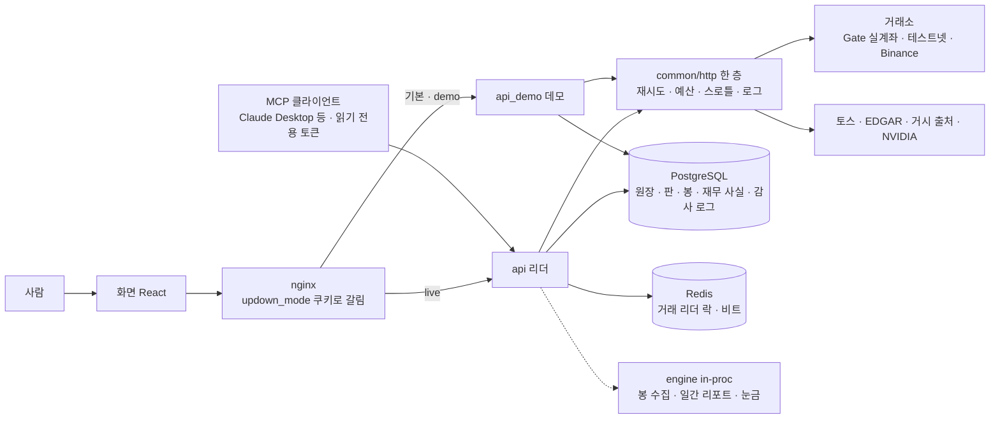

# 업 앤 다운 — 포트폴리오 문서 묶음

> 실계좌가 도는 자동매매 플랫폼을 **혼자, 36일 동안, 실제 돈으로** 만들면서 무엇을 고민했고 어떻게 결정했는가.
> 이 폴더는 코드가 아니라 **사고 과정**을 남기기 위한 것이다. 코드는 `src/`, 결정의 원문은 `docs/planning/`·`docs/` 에 있다.

| 문서 | 무엇을 답하나 |
|---|---|
| 이 문서 | 프로젝트가 무엇인지 · 어떤 고민에서 어떤 설계가 나왔는지 (결정 기록) |
| [diagrams.md](diagrams.md) | 개념 ERD · 기술 ERD · 시퀀스 다이어그램 · 스윔레인 다이어그램 · **플로우차트**(캔들 → 리포트) |
| [ledger_reconciliation.md](ledger_reconciliation.md) | **원장과 거래소를 어떻게 맞추나** — 주문 시 대조 절차 · 서버가 죽었을 때 · 영속성 · 실제 사고와 수정 |
| [code_quality_review.md](code_quality_review.md) | 코드가 개발 표준(추상화 · 책임 분리 · 주석 · 구조)을 얼마나 지키는지 — 분석 보고 |
| [functional_and_load_review.md](functional_and_load_review.md) | **기능이 도는가 · 비동기가 더 필요한가 · 여러 사용자 · 병목·부하** — 라우트 106개 목록 · 실측 근거 · 루프 위 동기 작업 · 경합 · 호출 예산 · 메모리 · 종료 (2026-09-07) |
| [ai_agents_and_mcp.md](ai_agents_and_mcp.md) | **AI 어시스턴트는 무엇을 하고 무엇을 못 하나** — 자체 루프(LangGraph 미채택 이유) · 도구 13 · 대시보드 명세(환각 측정) · MCP 로 바깥 AI 에 개방(개인 토큰 · 읽기 전용) |
| [ai_chat_scenarios.md](ai_chat_scenarios.md) | **시험한 대화** — 13사례 · 판정 기준 · 실측 두 묶음(9/12 → 12/13) · 시험 밖 실제 대화에서 깨진 것과 고친 것 |
| [cross_cutting_design.md](cross_cutting_design.md) | **횡단 관심사** — 바깥 호출 한 층(`common/http`) · TTL 캐시 한 벌 · 소프트 삭제 원칙 · 루프 눈금(비동기) · 표준 분리 점검표 |
| [architecture_security_audit.md](architecture_security_audit.md) | **추상화 · 하드코딩 · 책임 분리 · 보안** 네 질문에 대한 점검 — 스캔 수치 · 오늘 잡힌 결함 · 권장 순서 |

관련 원문: [runtime_architecture.md](../platform/runtime_architecture.md)(런타임 한 장 그림) ·
[ops_issues_2026-09.md](../platform/ops_issues_2026-09.md)(운영 이슈 대장 48건) ·
[Phase00_Foundation_plan.md](../planning/history/Phase00_Foundation_plan.md)(설계 결정 D-1~D-15) ·
[architecture_boundaries.md](../platform/architecture_boundaries.md)(계층 경계 근거).

---

## 1. 한 문단 요약

코인 선물(Gate · Binance)에서 **추세 추종 + 캐리** 매매법을 15분 봉으로 굴리는 자동매매 시스템이다.
백테스트(6.6년 · 45개 합성 미래)로 매매법을 고정한 뒤, 같은 코드를 테스트넷 → 실계좌(300 USDT · 6종 펀드)로 올렸다.
핵심 난제는 전략이 아니라 **"앱이 믿는 것(원장)과 거래소가 들고 있는 것(사실)을 어떻게 일치시키는가"** 였고,
이 문서 묶음의 절반이 그 이야기다.

| 규모 | 값 |
|---|---|
| 기간 · 커밋 | 2026-08-02 ~ 2026-09-06 · 1,342 커밋 |
| 백엔드 | Python 3.12 · FastAPI · SQLAlchemy 2 async · PostgreSQL 16 · Redis · **약 96,000 줄** (`src/`) |
| 프론트엔드 | React 18 · TypeScript strict · Vite · lightweight-charts · **약 16,600 줄** |
| 테스트 | pytest **239 파일 · 3,307 함수** (골든·결정론·AST 가드) · vitest 257 |
| 정적 검사 | ruff(D=docstring 포함) · pyright **strict** · import-linter 계약 4 |
| 배포 | Docker Compose base+override · 블루그린(api/api_b · Redis 리더 락) · Lightsail 1 GB · Caddy TLS |
| DB | 26 테이블 · `candles` 월 파티션 · `event_logs` 추가 전용(DB 권한) |

---

## 2. 무엇을 만들었나 — 층으로 보기

- **분석 → 결정 → 집행**이 코드 계층으로 갈려 있고 import-linter 가 CI 에서 역방향을 막는다.
  분석은 "제안"만 하고, 손절·수량은 결정 계층이 확정하고, 집행은 값을 바꿀 권한이 없다.
- 실주문 어댑터는 **한 파일**(`execution/gateway.py`)만 만들 수 있다. AST 정적 검사가 그 밖의 import 를 잡는다.
- 백테스트·모의 라이브·실계좌가 **같은 `Session.step()`** 을 돈다. 라이브의 비동기(체결·봉)는 우편함으로 밖에서 밀어넣어 결정론 코어를 지킨다.

---

## 3. 고민과 결정 — 무엇이 아팠고 무엇으로 답했나

아래는 "설계 원칙"이 아니라 **사고(또는 사고 직전) → 결정** 의 목록이다. 날짜는 실제 기록이다.

### 3.1 원장과 거래소가 갈린다 (가장 큰 고민)

| 날짜 | 무슨 일 | 결정 |
|---|---|---|
| 08-18 | 브로커 조건부 손절은 **가격이 닿는 순간** 나가는데 우리 청산 판정은 **봉 마감**에만 돌아 최대 15분 동안 화면이 "보유 중" 이라고 거짓말했다 | 판정과 무관한 **30초 대조 루프**(`LiveRunner.reconcile`)를 따로 둔다. 청산가는 지어내지 않고 거래소 체결 이력에서 읽는다. 못 읽으면 닫지 않고 감사에 넘긴다 |
| 08-18 | `src/` 를 고치면 API 가 리로드되고 **원장은 비는데 거래소 포지션은 남았다** — 아무도 반익·본절·손절 재장착을 안 한다 | 재기동 시 **거래소에서 계획을 되읽어 입양**(`adopt`). 손절 주문을 못 찾으면 입양하지 않는다 — 없는 값을 원장에 넣으면 그 값이 곧 주문이 된다 |
| 08-18 | RUN 을 지웠는데 포지션이 거래소에 남고, 24시간 뒤 조건부가 만료되어 **손절 없는 포지션**이 됐다 | RUN 삭제 = 포지션 청산 → 원장 마감. 러너가 없어도 저널을 읽어 닫는다 |
| 08-21 | 판을 지웠는데 조건부 손절 주문만 남았다. `size:0` 조건부는 "전량 닫기" 라 **다음 판의 새 포지션을 통째로 닫는다** | 잔재 회수(`leftovers.sweep`). 단 **포지션이 있으면 절대 거두지 않는다** — 그 조건부가 유일한 보호막이다 |
| 08-26 | 손절 118 계약 중 35 만 체결되고 83 은 거래소 가격보호에 죽었다. 화면엔 조건부가 보여 **지켜지는 것처럼** 보였다 | 대조에 **D 축(부분 무방비)** 추가 — 보호 물량 < 보유 물량이면 경보. 부분 보호가 무보호보다 위험하다 |
| 08-30 | "배포했을 때 거래소 원장만 남으면 큰 손실" (사용자) | **자동 싱크가 아니라 대조**(`orchestration/reconcile.py` · 순수 함수). 원장을 자동 수정하면 결정론이 깨지고, 거래소를 자동 청산하면 손익이 사람 모르게 확정된다. 갈린 사실을 4축(A/B/C/D)으로 **이름 붙여 내놓기만** 하고 판단은 사람에게 |
| 09-01 | 한 계정에 여러 판·강제청산·수동정리가 섞여 손익 귀속이 틀렸다 | 주문 이름에 **판 표식 6자**를 박고, 태그가 없는 청산(강제청산 `ao-`)은 **내가 그 계약을 들고 있던 시간창** 안이면 내 것으로 센다 |

상세: [ledger_reconciliation.md](ledger_reconciliation.md)

### 3.2 서버가 죽으면

| 고민 | 결정 |
|---|---|
| 프로세스가 죽으면 우리가 감시하는 손절도 죽는다 | **브로커측 조건부 손절**이 유일한 방어선. 매 걸음 + 30초 점검에서 "걸었다" 를 기억하지 않고 **거래소에 묻는다** (조건부는 조용히 만료된다) |
| 점검은 30초인데 복구는 4시간 걸음에서만 돌았다 (08-31 실측: 2시간 12분 무방비) | **탐지 주기 = 복구 주기**. 점검 루프도 손절을 다시 건다. 단 점검 루프에서는 시장가 청산으로 가는 연속 실패 카운터를 올리지 않는다 |
| 배포하면 세션(메모리)이 사라진다 | 상태를 **영속 등급**으로 나눴다 — 포지션·손절·진입 지정가는 거래소가 진실, 원장·판 메타·대기 계획은 DB, 캐시는 잃어도 된다. 부팅 순서가 그 등급을 따라 되살린다 |
| API 두 개가 동시에 뜨면 같은 포지션에 둘이 주문한다 | **Redis 리더 락**(`TradingLeader`). 팔로워는 조회만. 하트비트 끊기면 즉시 강등. 배포는 블루그린으로 락을 이양 |
| Redis 가 죽으면 거래를 멈춰야 하나 | 아니다. 손절 관리를 Redis 하나에 묶는 것이 더 위험 — **가용성 우선**, 크게 경고만. 중복 주문의 최종 방어는 락이 아니라 **멱등키** |
| 저장이 실패하면 매매를 멈춰야 하나 | 행동을 리스크 방향으로 가른다(D-13). 손절·청산·스탑 상향·취소는 **저장이 실패해도 무조건**, 신규 진입만 보류. 폴백 파일로 남긴다 |
| 데드맨 알림 | 보류(09-06 사용자 결정) — 앱이 7일 넘게 죽으면 브로커 손절이 만료된다는 한계를 **문서에 적어 두고** 사람이 리포트 메일로 본다 |

### 3.3 결정론과 측정

| 고민 | 결정 |
|---|---|
| 라이브와 백테스트가 다른 규칙으로 돌면 성적을 비교할 수 없다 | `Session.step()` 은 동기·순수. 라이브의 봉·체결은 **우편함**(`LiveFeed` · `LiveFiller`)으로 넣고 세션은 꺼내 읽기만 한다. 배속은 렌더링만 건너뛴다 |
| 결과만 재는 표는 계획 결함에 눈이 없다 (전 거래 RR 이 정확히 1.00 이던 사고) | 원장에 **계획과 실제를 나란히**(planned_stop/first/target vs 실제) · 새 규칙이 값을 만들면 그 분포를 리포트에 싣는다 |
| 라벨로 승패를 세면 승률 20% · 손익 +2% 같은 어긋남이 난다 | **돈이 판정한다** — outcome 은 "무슨 일이 있었나" 이고 승패는 손익 부호 |
| 합성 45미래 표가 재현되지 않았다 (원재료 parquet 재수신) | 09-02 표는 역사 기록으로 보존, 재생성 표는 따로. 결론이 아니라 **봉과 매매를 저장**해 누구나 차트로 확인할 수 있게 (T222) |

### 3.4 보안 · 권한 · 돈의 경계

| 고민 | 결정 |
|---|---|
| 게스트가 실계좌 값을 볼 구조적 경로가 있으면 안 된다 | **데모 API 를 별도 프로세스**(다른 DB · 라이브 키를 읽을 수도 없는 환경)로. 라우팅은 쿠키가 하고 권한은 각 서버가 자기 DB 로 다시 판정 |
| 실주문이 "실수로" 열리면 안 된다 | 이중 게이트: `APP_ENV=live` **and** `LIVE_ORDERS=1` **and** 키. 하나라도 빠지면 테스트넷. 판정은 순수 함수(진리표 4케이스 시험) |
| 같은 테스트넷 계정을 두 프로세스가 관리하면 손절 트레일·진입·회수가 겹친다 (09-06 실사고) | **계정 하나에 관리자 하나.** 로컬 데모는 Binance 테스트넷, 서버 데모는 Gate 테스트넷. 코드 가드: 이 API 가 연결하지 않은 거래소로는 판을 못 띄운다 |
| 시크릿 | `.env*` 커밋 금지 · 프로브는 이름·유무만 출력 · 실계좌 env 값 변경은 사람이 서버에서 |

### 3.5 운영 자원 (1 GB 서버)

- 콘솔 폴링이 초당 3~5회로 폭주해 CPU 를 다 먹은 첫날(09-05) → 폴링 10초 · 서버 TTL 캐시 · 어댑터 재사용(TLS 핸드셰이크 172회/10분 제거).
- 거래소 요율 밴을 밴 중에도 두드려 연장시킨 사고 → 밴 만료까지 그 거래소 호출 중지. 손절·청산은 어떤 상태에서도 나간다.
- 빌드 컨텍스트 14 GB → 5.1 MB. 서버에서 빌드하지 않고 로컬 빌드 → `docker save | ssh docker load`.

---

## 4. 무엇이 아직 비어 있나 (정직한 한계)

- 데드맨 알림 없음 — 7일 이상 다운 시 브로커 손절 만료. 운영(사람)이 본다.
- 인증 실패(401/403) 회로차단기 미구현 — 밴 회로차단은 있다.
- 계정 UUID 기준 "관리 호스트" 가드 없음 — 같은 계정에 두 스택이 붙는 것을 코드가 막지 못한다(설정으로만 막는다).
- 테스트 커버리지 측정 없음(3,307 함수가 돌지만 비율은 안 잰다).
- `apps/api/walkforward.py`(5,495줄) · `live_runner.py`(5,370줄) 는 책임이 과하다 — [code_quality_review.md](code_quality_review.md) §3.
- 스펙 시대의 스키마(`trade_proposals`·`approved_orders`·`orders`·`positions`)와 실제 라이브 경로의 스키마(`wf_*`)가 둘 다 있다.
