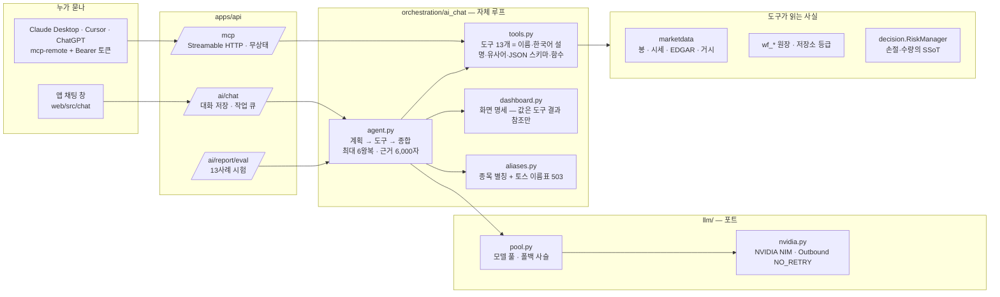

# AI 에이전트 · 도구 · MCP — 어떻게 짜여 있고 왜 그렇게 했나

> AI 투자 어시스턴트(채팅)가 **무엇을 할 수 있고 무엇을 절대 못 하는지**, 그 도구들이 어떻게 앱 밖의 AI(Claude Desktop · Cursor · ChatGPT)에도
> 열려 있는지, 그리고 왜 멀티 에이전트 프레임워크를 쓰지 않았는지. 코드는 `src/updown/orchestration/ai_chat/` · `src/updown/llm/` ·
> `src/updown/apps/api/{ai_chat,ai_report,mcp_server}.py` · `web/src/chat/`. 태스크 원문은 [T248](../planning/tasks/T248_ai_chat_assistant.md) ·
> [T256](../planning/tasks/T256_dashboard_spec_tool.md) · [T257](../planning/tasks/T257_chat_shell_ux.md) · [T258](../planning/tasks/T258_chat_eval_engine.md) ·
> [T263](../planning/tasks/T263_mcp_server.md). 시험한 대화는 [ai_chat_scenarios.md](ai_chat_scenarios.md).

## 1. 한 장 그림



- **앱 채팅과 MCP 는 같은 도구 함수를 부른다.** 차이는 "누가 생각하나" 뿐이다 — 채팅은 우리 모델 풀(NVIDIA NIM), MCP 는 상대 클라이언트의 모델.
- **도구는 사실을 읽거나 RiskManager 에 계산을 맡길 뿐 주문을 내지 않는다.** `propose_order` 까지가 AI 의 끝이고, 그 뒤는 사람이 화면에서 확인한다(절대 규칙 #2).

## 2. 절대 규칙과의 접점 — 먼저 정한 것

| 규칙 | 채팅·MCP 에서 어떻게 지키나 |
|---|---|
| #2 AI 는 가격·수량·타이밍을 결정하지 않는다 | `propose_order` 는 **RiskManager 값**으로 제안만 만든다. 주문이 되는 경로는 화면의 사람 확인뿐. MCP 토큰 호출자는 주문·설정 경로에 **403** (`token_allowed` — 읽기와 `/mcp` 만) |
| #5 결정론 | 모델은 순위를 매기지 않는다 — `screen` 이 서버에서 정렬한 상위 N 을 주고 모델은 읽는다. 대시보드 숫자는 **도구 결과 참조만** 허용, 리터럴 숫자는 칸을 비운다(환각 = `missing` 로 센다) |
| #8 조용한 실패 금지 | 도구 실패는 모델에게 **오류 결과**로 돌아가고 답 끝의 "근거" 줄에 남는다. MCP 에서도 500 이 아니라 오류 결과 |
| 관측 규약 | 도구 호출·토큰·왕복·환각 수가 `event_logs.ai_chat_turn` 에 추가 전용으로 쌓이고 AI 리포트(T249)가 모델별 원가·정확도를 표로 낸다 |

프롬프트 규칙 8개(요약): ① 숫자·사실은 도구 결과에서만 ② 예측하지 않는다 — 현재 구조를 설명한다 ③ 종목 이름은 먼저 `symbol_resolve`
④ 주문 요청은 `propose_order` 제안까지만 ⑤ 매매법 성과는 과거 실측이고 MDD 를 같이 말한다 ⑥ 답 끝에 어떤 도구를 봤는지 ⑦ 모르면 모른다고
⑧ 숫자가 여럿이면 마지막에 `render_dashboard`. 프롬프트를 바꾸면 `PROMPT_VERSION`(지금 `chat-1.4`)이 오르고 **새 참가자**가 된다 — 시험 표본이
0 부터 다시 쌓인다. `tests/test_ai_report.py::PROMPT_LOCK` 이 버전마다 해시를 잠근다.

## 3. 루프 — 왜 프레임워크가 아니라 자체 루프인가

```
사용자 질문 ─▶ [계획] 모델이 도구 호출을 고른다 ─▶ [도구] 서버가 실행 · 결과를 6,000자로 압축 ─▶ [종합] 모델이 답 + 근거 줄
                 ▲                                                                        │
                 └──────────────── 최대 6왕복 · 도구 결과는 ToolContext.results 에 턴 단위로 ─┘
```

- **LangGraph 딥에이전트는 미채택** (사용자 확정 2026-09-10). 정확도는 프레임워크가 아니라 **모델·프롬프트·도구가 주는 사실·검증**에서 나온다.
  지금 대화는 2~4왕복이고, 긴 작업("50종목 순위")은 서버 배치 도구(`screen`)로 흡수했고, 화면은 명세 도구(`render_dashboard`)로 풀었다.
  저장소에 LLM SDK 가 없고 `llm/` 포트(`LlmClient` 프로토콜)가 있어 의존성을 늘리지 않고 갈 수 있었다. 서브에이전트가 필요해지면
  `llm/` 포트 위에서 검토한다 — MCP 로 도구가 열려 있으므로 **어떤 에이전트 프레임워크든 물릴 수 있다**는 것이 대안이다.
- **멀티 에이전트가 "없는" 것이 아니다.** 역할은 이미 갈라져 있다 — 계획·종합은 모델, 사실은 도구(코드), 확정은 RiskManager, 판정은 사람.
  하나의 모델이 세 역할을 하는 대신 **역할마다 다른 주체**가 맡고, 경계는 코드(import-linter 계약 `llm ⇏ decision·execution`)가 지킨다.
- 모델 풀(`llm/pool.py`): 설정(`config/llm_pool.yml`)의 모델 후보를 **동시에**(`asyncio.gather`) 부르거나, 기본 모델이 죽으면 폴백 사슬로 간다.
  410(폐기 모델)은 "무효 응답" 이 아니라 **모델 없음**으로 따로 센다 — 실측으로 잡은 구멍이다. HTTP 는 아웃바운드 층 `NO_RETRY` — 재시도가
  실험 표본을 흔든다.

## 4. 도구 13개 — 무엇을 읽고 무엇을 못 하나

| 도구 | 무엇 | 사실의 출처 | 못 하는 것 |
|---|---|---|---|
| `symbol_resolve` | "오라클" · "삼전" · "비트" → 코드·시장·확신도 | 손 별칭(`config/ai_aliases.yml`) + 토스 이름표 503(`universe_names.yml`) · 퍼지 | 사전에 없으면 "모른다" — 지어내지 않는다 |
| `market_view` | 축별 요약(종가·변화·고저·이동평균 거리·RSI·ATR·거래량) · 지지/저항 · 계획선 | 우리 지표(`analysis/`) · 판과 같은 봉 캐시(`StoredCandles`) | **예측** — "현재 구조" 만 |
| `valuation` | PER·PBR·PSR·EV/EBITDA·FCF 수익률의 5년 백분위 · 부채 깃발 · 저평가 점수 · 공시 링크 | EDGAR companyfacts(`financial_facts`) | 이력이 없는 종목은 404 로 말한다 |
| `positions` | 포지션·잔고·조건부·펀드 | **거래소가 말하는 값** + 원장 대조 | 지어낸 손익 없음 |
| `extremes` | 52주 고저 거리 · SMA200 이격 · RSI 극단 | 우리 지표 | — |
| `playbook_expectation` | 매매법의 과거 실측(기간·손익·MDD·매매 수·등급) | 저장소(`config/playbooks.yml` + 실측표) | "예상" 이 아니라 과거 |
| `propose_order` | 진입·손절·1차·목표를 **RiskManager 로 확정**한 제안 | `decision/` | 주문을 내지 않는다 |
| `recommend_by_budget` | 예산·성향 → 매매법·최소 단위·저평가 후보 3 | T247 성향 규칙 · 저장소 등급 · T244 | "추천" 표기는 `recommended` 참일 때만 |
| `portfolio_exposure` | 갈래·등급별 비중 · AI 판 비중 · 쏠림 경고 | 살아 있는 판의 예산 · 잔고 | 상관계수(아직 없음 — 응답에 적는다) |
| `trade_journal` | 끝난 AI 매매의 결과·R·근거별 적중 | 원장 + `llm_proposals` | — |
| `screen` | 저평가 점수·PER·PBR·모멘텀·시총으로 **서버가 정렬**한 상위 N | 재무 순위(`fundamentals`) | 모델이 순위를 매기는 것 |
| `macro_view` | VIX(구간·설명) · 나스닥100 선물 · S&P500 · 10년물 · 달러 · 금 · WTI · 원달러 · EFFR · CPI · 코스피 · 코스닥 · 한국 10년물 | 야후 · CBOE · 뉴욕연준 · BLS · 토스 | 실패한 지표는 이유와 함께 `failures` |
| `render_dashboard` | 카드·표·칩·스파크라인 **명세** | 이번 턴의 도구 결과 참조만 | 리터럴 숫자 — 그 칸은 비운다 (채팅 전용 · MCP 에는 안 내보낸다) |

도구 하나 = `Tool(spec, fn)` 한 벌: 영어 스네이크 이름 · **한국어 설명 + 유사어 목록**("저렴/싸/비싸/고평가/PER") · JSON 입력 스키마 · 함수.
의도 분류는 규칙 매칭이 아니라 모델이 한다(유사어를 다 적을 수 없다). 도구를 더하면 시험 사례도 더해야 한다 — `test_ai_chat_eval` 이 빠짐을 잡는다.

## 5. 대시보드 — 생성형 UI 를 규칙 #2 에 맞게

모델은 HTML 이나 차트 코드를 쓰지 않는다. **무엇을 어떤 순서로 보여줄지**(카드·표·칩·스파크라인·문장)만 JSON 명세로 내고, 값 칸은 전부
`{"from": "도구.키[0].키"}` 참조다. 서버(`dashboard.resolve`)가 참조를 이번 턴의 실제 도구 결과로 채우고, 없는 참조는 비우고 `missing` 에 적는다.
그 수가 AI 리포트의 **환각 열**이다. 명세는 대화 메시지에 붙어 저장되므로 다시 열어도 그대로다. 화면은 기존 부품(`Card` · 표 · `Sparkline` · `chip`)만
쓴다 — 새 CSS 없음 · 팝업 없음.

## 6. MCP — 같은 도구를 바깥 AI 에

```
Claude Desktop / Cursor / ChatGPT ──(Streamable HTTP · JSON · 무상태)──▶ POST /mcp ──▶ tools/list · tools/call ──▶ 채팅과 같은 ToolContext · 같은 함수
                          Authorization: Bearer updn_…  (개인 토큰 · 해시만 저장 · 되돌리기)
```

| 조각 | 결정 | 왜 |
|---|---|---|
| 전송 | `mcp` SDK 저수준 `Server` + `StreamableHTTPSessionManager(json_response=True, stateless=True)` 를 기존 FastAPI 에 **한 경로**(`/mcp`)로 | 프로세스·메모리를 늘리지 않는다(7달러 서버). 세션 상태가 없어 블루그린에도 안전 |
| 인증 | **개인 API 토큰**(`api_tokens` · 화면 `/tokens` · 값은 한 번만 · SHA-256 해시 · `revoked_at`). 만들 때 구글 재인증 필요 · 게스트·토큰으로는 못 만든다 | OAuth(MCP 표준)는 개인·소수 사용자 앱에 과하다 |
| 권한 | 토큰 호출자는 `Caller.via_token=True` · `fresh=False` → **읽기와 `/mcp` 만**. 주문·설정 경로는 403 | 바깥 AI 가 돈을 움직일 길을 구조로 막는다 — 규칙 #2 의 두 번째 방어선 |
| 목록 | `TOOLS` 에서 `render_dashboard` 만 뺀 **12개** — 이름·설명·JSON 스키마가 채팅과 한 벌 | 화면 명세는 우리 채팅 창에서만 뜻이 있다 |
| 호출자 | `McpEndpoint` 가 미들웨어의 `scope.state.caller` 를 컨텍스트 변수로 옮겨 도구가 "누구의 포지션" 인지 안다 | 토큰 없이 부르면 오류 **결과**(500 아님) |
| 실측 | initialize → `updown 1.7.0` · tools/list 12 · Bearer 로 `symbol_resolve` 8ms · `macro_view` 243ms · 토큰 없음/되돌림 = 오류 결과 · 토큰으로 `POST /walkforward/live` = 403 (2026-09-10) | — |

연결 방법(사용자): 화면 `/tokens` → 토큰 만들기 → "Claude Desktop 설정 복사"(`npx -y mcp-remote https://<도메인>/api/mcp --header "Authorization: Bearer updn_…"`) →
`claude_desktop_config.json` 에 붙여 넣기. 랭그래프 시연(`langchain-mcp-adapters` 로 우리 `/mcp` 를 물린 예제)은 남겨 둔 선택지다 — 코어는 안 바뀐다.

## 7. 시험 — 도구마다 사례 하나, 실제 루프로

`orchestration/ai_chat/evaluate.py CASES` 13개(도구 12 + 합성 1)가 **실제 모델·실제 도구**로 돈다(`POST /ai/report/eval` · 작업 큐 · SSE 진행).
판정은 순수 함수 `judge` — 기대 도구가 불렸나 · 도구 오류 없나 · 답이 있나 · 대시보드가 기대될 때 있나 · 환각(`missing`) 0 인가.
결과는 `event_logs.ai_chat_eval` 에 추가 전용으로 쌓이고 AI 리포트 "도구 시험" 절에 표로 뜬다. 같은 프롬프트로 결과가 갈리면 **모델 편차**이므로
한 번의 실패로 프롬프트를 고치지 않는다 — 세 번 누적 뒤 판단한다(측정 없이 고치면 표본이 0 부터). 결과 표는 [ai_chat_scenarios.md](ai_chat_scenarios.md).

## 8. 비어 있는 것 (정직하게)

- 상관계수(비중 분석)가 없다 — 응답이 그렇게 말한다.
- 대화 안 서브에이전트(계획자/검증자 분리)는 없다 — 필요가 생기면 `llm/` 포트 위에서.
- MCP 토큰 사용량(도구별 호출 수)을 AI 리포트 원가 축에 아직 합치지 않았다(`mcp_tool_call` 로그는 있다).
- 채팅 시험은 로컬 데모에서 사람이 눌러 돈다 — CI 에서는 모델을 부르지 않는다(비용 · 외부 의존).
