# 다이어그램 — 개념 ERD · 기술 ERD · 시퀀스 · 스윔레인 · 플로우차트

> 전부 Mermaid 다 (GitHub 에서 바로 그려진다). 출처는 코드다 — 표·열은 `src/updown/common/db/models/`(22 표 · 마이그레이션 0129 — 죽은 표 14 정리), 흐름은
> `apps/api/main.py`(기동) · `apps/api/walkforward.py`(판·대조) · `orchestration/walkforward/live_runner.py`(러너) ·
> `orchestration/ai_chat/`(AI) · `apps/api/chart_order.py`(차트 분석 주문) · `apps/api/toss_proxy.py`·`warm_candles.py`(토스 프록시 · 예열) ·
> `common/http/`(바깥 호출). 2026-09-11 갱신 — AI 차트 분석 주문(차트 보기 · 분석 작업 · AI 비교 · 채점) · 토스 프록시 · 서버 합성 봉 · 야간 예열 ·
> 작업+SSE · 저평가 Redis 사본 반영.

---

## 1. 개념 ERD — 사람이 말하는 단어로

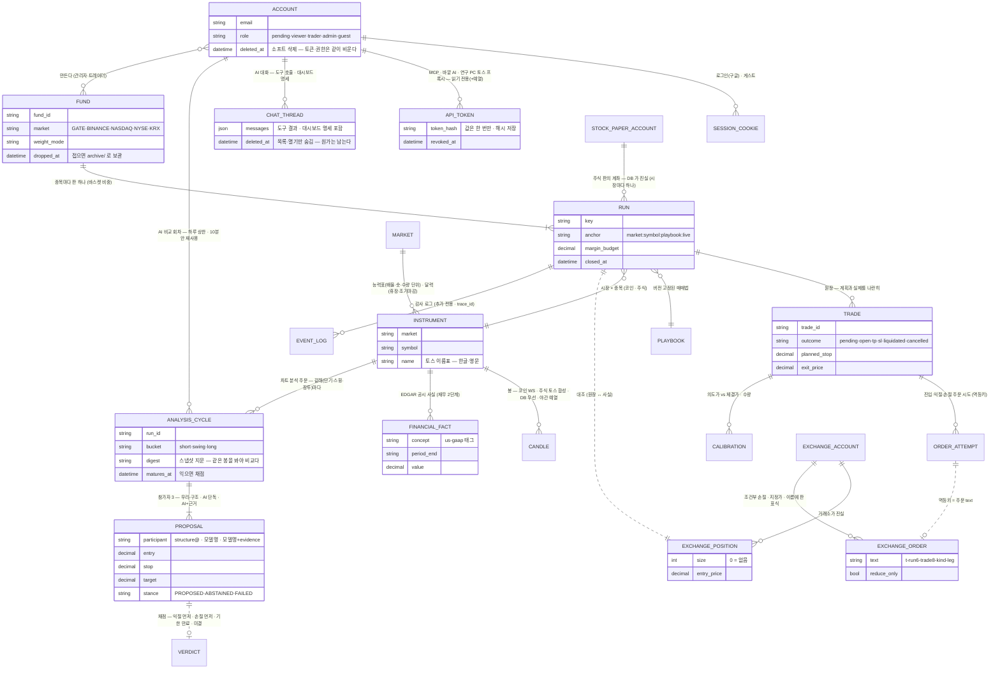

읽는 법:
- **원장(RUN · TRADE)은 앱의 의도**이고 **거래소(POSITION · ORDER)는 사실**이다. 둘 사이의 점선이 "대조" 다. 주식 판은 거래소 대신 **DB 의 페이퍼 계좌**가 사실이다(실주문 어댑터 없음).
- 원장과 거래소를 잇는 유일한 끈은 **주문 이름**이다. 멱등키에 판 표식과 매매 id 가 들어가 있어 재시작 뒤에도 "이 주문은 내 것" 을 증명한다.
- FUND 는 DB 표가 아니라 JSON 파일(`logs/funds/*.json`)이다. 접으면 지우지 않고 `archive/` 로 옮긴다(`dropped_at`) — 판이 펀드 이름을 잃지 않게.
- MARKET 은 표가 아니라 설정이다(`config/markets.yml` 능력표 · `config/market_sessions.yml` 달력). 엔진·러너·화면은 시장 이름으로 분기하지 않고 이것을 읽는다.
- 계정 · 대화 · 토큰 · 펀드 · 판은 **소프트 삭제**(`*_at`), 권한 · 설정은 하드 + `event_logs` — 원칙은 [cross_cutting_design.md §3](cross_cutting_design.md).

---

## 2. 기술 ERD — 실제 테이블

두 계열이 있다. **라이브·모의 라이브가 실제로 쓰는 `wf_*` 계열**과, 스펙(§3.2) 시대에 설계한 **제안→승인→주문 계열**(승인 게이트가 범위 밖으로 밀려 지금은 대부분 비어 있다). 그리고 공통 마스터·시장·운영 표.

### 2.1 라이브 경로 (wf_*)

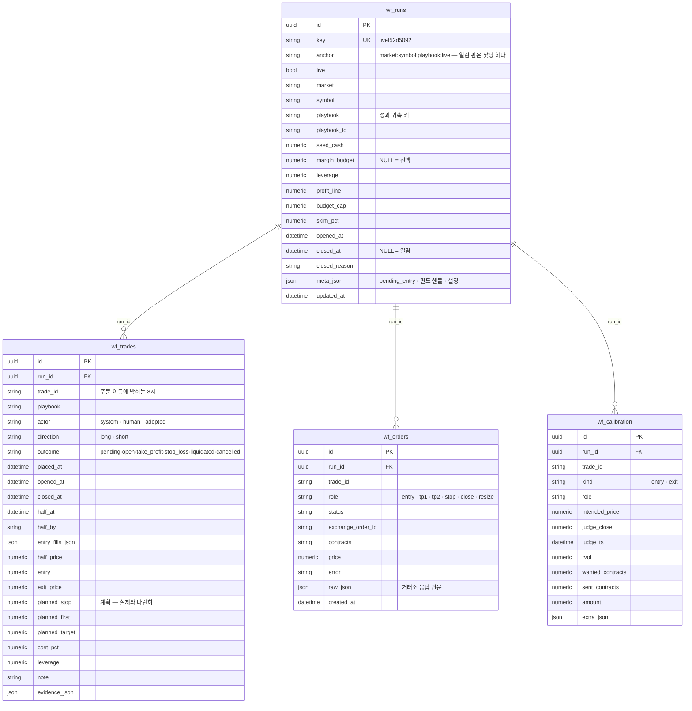

### 2.2 마스터 · 시장 · 재무 · 계정 · AI · 운영

```mermaid
erDiagram
    instruments ||--o{ candles : instrument_id
    instruments ||--o{ candle_quality_issues : instrument_id
    instruments ||--o{ structures : instrument_id
    instruments ||--o{ analysis_reports : instrument_id
    instruments ||..o{ financial_facts : "symbol (FK 없음 · 출처가 EDGAR)"
    accounts ||..o{ api_tokens : "email (FK 없음)"
    accounts ||..o{ chat_threads : "email"
    accounts ||..o{ playbook_grants : "email"
    accounts ||..o{ market_grants : "email"
    accounts ||..o{ account_contacts : "email"
    accounts }o..|| role_collections : "role_collection"
    users ||--o{ broker_credentials : user_id
    users ||--o{ notifications : user_id
    users ||--o{ backtest_runs : user_id

    instruments {
        bigint id PK
        enum market "KRX·NASDAQ·NYSE·BINANCE·UPBIT·GATE"
        string symbol
        string name "토스 영문명 (한글은 config 이름표)"
        enum asset_type
        enum currency
    }
    candles {
        bigint instrument_id FK
        enum timeframe
        datetime ts "RANGE 파티션 (월) · 2020~"
        numeric open
        numeric high
        numeric low
        numeric close
        numeric volume
    }
    financial_facts {
        string source PK "edgar"
        string symbol PK
        string concept PK
        string unit PK
        date period_end PK
        string accession PK
        string entity_id "CIK"
        numeric value
        string form "10-K · 10-Q"
        datetime filed_at
    }
    stock_paper_accounts {
        enum market PK "NASDAQ · NYSE · KRX"
        json state "현금 · 보유 · 주문 — 주식 판의 진실"
        datetime updated_at
    }
    accounts {
        uuid id PK
        string email UK
        enum role "pending·viewer·trader·admin·guest"
        string role_collection
        json extra_caps
        bool audit "백테스트 손익 열람"
        bool blocked
        datetime deleted_at "소프트 삭제 (0126)"
        datetime approved_at
        datetime last_login_at
    }
    api_tokens {
        uuid id PK
        string email
        string token_hash UK "SHA-256 · 값은 안 남긴다"
        datetime last_used_at
        datetime revoked_at
    }
    chat_threads {
        string id PK
        string email
        string model
        json messages "도구 결과 · 대시보드 명세"
        datetime deleted_at "소프트 삭제 (0127)"
        datetime updated_at
    }
    ai_participants {
        string id PK
        string model
        string prompt_version "chat-1.4 · 바뀌면 새 참가자"
        string prompt_hash
        datetime frozen_at
    }
    playbook_grants {
        string email PK
        string playbook_id PK
        bool view
        bool backtest
        bool trade
    }
    market_grants {
        string email PK
        string market_group PK
        bool view
        bool backtest
        bool trade
    }
    role_collections {
        string name PK
        json caps
        json playbook_policy
        json market_policy
    }
    users {
        uuid id PK
        string google_sub UK
        string email UK
        enum role
    }
    event_logs {
        uuid id PK
        string trace_id
        string actor
        enum level
        string event_type "permission_changed · setting_cleared · ai_chat_turn · ai_chat_eval …"
        json payload_json
        datetime ts "INSERT 만 — UPDATE/DELETE 권한 없음"
    }
    app_settings {
        string key PK
        string value "비우면 삭제 + event_logs.setting_cleared"
        datetime updated_at
    }
```

> `accounts` 는 구글 로그인 계정(T220 · 승인 흐름)이고 `users` 는 스펙 시대의 사용자 표다. 둘이 공존하는 것은 [code_quality_review.md](code_quality_review.md) §3.4 의 지적 사항이다.
> 계정에 매인 표(권한 · 토큰 · 대화 · 문의)는 **이메일로 매이고 FK 가 없다** — 그래서 계정 삭제가 소프트가 됐고, 지우는 트랜잭션이 토큰·권한을 같이 비운다(T266).
> `financial_facts` 는 종목 코드로 매인다(EDGAR 는 CIK 로, 우리는 티커로 부른다 · `BRK.B`↔`BRK-B` 변환은 어댑터가).

### 2.3 스펙 시대의 제안 → 승인 → 주문 계열 (지금은 골격만)

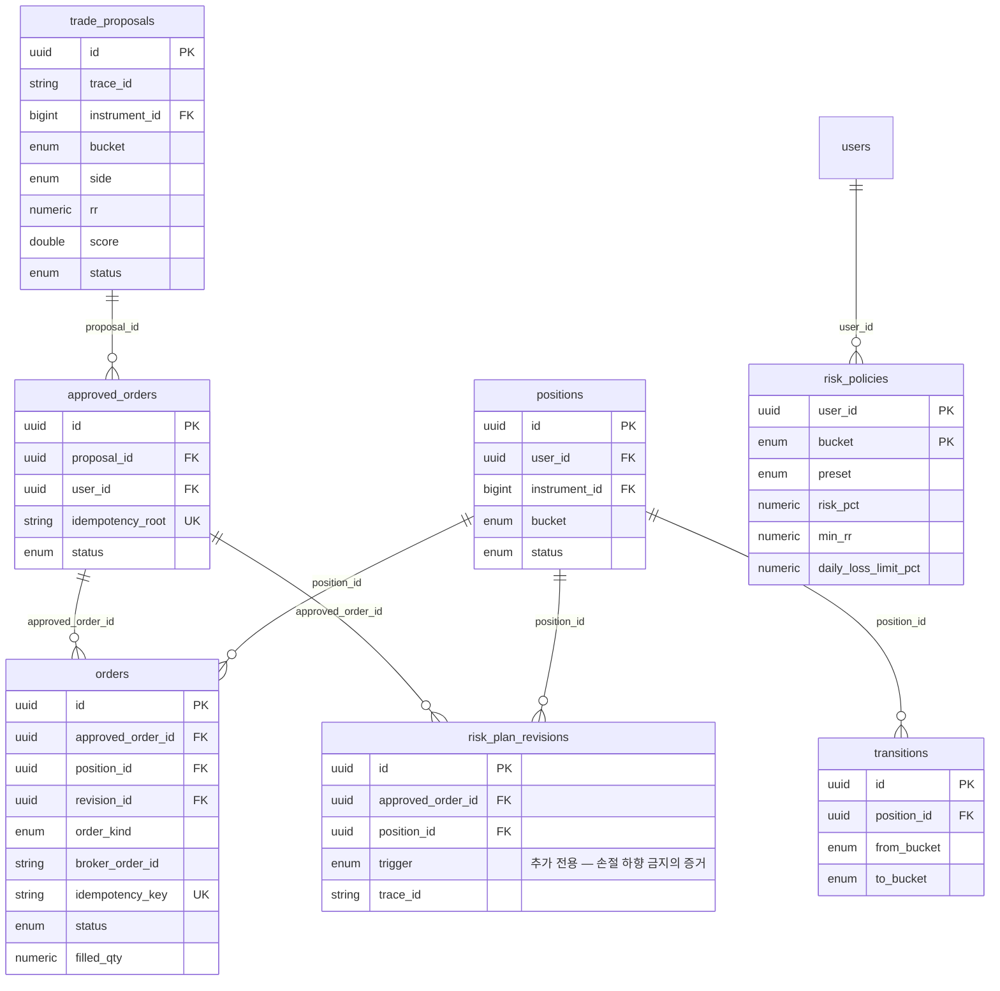

멱등키 규격 `idempotency_key = f"{root}:{order_kind}:{leg}"` 은 이 계열에서 정의됐고, `wf_*` 경로가 `root` 자리에 `판표식-매매id` 를 넣어 **그대로 쓴다**.

---

## 3. 시퀀스 다이어그램

### 3.1 한 판의 한 걸음 — 판정 · 주문 · 보호 · 대조

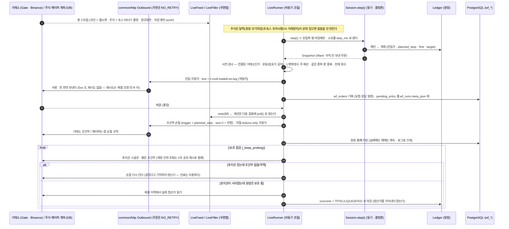

### 3.2 재기동 · 배포 — 무엇이 어디에서 살아나나

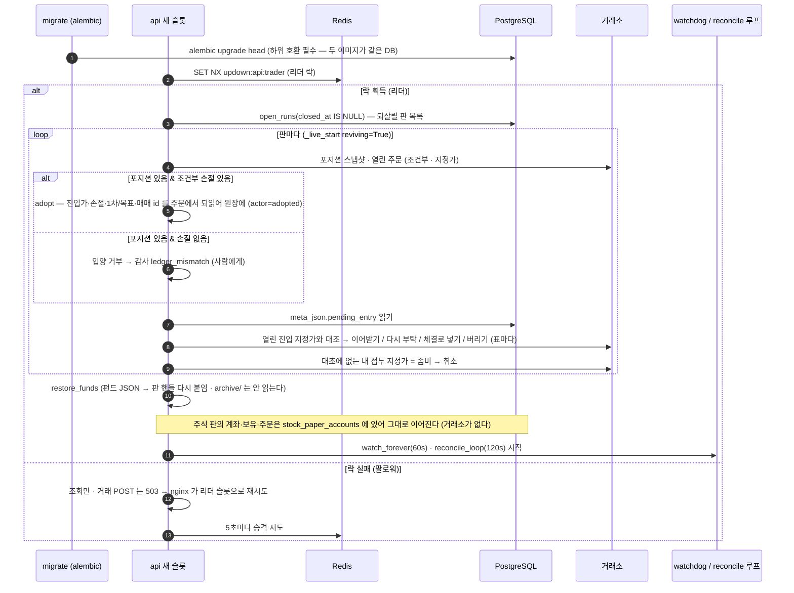

### 3.3 전 거래소 대조 (120초) — 갈림을 이름 붙이고 사람에게

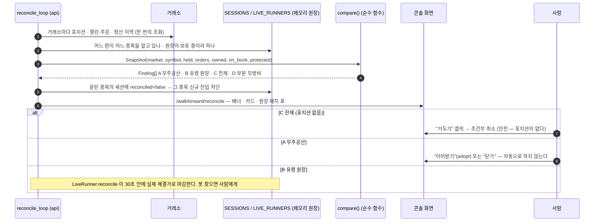

### 3.4 요청 라우팅 — 실계좌 · 데모 · 게스트

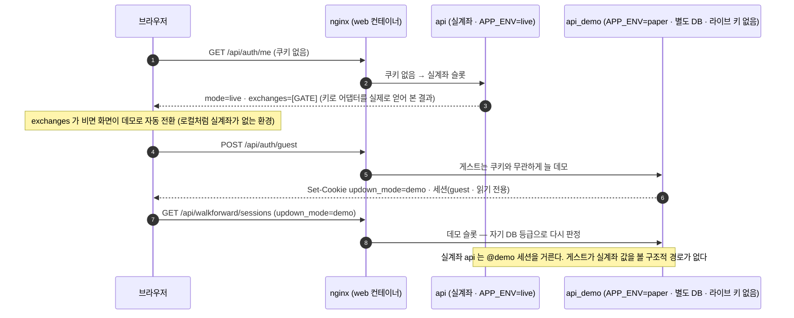

### 3.5 AI 채팅 한 턴 — 화면과 MCP 가 같은 도구를 부른다

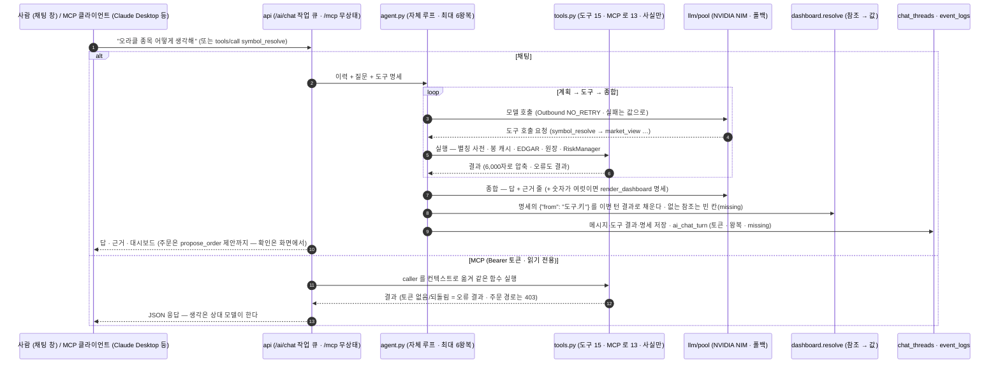

### 3.6 바깥 호출 한 층 — 모든 출처가 같은 길을 지난다

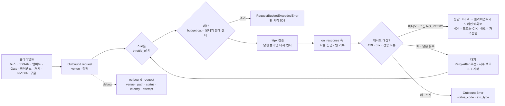

- 주문 클라이언트(Gate · 바이낸스)는 `NO_RETRY` — 어떤 상태도 재시도 대상이 아니라 **응답이 그대로 돌아간다**. 주문이 생겼을 수 있는 5xx 를 층이 삼키면 안 된다(규칙 #6).
- 원시 `httpx.AsyncClient` 를 만드는 파일은 층 자체와 웹소켓 핸드셰이크 둘뿐이고, [래칫 시험](../../tests/test_outbound_layer.py)이 목록을 못 박는다.

### 3.7 AI 차트 분석 주문 한 번 — 차트 보기 · 분석 · AI 비교 · 채점

> 차트는 즉시, 분석은 작업으로, AI 는 비교 참가자로. 어느 화살표도 거래소로 가지 않는다 — "이 계획으로 주문" 은 주문 창의 **초안**이고 사람이 보낸다.

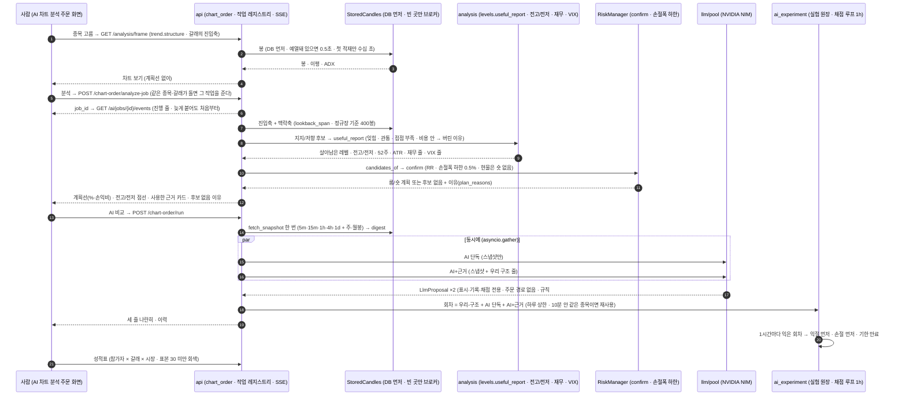

### 3.8 토스 프록시와 야간 예열 — 토큰은 하나, 부르는 프로세스도 하나

> 토스 조회 토큰은 client 당 하나라 두 프로세스가 각자 발급하면 서로 무효화한다(2026-09-11 실측). 그래서 **실계좌 서버만** 토스를 부르고,
> 연구 PC 는 개인 토큰으로 서버의 관리자 접두어를 지난다(T275). 밤에는 서버가 유니버스를 미리 합성해 낮의 첫 클릭을 1~2초로 만든다.

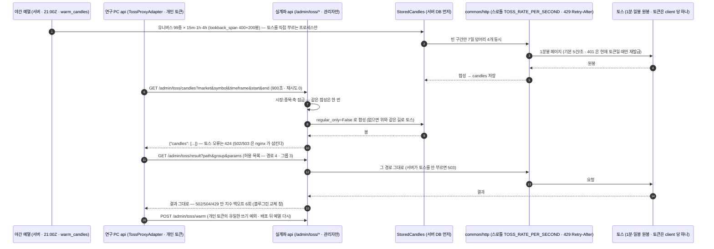

- 실계좌 서버 자신은 프록시 client 가 될 수 없다(`ConfigurationError`) — 프록시 두 값이 반쪽이면 기동을 거부한다(규칙 #8).
- 요율은 env 값이라 사람이 서버에서 올린다. 429 가 보이면 내리고, 안 보이면 10~15 까지 실험한 뒤 고정한다.

---

## 4. 스윔레인 다이어그램

Mermaid 에는 스윔레인 전용 문법이 없어 `flowchart` 의 `subgraph` 를 레인으로 쓴다.

### 4.1 판(RUN)의 생명주기 — 누가 무엇을 하나

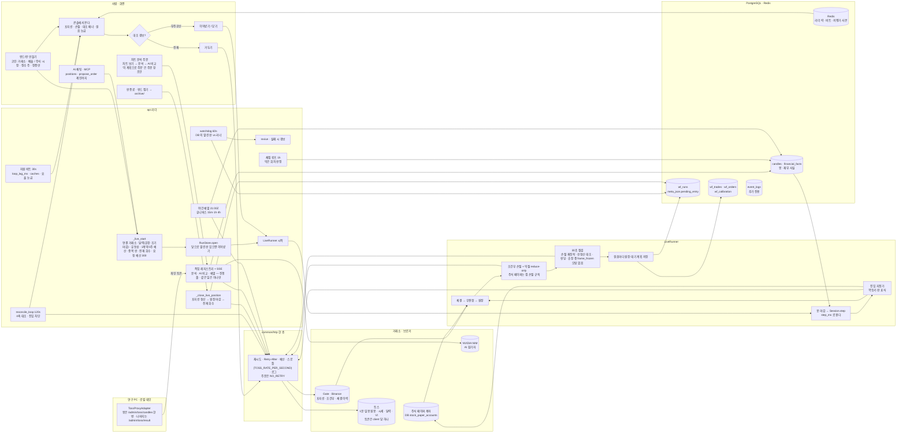

### 4.2 블루그린 배포 — 거래 리더가 끊기지 않게

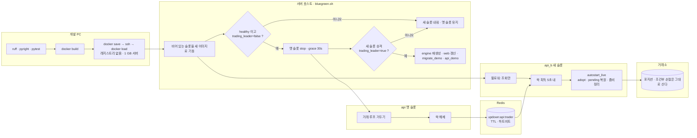

- 배포 중에도 **포지션과 브로커 조건부 손절은 거래소에 살아 있다.** 끊기는 것은 "우리가 감시하는 손절" 이고, 그 공백은 그레이스 30초 + 승격 5초 안이다.
- 첫 실전 배포(09-05 · v2026.09.05-1647)에서 대기 진입 지정가 1건이 `pending_entry` 복원으로 살아서 넘어왔다(T218 검증).

### 4.3 대조 판정 — 4축을 어떻게 가르나 (순수 함수 `compare`)

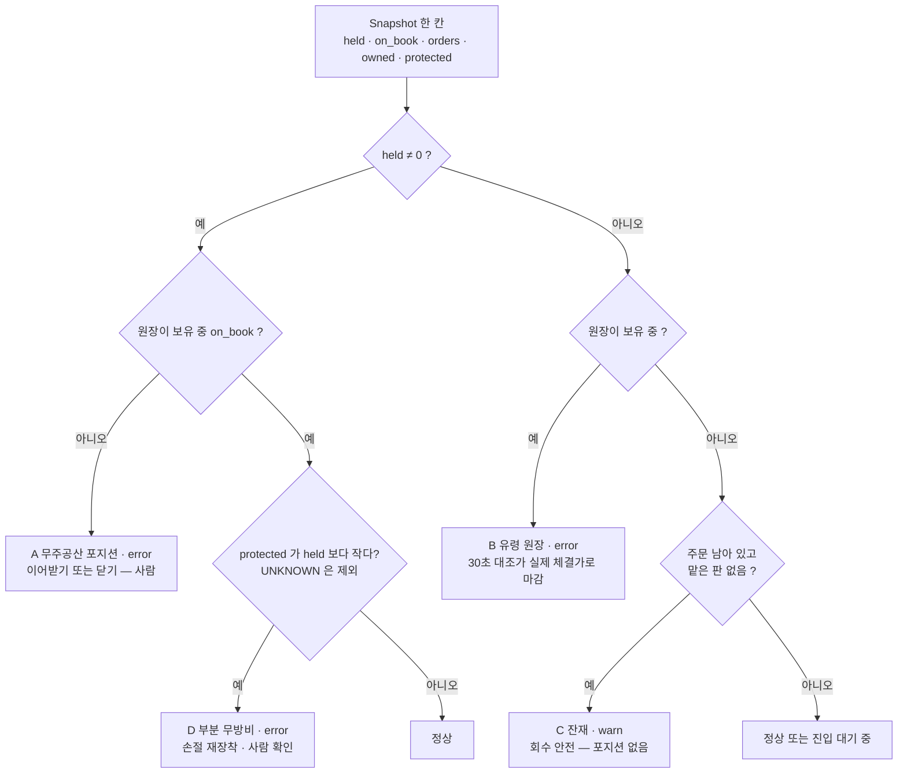

---

## 5. 플로우차트 — 캔들 하나가 들어와 리포트 한 줄이 되기까지

> 한 판(RUN)의 **한 걸음**을 처음부터 끝까지. 판정(analysis)은 제안만 하고, 확정(decision)은 RiskManager 만 하며,
> 집행(execution)은 값을 바꾸지 못한다 — 절대 규칙 #2·#4 가 이 그림의 화살표 방향이다.

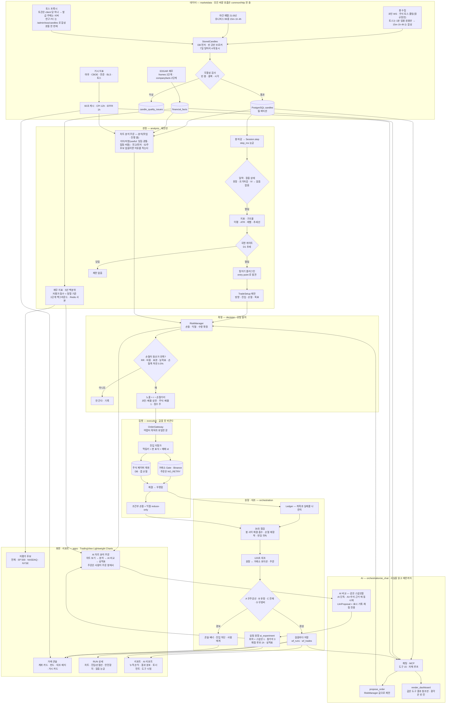

읽는 법:
- **화살표는 한 방향**이다. 판정에서 집행으로만 흐르고, 집행이 판정 값을 고쳐 되돌리는 화살표는 없다. AI 도 마찬가지 — `propose_order` 가 RiskManager 로 들어가는 화살표는 있어도 거래소로 가는 화살표는 없다.
- 거래소는 그림의 **중간**에 있다 — 주문을 내는 자리(EXEC)와 사실을 되읽는 자리(LEDGER)가 다르다. 둘을 잇는 끈은 멱등키(주문 이름)뿐이다. 주식은 거래소 자리에 **DB 페이퍼 계좌**가 선다.
- 30초·120초 두 리듬이 다른 것을 본다. 30초는 *내 매매*(체결·손절·펀딩), 120초는 *거래소 전체*(내 것이 아닌 포지션·주문까지).
- 바깥으로 나가는 화살표는 전부 `common/http` 한 층을 지난다(§3.6). 주문은 그 층이 재시도하지 않는다.
- **차트 분석 주문**(j7 · s5 · a4 · l7)은 판(RUN)이 아니다 — 같은 봉·같은 RiskManager 를 쓰지만 결과는 실험 원장에 남고 주문은 사람이 주문 창에서 낸다.
- 봉이 DB 에 먼저 있어야 모든 화면이 빠르다 — 야간 예열(c10)과 프록시(c11)는 그 한 가지를 위한 길이다.
- 요청이 이 그림에 닿는 문은 하나다 — `auth.guard` 가 `required_cap(method, path, live)` 로 기능 하나를 고르고 계정이 그것을 쥐었는지 본다. MCP 토큰 호출자는 읽기 기능만 쥔다.
