# 다이어그램 — 개념 ERD · 기술 ERD · 시퀀스 · 스윔레인 · 플로우차트

> 전부 Mermaid 다 (GitHub 에서 바로 그려진다). 출처는 코드다 — 표·열은 `src/updown/common/db/models/`, 흐름은
> `apps/api/main.py`(기동) · `apps/api/walkforward.py`(판·대조) · `orchestration/walkforward/live_runner.py`(러너).

---

## 1. 개념 ERD — 사람이 말하는 단어로

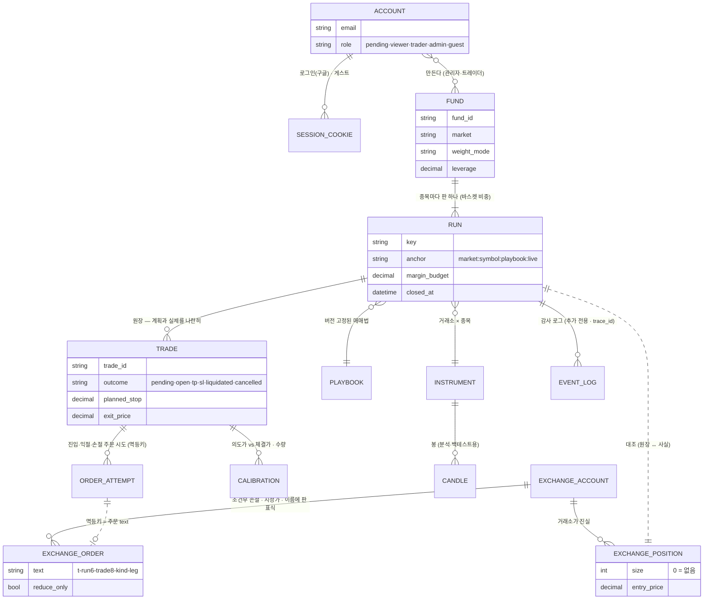

읽는 법:
- **원장(RUN · TRADE)은 앱의 의도**이고 **거래소(POSITION · ORDER)는 사실**이다. 둘 사이의 점선이 "대조" 다.
- 원장과 거래소를 잇는 유일한 끈은 **주문 이름**이다. 멱등키에 판 표식과 매매 id 가 들어가 있어 재시작 뒤에도 "이 주문은 내 것" 을 증명한다.
- FUND 는 DB 표가 아니라 JSON 파일(`logs/funds/*.json`)이다. 판(RUN)들을 묶고 예산을 나누는 상위 객체다.

---

## 2. 기술 ERD — 실제 테이블

두 계열이 있다. **라이브·모의 라이브가 실제로 쓰는 `wf_*` 계열**과, 스펙(§3.2) 시대에 설계한 **제안→승인→주문 계열**(승인 게이트가 범위 밖으로 밀려 지금은 대부분 비어 있다). 그리고 공통 마스터·시장·운영 표.

### 2.1 라이브 경로 (wf_*)

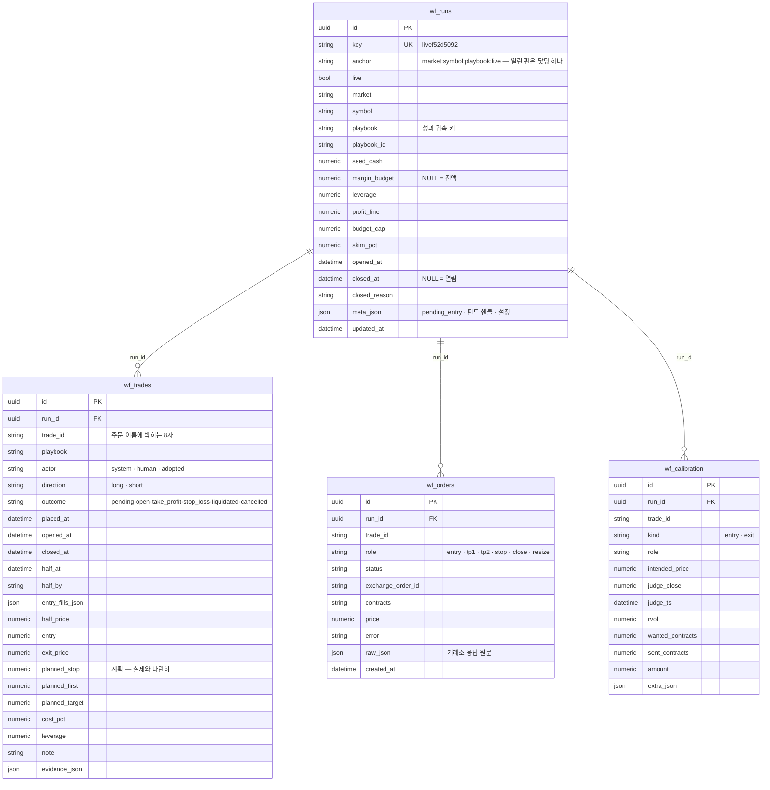

### 2.2 마스터 · 시장 · 계정 · 운영

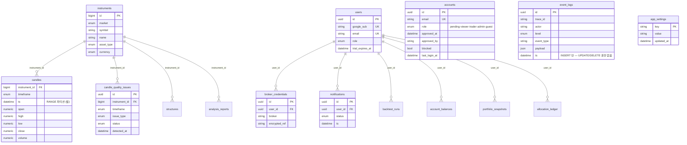

> `accounts` 는 구글 로그인 계정(T220 · 승인 흐름)이고 `users` 는 스펙 시대의 사용자 표다. 둘이 공존하는 것은 [code_quality_review.md](code_quality_review.md) §3.4 의 지적 사항이다.

### 2.3 스펙 시대의 제안 → 승인 → 주문 계열 (지금은 골격만)

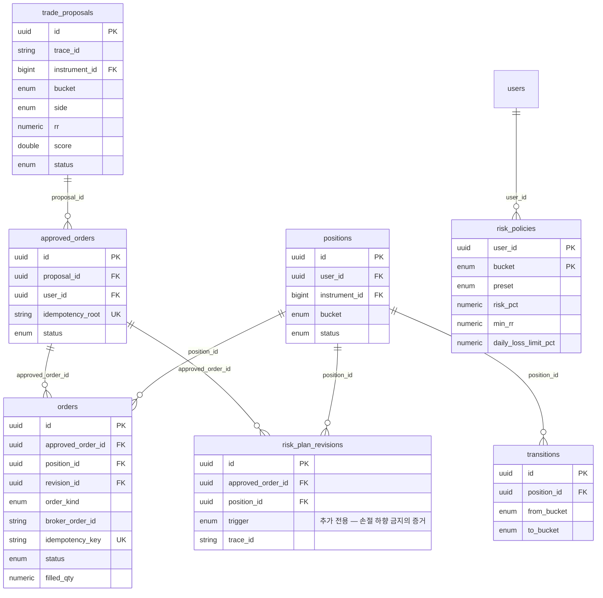

멱등키 규격 `idempotency_key = f"{root}:{order_kind}:{leg}"` 은 이 계열에서 정의됐고, `wf_*` 경로가 `root` 자리에 `판표식-매매id` 를 넣어 **그대로 쓴다**.

---

## 3. 시퀀스 다이어그램

### 3.1 한 판의 한 걸음 — 판정 · 주문 · 보호 · 대조

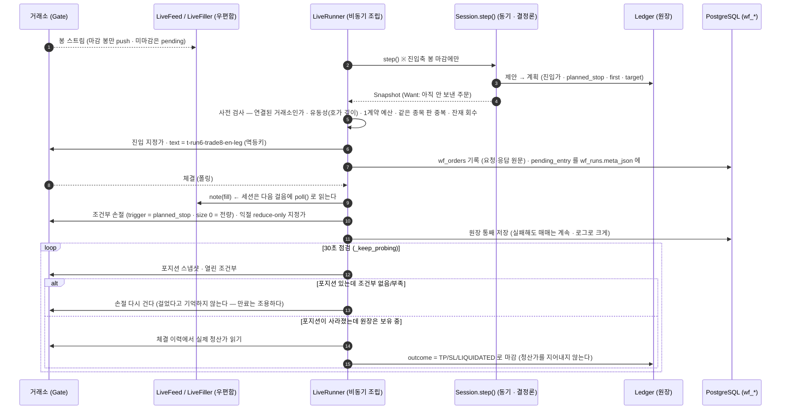

### 3.2 재기동 · 배포 — 무엇이 어디에서 살아나나

```mermaid
sequenceDiagram
    autonumber
    participant M as migrate (alembic)
    participant A as api 새 슬롯
    participant Rd as Redis
    participant DB as PostgreSQL
    participant X as 거래소
    participant W as watchdog / reconcile 루프

    M->>DB: alembic upgrade head (하위 호환 필수 — 두 이미지가 같은 DB)
    A->>Rd: SET NX updown:api:trader (리더 락)
    alt 락 획득 (리더)
        A->>DB: open_runs(closed_at IS NULL) — 되살릴 판 목록
        loop 판마다 (_live_start reviving=True)
            A->>X: 포지션 스냅샷 · 열린 주문 (조건부 · 지정가)
            alt 포지션 있음 & 조건부 손절 있음
                A->>A: adopt — 진입가·손절·1차/목표·매매 id 를 주문에서 되읽어 원장에 (actor=adopted)
            else 포지션 있음 & 손절 없음
                A->>A: 입양 거부 → 감사 ledger_mismatch (사람에게)
            end
            A->>DB: meta_json.pending_entry 읽기
            A->>X: 열린 진입 지정가와 대조 → 이어받기 / 다시 부탁 / 체결로 넣기 / 버리기 (표마다)
            A->>X: 대조에 없는 내 접두 지정가 = 좀비 → 취소
        end
        A->>A: restore_funds (펀드 JSON → 판 핸들 다시 붙임)
        A->>W: watch_forever(60s) · reconcile_loop(120s) 시작
    else 락 실패 (팔로워)
        A->>A: 조회만 · 거래 POST 는 503 → nginx 가 리더 슬롯으로 재시도
        A->>Rd: 5초마다 승격 시도
    end
```

### 3.3 전 거래소 대조 (120초) — 갈림을 이름 붙이고 사람에게

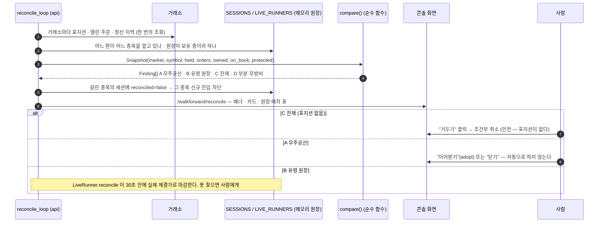

### 3.4 요청 라우팅 — 실계좌 · 데모 · 게스트

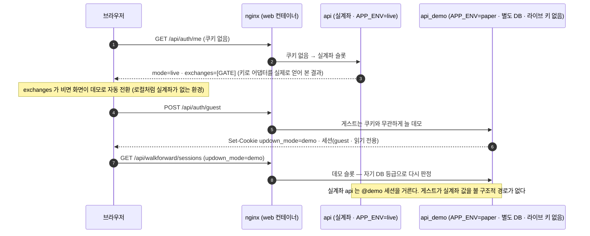

---

## 4. 스윔레인 다이어그램

Mermaid 에는 스윔레인 전용 문법이 없어 `flowchart` 의 `subgraph` 를 레인으로 쓴다.

### 4.1 판(RUN)의 생명주기 — 누가 무엇을 하나

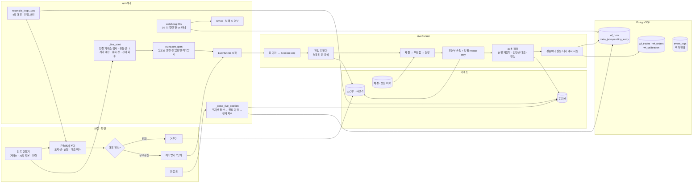

### 4.2 블루그린 배포 — 거래 리더가 끊기지 않게

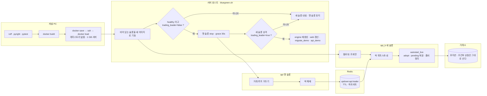

- 배포 중에도 **포지션과 브로커 조건부 손절은 거래소에 살아 있다.** 끊기는 것은 "우리가 감시하는 손절" 이고, 그 공백은 그레이스 30초 + 승격 5초 안이다.
- 첫 실전 배포(09-05 · v2026.09.05-1647)에서 대기 진입 지정가 1건이 `pending_entry` 복원으로 살아서 넘어왔다(T218 검증).

### 4.3 대조 판정 — 4축을 어떻게 가르나 (순수 함수 `compare`)

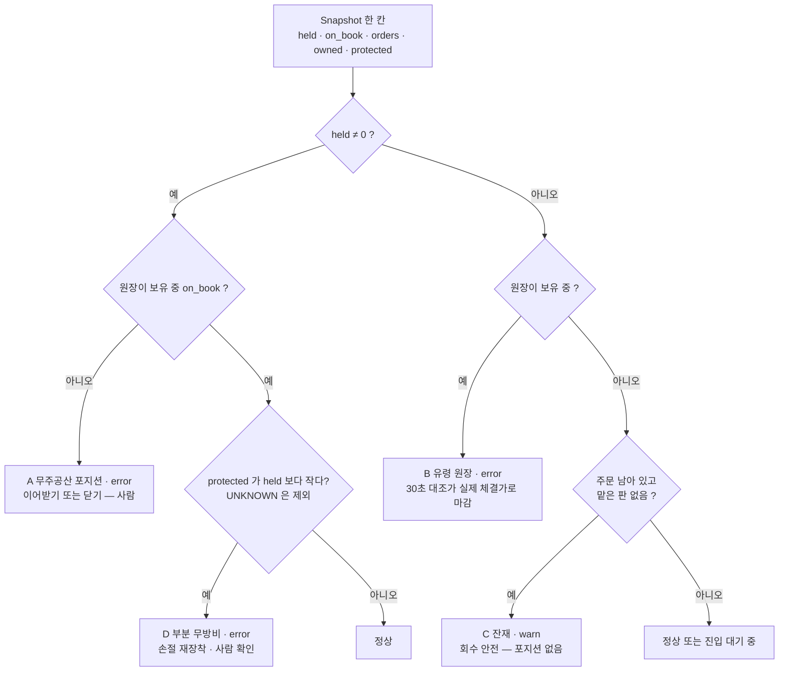

---

## 5. 플로우차트 — 캔들 하나가 들어와 리포트 한 줄이 되기까지

> 한 판(RUN)의 **한 걸음**을 처음부터 끝까지. 판정(analysis)은 제안만 하고, 확정(decision)은 RiskManager 만 하며,
> 집행(execution)은 값을 바꾸지 못한다 — 절대 규칙 #2·#4 가 이 그림의 화살표 방향이다.

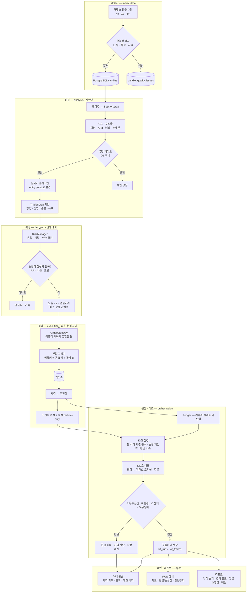

읽는 법:
- **화살표는 한 방향**이다. 판정에서 집행으로만 흐르고, 집행이 판정 값을 고쳐 되돌리는 화살표는 없다.
- 거래소는 그림의 **중간**에 있다 — 주문을 내는 자리(EXEC)와 사실을 되읽는 자리(LEDGER)가 다르다. 둘을 잇는 끈은 멱등키(주문 이름)뿐이다.
- 30초·120초 두 리듬이 다른 것을 본다. 30초는 *내 매매*(체결·손절·펀딩), 120초는 *거래소 전체*(내 것이 아닌 포지션·주문까지).
- 요청이 이 그림에 닿는 문은 하나다 — `auth.guard` 가 `required_cap(method, path, live)` 로 기능 하나를 고르고 계정이 그것을 쥐었는지 본다. 같은 경로가 데모 서버에서는 데모 기능, 실계좌 서버에서는 실거래 기능을 요구한다.
