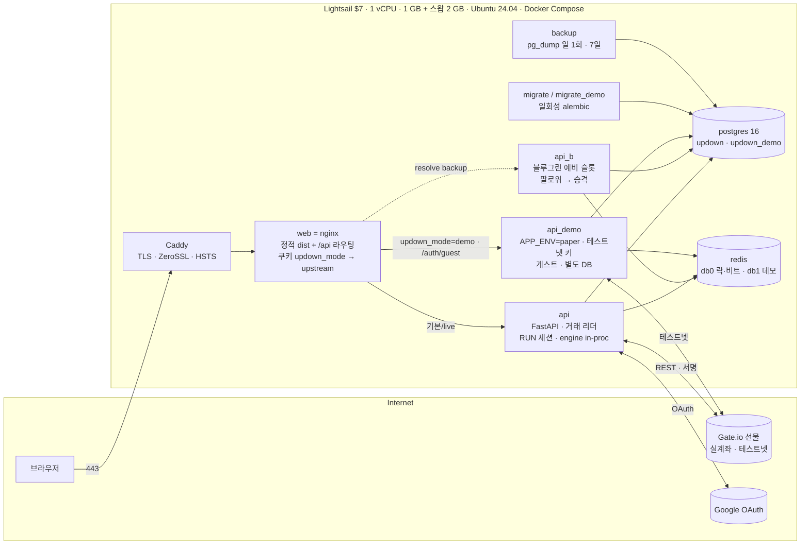
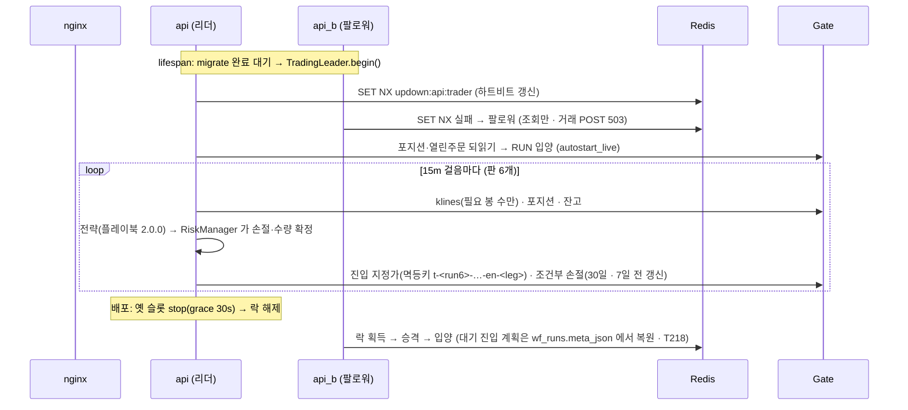
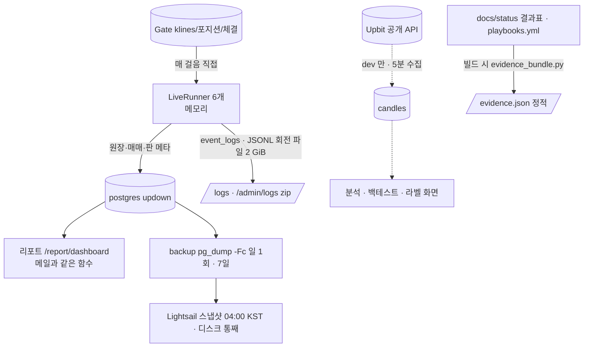

# 런타임 아키텍처 — 배포된 실계좌 서버는 어떻게 돌아가나 (2026-09-05 기준)

> 이 문서는 **코드의 계층**([architecture_boundaries.md](architecture_boundaries.md))이 아니라 **돌고 있는 프로세스**를
> 설명한다: 무엇이 어디서 돌고, 요청·데이터·돈이 어느 길로 흐르고, 죽으면 무엇이 살아나고, 왜 그렇게 정했나.
> 운영 절차는 [ops_runbook.md](ops_runbook.md), 배포 절차는 [deploy.md](deploy.md), 겪은 사고와 교훈은
> [ops_issues_2026-09.md](ops_issues_2026-09.md) 에 있다. 세 문서는 이 그림을 전제로 한다.

## 0. 한 장 그림



- **컨테이너 7개**(live): proxy(Caddy) · web(nginx) · api(+api_b 슬롯) · api_demo · postgres · redis · backup. 일회성 migrate 둘.
  engine 컨테이너는 **없다** — 1 GB 라 리더 api 안에서 돈다(`UPDOWN_ENGINE_INPROC=1` · 프로필 `separate-engine` 뒤로).
- **이미지는 서버 밖에서** 만든다(빌드 불가 · [deploy.md §12](deploy.md)). `ship.sh` 한 줄 = 빌드 → 전송 → `IMAGE_TAG` → 블루그린 → 태그 push.

## 1. 요청은 어디로 가나

| 요청 | 경로 | 누가 답하나 |
|---|---|---|
| `GET /` · 정적 | Caddy → nginx `try_files $uri /index.html` | nginx (SPA · 라우트 이름과 같은 정적 디렉토리 금지 → [B11 · #37](ops_issues_2026-09.md#b11)) |
| `/api/**` · 쿠키 없음/`live` | nginx `map $cookie_updown_mode` → `upstream updown_api {api resolve; api_b backup resolve}` | 리더 또는 팔로워 api (읽기는 둘 다 · **거래 POST 는 리더만** · 팔로워 503 → nginx 가 재시도) |
| `/api/**` · 쿠키 `demo` | → `upstream updown_api_demo` | api_demo (테스트넷 · 자기 DB 등급으로 다시 판정) |
| `POST /api/auth/guest` | 쿠키 무관 → api_demo 고정 | 데모만 게스트를 만든다 · 실계좌 api 는 `@demo` 쪽지를 거른다 |

> **로컬(dev)은 다르다** (2026-09-06 · [S7](ops_issues_2026-09.md#s7)): `web/nginx.dev.conf`·vite 가 데모 요청을 **서버 데모 API 로**
> 넘기고 쓰기는 405. 로컬 `api_demo` 는 프로필 뒤라 뜨지 않고, 로컬 `api` 는 Gate 테스트넷 키가 없다. 테스트넷 계정 하나에
> 관리자는 서버 하나다.
| 헬스 | `GET /api/health` (bash `/dev/tcp` 헬스체크 · 60s · start_period 240s) | 슬롯 자신 (`trading_leader` 포함) |

**쿠키는 행선지이지 권한이 아니다.** 어느 서버로 가든 그 서버가 세션 쪽지(같은 `SESSION_SECRET`)를 열고 **자기 DB 의 계정·등급**으로
판정한다. 쿠키를 조작해 얻는 것은 "다른 서버에 물어보기" 뿐이다.

### 인증·권한 (요약 · 상세 [deploy.md §4~§8](deploy.md))

```
구글 OAuth ──▶ 세션 쪽지(HMAC · 12h · secure/httpOnly) ──▶ Account 행(PENDING/VIEWER/TRADER/ADMIN/GUEST)
                                                      ├─ 돈이 움직이는 경로: 5분 재인증(FRESH_S) · TRADER 이상
                                                      ├─ live 환경: /exchange·/walkforward/live·/rebalancer 는 **읽기도 TRADER** (MONEY_READ_PREFIXES)
                                                      └─ 설정을 못 읽으면 조인다 (on_real_money · fail-closed)
```

- 평문 HTTP 로는 로그인이 아예 안 뜬다(secure 쿠키). 프록시 체인은 `X-Forwarded-Proto` 를 **보존**해야 한다([S1 · #5](ops_issues_2026-09.md#s1)).
- 거래 요청은 사람당 분당 30 (429). 외부 노출 검사 `check_exposure.sh`: 96 라우트 쿠키 없이 열린 것 0.

## 2. 돈은 어디로 가나 — 판(RUN)과 거래 리더



- **RUN 세션은 api 프로세스 메모리에 산다.** 그래서 "무중단" 의 뜻은 *프로세스가 안 죽는다* 가 아니라 **거래 리더가 끊기지 않는다** 다
  (`TradingLeader` · [G1 · #46](ops_issues_2026-09.md#g1)). Redis 가 죽으면 거래를 **막지 않는다** — 손절 관리를 Redis 로 막는 것이 더 위험.
- 실주문은 `OrderGateway` 만 준다(절대 규칙 #0). 조건: `APP_ENV=live` **and** `LIVE_ORDERS=1` **and** `GATE_API_*`. 하나라도 빠지면 테스트넷.
  같은 코드가 테스트넷도 실계좌도 된다 — 장점이자 그림자([G2 · #47](ops_issues_2026-09.md#g2)).
- 손절·익절의 SSoT 는 `RiskManager`(규칙 #4) · 손절 하향 금지(규칙 #3) · 모든 주문에 멱등키(규칙 #6). 멱등키에 판 식별자가 들어 있어
  재시작 뒤 **소유권 증명**으로 쓰인다.

### 재시작 뒤 무엇이 살아나나 (상태 영속 등급)

| 상태 | 어디가 기억 | 재시작·배포 뒤 | 근거 |
|---|---|---|---|
| 포지션 | 거래소 | `LiveRunner.adopt` 가 되읽어 입양 | 첫날 실측 |
| 조건부 손절 (30일 만료) | 거래소 | 계획을 되읽어 다시 건다 · 만료 7일 전 갱신 | live_money_review 갭 2 |
| 열린 진입 지정가 | 거래소 | 멱등키 접두 + 영속 계획이 맞으면 **이어받음**, 아니면 좀비로 취소 | T218 · [F1 · #20](ops_issues_2026-09.md#f1) |
| 대기 진입 **계획** (`_waiting`·`_tickets`) | DB `wf_runs.meta_json` (T218 이후) | 복원 · 복원 직후 한 걸음은 거래소 상태를 먼저 읽는다 | 〃 |
| 판 메타 · 원장 · 매매 | DB | 그대로 | — |
| 지표·폴링 캐시 · 레이트리밋 계측 | 메모리 | 잃어도 됨 (재계산) | — |
| ⚠️ 앱이 **7일 넘게** 죽어 있으면 | — | 브로커 손절이 만료된다 — 코드가 아니라 **알림·재기동(운영)** 의 몫 | [F6 · #25](ops_issues_2026-09.md#f6) |

⚠️ 이 표는 아직 사람이 쓴 표다. 필드마다 등급을 붙이고 시험으로 고정하는 일이 [G6 · #51](ops_issues_2026-09.md#g6).

## 3. 데이터는 어디로 가나



- **봉의 출처가 둘이다.** 펀드 러너는 `candles` 표를 안 쓰고 거래소 klines 를 직접 읽는다. `candles` 는 분석·백테스트용이고 **라이브 DB 에는
  봉이 0건**이다. 이 간극은 결정이 필요한 열린 문제([F5 · #24](ops_issues_2026-09.md#f5)).
- 스키마는 **기동의 일부**다: 일회성 `migrate` 가 `alembic upgrade head` 를 돌리고 api 는 완료를 기다린다. 블루그린 겹침 때문에 마이그레이션은
  **확장 → 배포 → 수축**의 하위 호환이어야 한다([deploy.md §9](deploy.md) · [D5 · #15](ops_issues_2026-09.md#d5)).
- 배포 DB 는 **빈 볼륨에서** 시작했다(`init_db.sh` · `verify_clean_db.py` · 개발 볼륨 복사 금지 · [F4 · #23](ops_issues_2026-09.md#f4)).
  보존: `candles` 영구 · `event_logs` 180일 · 로그 파일 2 GiB.
- `event_logs` 는 UPDATE/DELETE 불가(DB 권한 · 규칙 #8-2). 로그 적재 실패는 리스크 감소 행동을 막지 않는다(규칙 #8-1).

## 4. 외부 호출 예산

| 방향 | 무엇 | 예산·보호 |
|---|---|---|
| api → Gate | 걸음마다 klines(필요 봉 수만) · 포지션 · 잔고 · 주문 | 실계좌 첫날 429·오류 0. **하루 실측 남음**(T219) |
| api → Binance | **배포에서는 없음** (`UPDOWN_MARKETS=GATE`) | dev 실측 141% 초과 경험 → 감사 호출 묶기·캐시([C1 · #38](ops_issues_2026-09.md#c1)) |
| 브라우저 → api | 콘솔 10~15s · 판 상세 10/5s · 리포트 60s · 헬스 30s | 서버측 TTL 캐시가 거래소 호출을 막는다 · 거래 요청 30/분 |
| 밴·인증 거절 | 밴 만료까지 그 거래소 호출 중지([C2 · #39](ops_issues_2026-09.md#c2)) · 인증 실패 회로차단은 **미구현**([S4 · #8](ops_issues_2026-09.md#s4)) | 손절·청산은 어떤 상태에서도 나간다 |
| 시계 | 거래소 서버시간 오프셋을 클라이언트가 캐시 · OS 시계는 건드리지 않는다 | [C3 · #40](ops_issues_2026-09.md#c3) |

## 5. 죽으면 어떻게 되나 — 재기동·복구 정책

| 층 | 정책 | 한계 |
|---|---|---|
| 컨테이너 | `restart: always` (live) · 헬스체크 60s · 실패 시 Docker 가 재시작 | 인스턴스 정지·네트워크 단절은 못 본다 |
| 배포 | 블루그린: 새 슬롯 healthy·팔로워 확인 → 옛 슬롯 stop → 승격 → 입양. 2·4 단계 실패 시 자동 되돌림 | 되돌림은 스키마를 되돌리지 않는다 → 하위 호환 규약 |
| 거래 | 리더 락 하트비트 끊기면 즉시 강등 · 팔로워가 5초 안 승격 | 두 슬롯이 모두 죽으면 브로커 손절만 남는다 |
| 손절 | 브로커 조건부 주문 30일 · 7일 전 갱신 | 앱이 7일 넘게 죽으면 만료. 데드맨 알림은 **보류**(사용자 결정 2026-09-06) — 사람이 화면·리포트 메일로 본다 [F6 · #25](ops_issues_2026-09.md#f6) |
| DB 다운 | 러너는 브로커 손절이 지키고 `fund_retry_loop` 가 재시도 | 복구 지연 (live_money_review 갭 3) |
| 데이터 | pg_dump 일 1회(7일) + Lightsail 스냅샷(서버 밖) · `restore.sh` 11초 리허설 | 마지막 백업 이후 구간 |

## 6. 자원 — 1 GB 에서 지키는 다섯 가지

**스왑 2 GB · 서버 밖 빌드 · postgres 감량(32 MB) · 판 수 고정(6) · engine 을 api 안에.** 실측 합계 650/911 MiB · 스왑 137~299 MiB ·
데모 API 97~105 MiB(상한 256M · matplotlib 지연 import). 버스트형 vCPU 는 **크레딧이 배포 예산**이다 — 첫 밤 배포 몰이 + 폴링 폭주로
스틜 66~90% 를 겪었다([P2 · #44](ops_issues_2026-09.md#p2)). 판 자체는 코어의 0.3%. 올리는 기준(→ $12): 메모리 85% 하루 · 스왑 300 MiB 지속 · 판 추가.

## 7. 관측 — 무엇을 어디서 보나

```
사용자 증상 ──▶ ① nginx 접근 로그 (브라우저가 실제 보낸 요청·상태·빈도 · 499 는 여기만)   status.sh browser traffic
            ──▶ ② api JSON 로그 (event_type 집계 · trace_id → proposal → order → position)  docker logs · /admin/logs zip
            ──▶ ③ /admin/resources (psutil+cgroup · Redis 비트 · 레이트리밋 경로별 weight)  관리자 화면 자원 카드
            ──▶ ④ vmstat steal · free · docker stats                                    status.sh
```

첫 줄이 ①인 이유는 [G4 · #49](ops_issues_2026-09.md#g4) — 서버 프로브 200 만 보고 두 번 틀렸다. 서버 명령은 **파일로**(`scripts/ops/remote.sh <script>`),
인라인 따옴표·`$()` 는 wsl 경계에서 깨진다.

## 8. 이 그림에서 아직 비어 있는 것

| 것 | 왜 비어 있나 | 이슈 |
|---|---|---|
| 기동 시 외부 전제 프로브(포지션 모드·키 권한·화이트리스트·OAuth·SMTP·데드맨) | 첫 밤 사고의 절반이 "코드 밖 전제" 였는데 아직 사람 체크리스트다 | [G5 · #50](ops_issues_2026-09.md#g5) |
| ~~SMTP (리포트 메일)~~ | ✅ 2026-09-06 `env_sync.sh` 로 채우고 배포. 데드맨은 보류(사용자 결정) | [F6 · #25](ops_issues_2026-09.md#f6) · [env_live.md](env_live.md) |
| 인증 실패 회로차단기 | 403 이 1시간 2,498건 — 재시도로 풀리지 않는 오류를 일시 오류처럼 다룬다 | [S4 · #8](ops_issues_2026-09.md#s4) |
| 상태 영속 등급 표의 시험 고정 | 표는 사람이 썼다 | [G6 · #51](ops_issues_2026-09.md#g6) |
| 봉 출처 단일화 | 러너 klines 와 `candles` 사이에 다리가 없다 | [F5 · #24](ops_issues_2026-09.md#f5) |
| 오래 걸리는 쓰기의 job 화 | `asyncio.shield` 임시 해법 | [G7 · #52](ops_issues_2026-09.md#g7) |
| ~~데모 API 를 포함한 배포 스크립트~~ | ✅ `bluegreen.sh` 4b — 2026-09-06 배포에서 migrate_demo Exited(0) · api_demo healthy | [D9 · #19](ops_issues_2026-09.md#d9) |

## 변경 이력

- 2026-09-05 — 첫 작성 (실계좌 배포 첫 이틀 뒤 · T222 근거 화면과 함께).
